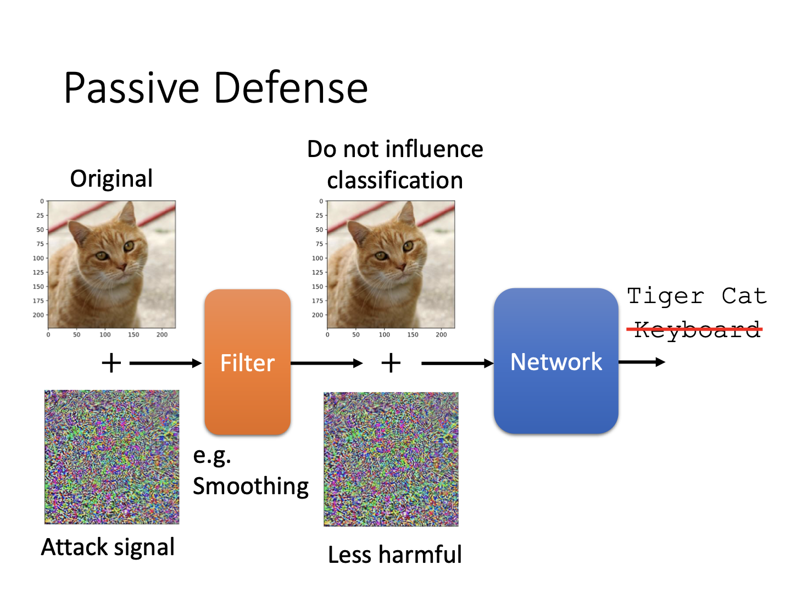

# Adversarial Attack

### Adversarial Attack

**动机**

人类希望通过自身的经验骗过机器学习模型，因此在一些简单任务上开始尝试修改数据骗过机器。但对于复杂的任务，显然需要通过某些训练方式来完成这一欺骗过程。

#### 如何攻击

**实例介绍**

以图片分类的攻击为例，在每一元素位置加上微小扰动后，送入原始的分类模型，有可能让它所对应的类别发生变化。以下为示意图。

该图中，原本的图片属于tiger cat类，但通过添加扰动后，会成为其他类。当然，这种扰动十分明显。我们在研究攻击时，自然会希望能做到不明显的攻击，即骗过人眼。以下为另一个例子。

可以看到，两张在人眼分辨上几乎相同的图片，前者被分类为tiger cat，后者却是star fish（并且分数高的吓人）。它们之间的差距放大五十倍后呈现出来是一副奇怪的马赛克。

以上的攻击看起来是毫无逻辑的，而还有一些攻击是可以理解的。例如某些人眼可识别的噪声，通过让图片变模糊，及其会把猫看成更毛茸茸的波斯猫，或者把猫当作模糊的火焰，背景当作壁炉...

**攻击方法**

攻击的目标是在某个训练好的分类器上从输入图片$\boldsymbol{x}_0$得到对应的能骗过网络的输出图片$\boldsymbol{x}$，则最主要的目标就是让输出的类别$\boldsymbol{y}$和真实类别$\hat{\boldsymbol{y}}$越远越好。将其定义为一个损失函数即可。注意，为了实现前述的人眼看不出的变化，实际上这一过程需要一个约束：$d(\boldsymbol{x}_0, \boldsymbol{x})\le\epsilon$（图中蓝框部分没显示）。

这种目标输出和原始输出的近距离约束需要通过domain knowledge来完成。例如图像任务，我们通过衡量L2范数和无穷范数来判定$d(\boldsymbol{x}_0, \boldsymbol{x})$的大小。

观察图中的马赛克，右上为四个像素都变化一点，右下为绿色格像素变化较多。但它们的L2范数完全相同，右下者无穷范数更大。从人眼角度，对右下的变化更为敏感。所以使用捕捉这一变化的无穷范数作为距离约束就可以保证输出和输入数据的接近。

与梯度下降类似，但此时固定网络参数，更新输入数值$\boldsymbol{x}$，即损失函数L对$\boldsymbol{x}$求偏导。注意对于约束$d$，在梯度更新的时候判断是否超限，若超限则在相同方向上“往回拉”一段即可。通过如此迭代，可以找到效果最好的输出数值。

从约束$d$的特殊性出发，有人提出，不如一次迭代来解决攻击问题：

通过让下降步长$\eta=\epsilon$，更新的梯度为原梯度方向的符号值，则每次更新后的结果一定会是无穷范数限制的高维多面体顶点。如此，在不违反限制的情况下又让输出数值有了最大的偏移，通过一次迭代就能完成。当然这一符号梯度的方法也可以加上多次迭代和“回拉”，以达到更佳的攻击效果。

#### 白盒vs黑盒

如果我们知道模型的参数（能够不断训练模型），那么就可以针对性地进行训练与攻击，这被称为白盒攻击。而一般的在线模型无法下载，这时候就需要使用黑盒攻击进行处理。

如图，如果我们无法获得模型，训练一个相似的模型并由此反推出攻击资料，同样可以完成网络攻击的目的。如果我们已知需要攻击的网络是由何种数据训练的，那么我们的相似模型使用同样的数据集进行训练即可。若否，则可以将一些训练资料输入攻击目标网络并得到输出的预测结果，用这些成对的资料对我们的相似模型进行训练，并在训练好的模型基础上反得到攻击数据。

黑盒攻击的效果十分显著。对不同模型的对比表明，使用一个相似模型对目标模型进行攻击同样可以达到效果。

如图中的上表，在ResNet-152作为相似模型的情况下，攻击VGG-16，会使得其准确度变为19%，这已经十分明显。注意对角线为相同模型攻击，即白盒攻击。另外也可以考虑ensemble attack。若某一图片在除了目标模型外的所有模型中表现都较差时，将其放入目标模型，大概率也能得到较差的结果。表格中每一列代表要被攻击的模型名字，纵轴的减号代表五个模型中除了哪个模型没被加入攻击训练，所以对角线表示使用其余模型唯独不使用攻击目标进行训练，再将得到的攻击数据放入目标网络得到的准确率。此时对角线表示的是黑盒攻击。可以看出集成的效果显然更佳。

**为什么攻击这么容易**

有学者做了一个可视化展示，下图中蓝色部分表示图像向量的分类结果不改变的区域。可以发现对于同样的图片，所有网络训练出来的结果均表明图像向量在某一范围变化时类别不改变，因此他们提到，攻击成功并非说明网络存在漏洞，而是数据特征如此，这在网络上存在共性，所以实际上是数据存在特性。

**单像素攻击**

神奇的是，有人实践出只改变一个像素就能够让网络识别错误。

**Universal Adversarial Attack**

目前的方法均为对特定的图片进行特定的训练，因此又有研究者尝试使用一个通用的干扰来攻击所有的图片内容，基本可以实现。

#### 图像之外

除了图像任务外，对于语音识别或NLP任务，均可通过添加噪声完成攻击。例如对一段人工合成的声音，机器能够执行检测是否为合成讯号。此时加入人耳无法分辨的噪声后，就可以让机器认为声音是真实世界产生的。同样，对文字问答任务，在段落内添加某些特定词句，会让回答变为某些固定内容...

#### 现实世界的攻击

前述攻击都是处于虚拟世界之中的，即找到数据和特征，由它们反推得到攻击模型的原料。但这种攻击又显得过于费时费力。一种更危险有效的方式是在物理世界中寻求突破。例如下图的花边眼镜：

通过这种奇怪的图案，戴眼镜的人就会被识别为某个明星。这种物理攻击要求具有很强的泛化能力（人头的角度会变化，要求都得骗过机器）。因为真实世界的摄像机分辨率问题，所以不可能和虚拟攻击一样，在某几个像素上做文章。另外，产生的攻击内容（像素、颜色）也必须能在现实世界打印出来，不应偏色。所以这一系列物理世界的攻击都有现实情境的考量。

这种攻击的另一个场景是交通标志识别。通过在标识上贴图案，可以让它们骗过识别器。当然这是比较“嚣张”的做法，容易被管理人员检测到。另一种隐秘方法是如下：

在限速标示的3位置加横线，能让自动驾驶的识别器误认为8，从而改变限速速度，可以说是非常危险的应用了。

#### 其他攻击方法与应用

**Adversarial Reprogramming**

通过在攻击中加入特殊的内容，让被攻击的模型能够执行攻击者所需的功能。例如将一个图像分类器“改造”成识别图片中有几个方块的分类器。

**后门**

有一种极度危险的方法称为后门。前述的攻击都是在完整的模型上进行的。如果从训练阶段就进行攻击，就称为后门。将看似无害但能够产生扰动的图片混杂在数据集中，可以让模型在最终执行任务的时候产生错误的结果：

目前网络上的公开数据集很多，如果有恶意用户将数据集中混杂攻击图片，则模型在训练中就会因为它们的影响而留下漏洞。这样一来投入使用的模型就产生了安全风险。换句话说，攻击者通过在数据集埋植后门，从而使得所有通过这些数据集得到的模型能够满足他的某种需要。

### Defense

**Passive Defense**

在原有模型上进行结构或数据改造是一种被动过程。例如可以在网络层前增加模糊层，从而让加上攻击信号的图片无从施展。例如，因为攻击信号尽量小，所以模糊后这些基于原始图片的攻击信号相当于受到了极大的扰动。当然，模糊化会导致对原始图片的分类置信度降低。

另外，也可以通过图像压缩或生成器的方式避免攻击。前者同样进行了模糊化的扰动，后者则是利用生成器重新生成数据，它们对扰动信息一无所知，所以产生的微小扰动可能就被过滤掉了。

另一种被动防御的机制是随机化。如果防御的方法被别人知道，那么实际上它们也只相当于在网络上多增加了一层，同样有可能被攻破。所以将防御手段随机组合，就可以保证更多安全。例如，在一开始先对图片进行随机放缩，再进行随机补全拼贴，这样的过程难以被猜到，就有了更强的抗攻击能力。

**Proactive Defense**

主动防御就是在自我训练时即加入攻击元素。例如对于训练好的模型，将原始图像产生攻击信息而标签不变，送入网络进行训练，通过迭代训练的方式增强网络的鲁棒性。这也是一种数据增强的手段。

