# Deep Learning

## General Guidance

### 机器学习的框架

**1.准备模型**

一般将所有参数写为$\boldsymbol{\theta}$，故对于某输出$y$和输入$\boldsymbol{x}$可定义$y=f_\boldsymbol{\theta}(\boldsymbol{x})$表示一个机器学习模型。

**2.定义损失函数**

写出一个将预测结果$y$当作输入，衡量其与真实数据$\hat{y}$相似程度的函数$L$，实际上它是以模型参数为输入，所以一般写作$L(\boldsymbol{\theta})$。

**3.优化**

通过梯度下降迭代，求得最佳$\boldsymbol{\theta}^*=\arg\min_\boldsymbol{\theta}L$。

### 各种问题与应对法

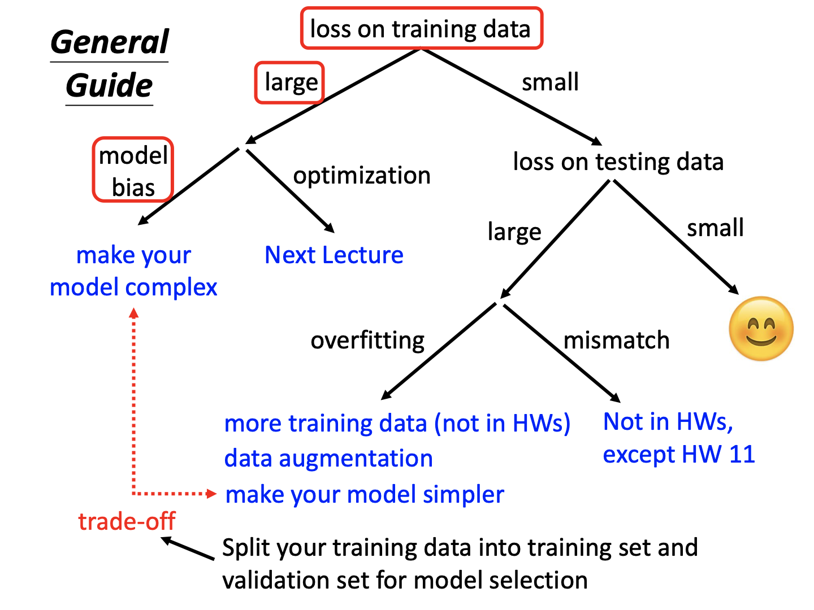

一图流，从各个方面分析机器学习模型遇到的问题，以下详述。

#### 训练数据上的大误差

**Model Bias**

模型偏移实际上是一种建模失败，即我们所使用的模型并未包含所有的函数/模型空间。由此，无论如何改进这个函数，都无法找到最好的结果，所以训练数据的误差仍然十分大。用一句俗语言就是“find a needle in a haystack”，然而“there is no needle”。所以一般而言机器学习的模型都需要比较复杂。渐渐地，现在都在使用深度学习，意图直接拿最为复杂的模型去覆盖简单的问题空间。

**Optimization**

如果函数的参数空间包含了想要的目标，但是不够光滑，就有可能陷入local minima，导致在训练数据上的误差无法下降。

***有什么区别***

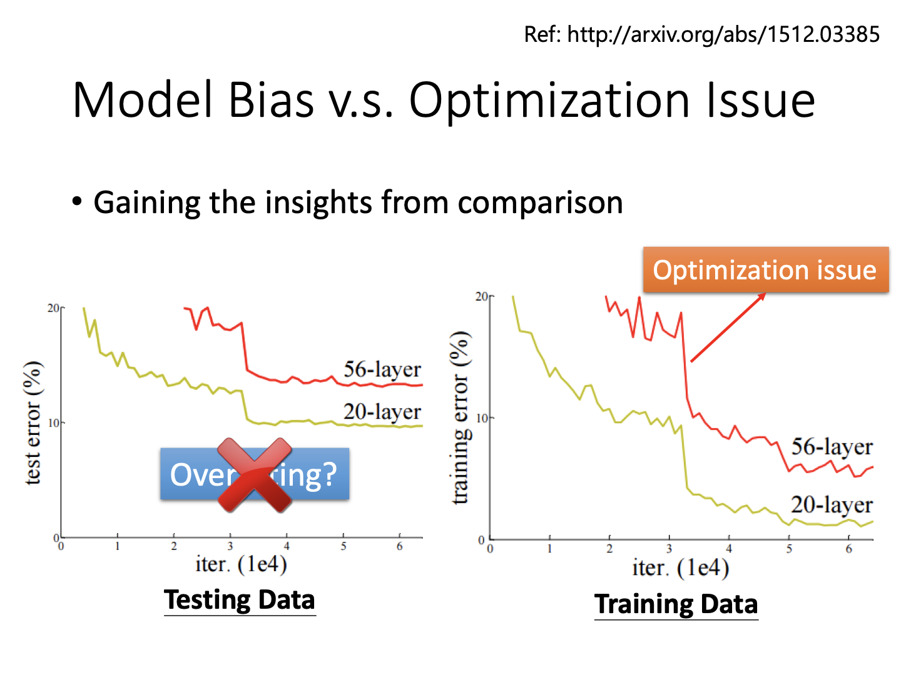

画出不同结构的网络误差图，可以直观发现，一个更复杂的网络理论上一定包含了简单网络的参数空间，所以应该有比它更好的效果。所以一旦复杂网络误差更大，其实一般是优化没有做到位。同样，这时候因为包含了更多的参数，所以不会存在model bias问题。

在训练的时候可以对比深浅不同的网络，从而确定是否是Optimization的问题。

#### 测试数据上的大误差

**Overfitting**

首先需要强调，只有训练误差小，测试误差大的时候，才说明可能产生过拟合问题。

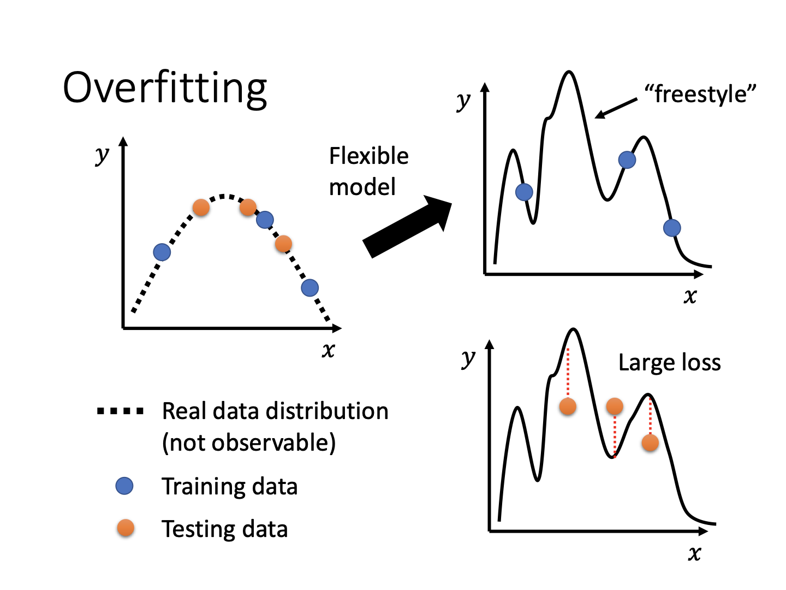

对于过拟合问题，一般来说是产出的模型太过复杂了。在这种情况下，有两种解决办法：

***1.增加数据***

通过添加训练数据的方式，对模型加以限制，令其学到更准确的数据分布。这一手段可以通过搜集训练数据或数据增强的方式来解决。

***2.模型限制***

不受限制的模型可能会变得极为复杂，通过设置简单的模型、更少的参数、更少的特征、正则化或Dropout等手段均可让模型不至于“过分学习”。但需要注意的是，如果对模型的限制过大，将会让其直接退化，从而无法包含所需的参数空间，最终回到model bias问题。

***折衷手段：Cross Validation***

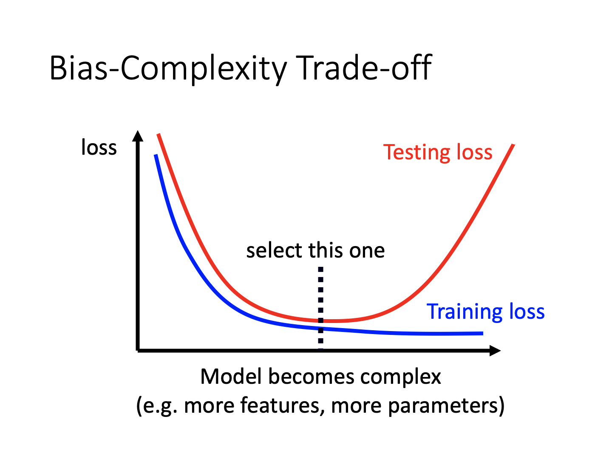

通过同时观察训练误差和测试误差的曲线，可以发现随着训练次数增加（使得模型参数变复杂），训练误差一般会下降，但测试误差会在某个地方开始抬升，这时候就达到了一个模型复杂性和准确率的平衡点。当然此处的横轴也可以代表参数的增加、使用特征增加等等。在这个时候，可以通过Cross Validation的方式来确定不同模型的优劣，以免在测试数据上挑选模型而花费时间。

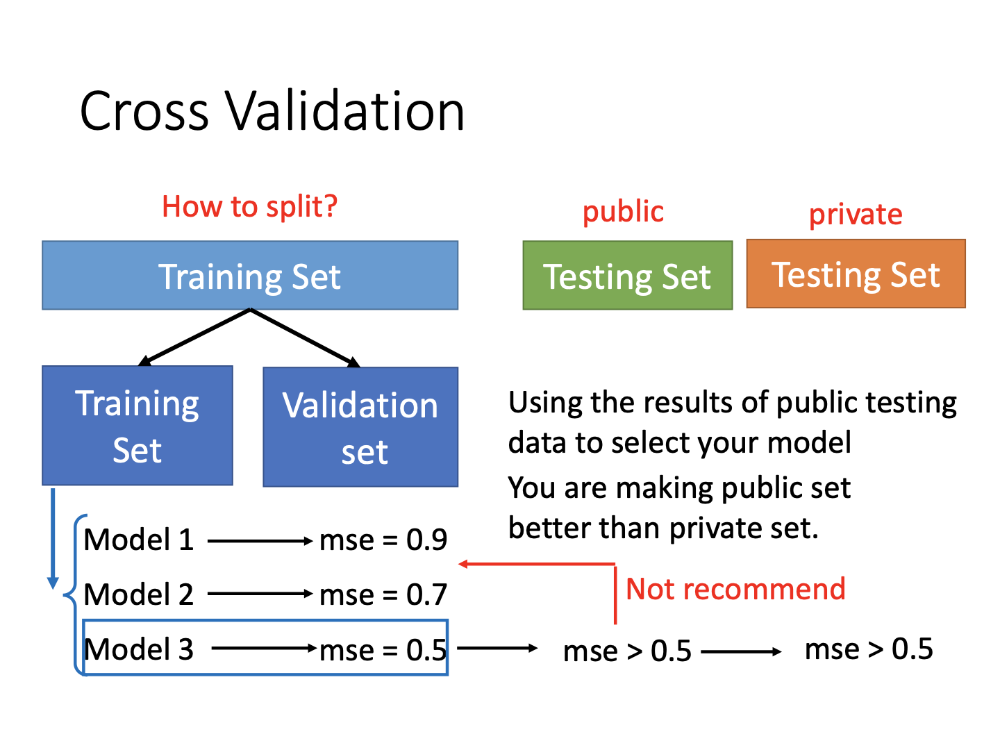

通过对训练数据划分验证集的方式，我们可以训练后挑选验证集上的最好模型，将其作为测试数据集的代表。同时，为了让挑选过程更robust，可以使用N-fold Cross Validation，切分多份验证集，让模型在不同切分下的误差取平均，确定最终的选择。

**Mismatch**

另外，测试数据的大误差也有可能是测试集的分布与训练集完全不同，这种时候就需要关心数据的生成情况了。

## When Gradient is small

### Critical Point

当网络无法下降的时候，一般存在两种可能：局部最小 local minima 和鞍点 saddle point，二者均有微分为0。对于local minima，实际上比较难逃脱，而saddle point是可以逃离的。所以鉴别到底属于哪种情况十分重要。

#### 一点数学推导

虽然我们无法通过数学表达式写出神经网络，但是同样可以写出其损失函数的泰勒展开形式：

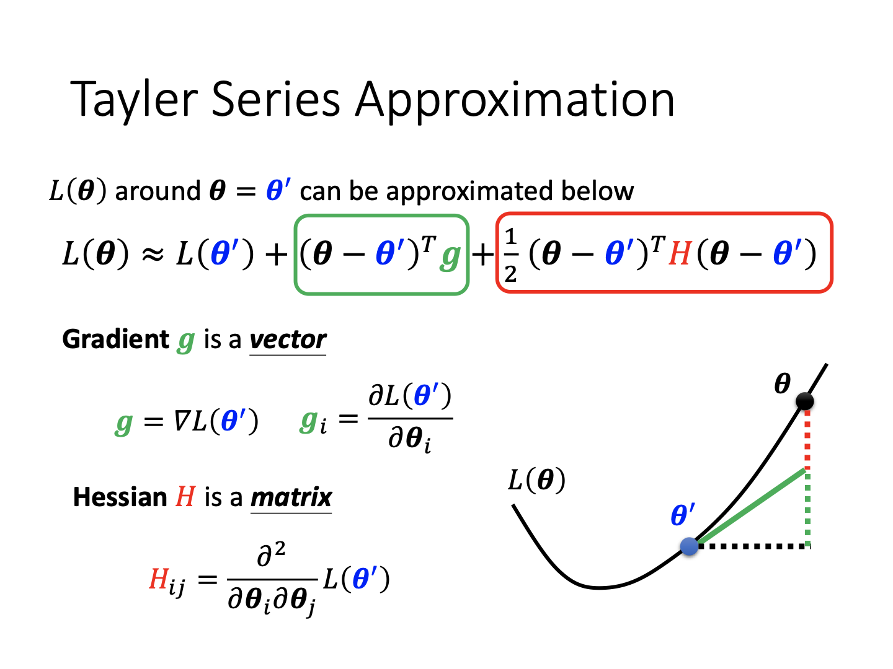

可以通过泰勒展开形式近似$\boldsymbol{\theta'}$和$\boldsymbol{\theta}$，图中绿色实线为梯度，虚线则表示绿色框部分，红色类似。

当我们走到了一个鞍点时，已知一阶梯度为0，那么绿色框部分为0。那么我们产生了如下推导：

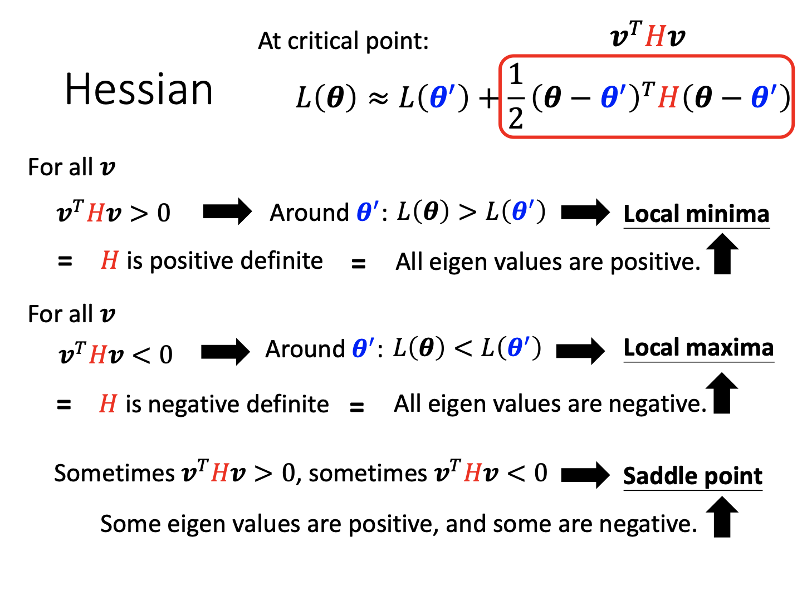

对于等式第二项，其大于0则说明对于代入的$\boldsymbol{v}$，都有$L(\boldsymbol{\theta})$最大，则说明走到了局部最小，反之最大，若结果不确定，则是鞍点。当然，实际上不可能找到所有的$\boldsymbol{v}$，所以实际上只要观察二阶梯度$\boldsymbol{H}$是否正定，即可判断等式第二项是否大于0。

另外，拥有$\boldsymbol{H}$实际上也能够帮助我们确定下一步优化的方向：

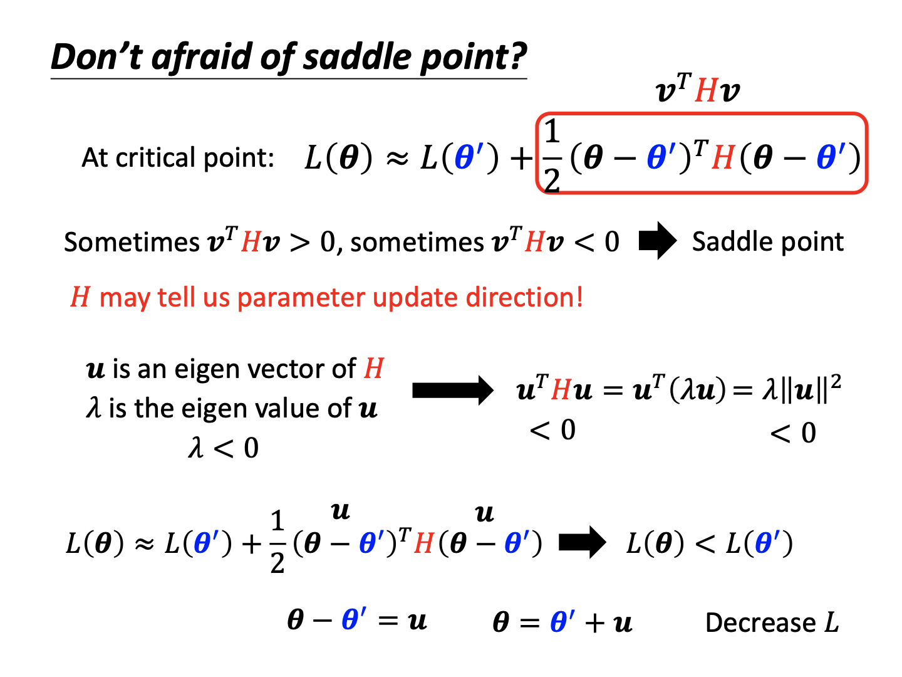

实际上对$\boldsymbol{H}$分别左右乘特征向量就可以得到一个特征值与恒正值的乘项。负特征值对应的是下降，所以只要把对应的负特征向量找出来代入即可，此时就可以在$\boldsymbol{\theta'}$的基础上得到$\boldsymbol{\theta}=\boldsymbol{\theta'}+\boldsymbol{u}$。由此，我们可以逃离鞍点了。

***现实真的如此吗***

实际上现实实现中，计算梯度的开销已经极大，并且计算特征值分解也是成本极高的，因此该方法并不使用，但这只是一个最坏结果的处理方案。

#### 一点小思考

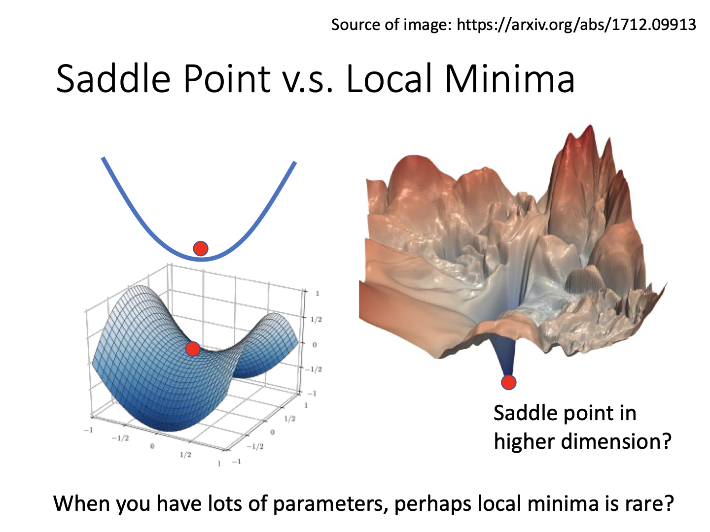

如图，一个低维空间的最小处在高维空间可能只是一个鞍点，当参数越来越多的时候，也许局部最优就有可能难找了。

以一个实际小例子说明：

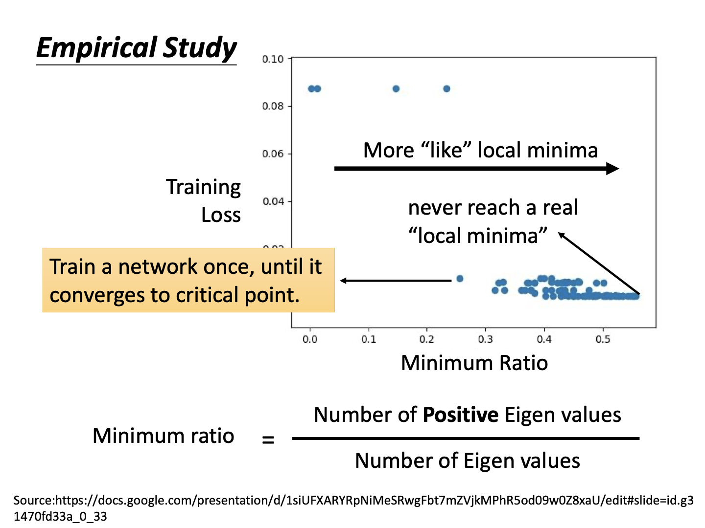

训练网络到一个收敛处，然后观察那时候位置对应的二阶梯度正特征向量和总特征向量比值。首先对于loss较大的部分，比值低，说明还有很多地方可供下降，而到了loss较低的点区，我们发现比值虽然高了，但并不接近1，说明还有很多位置供下降，所以此时我们实际上是在鞍点。

## Tips for training: Batch and Momentum

### Batch

一般在进行训练的时候，都是在某一批数据上进行优化，将参数更新后投入下一批数据的优化之中：

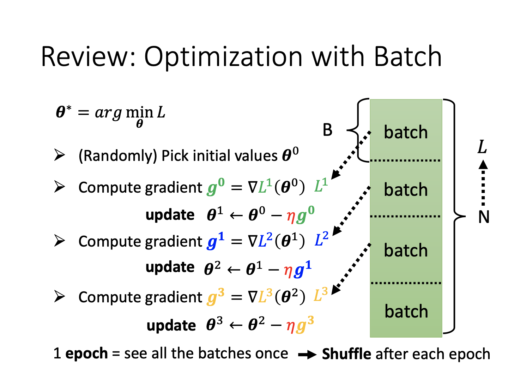

这样做的实际效果就是，我们在历经一个epoch后，实际上优化的次数不止一次了。这和对全体数据做优化的loss下降对比表现如下：

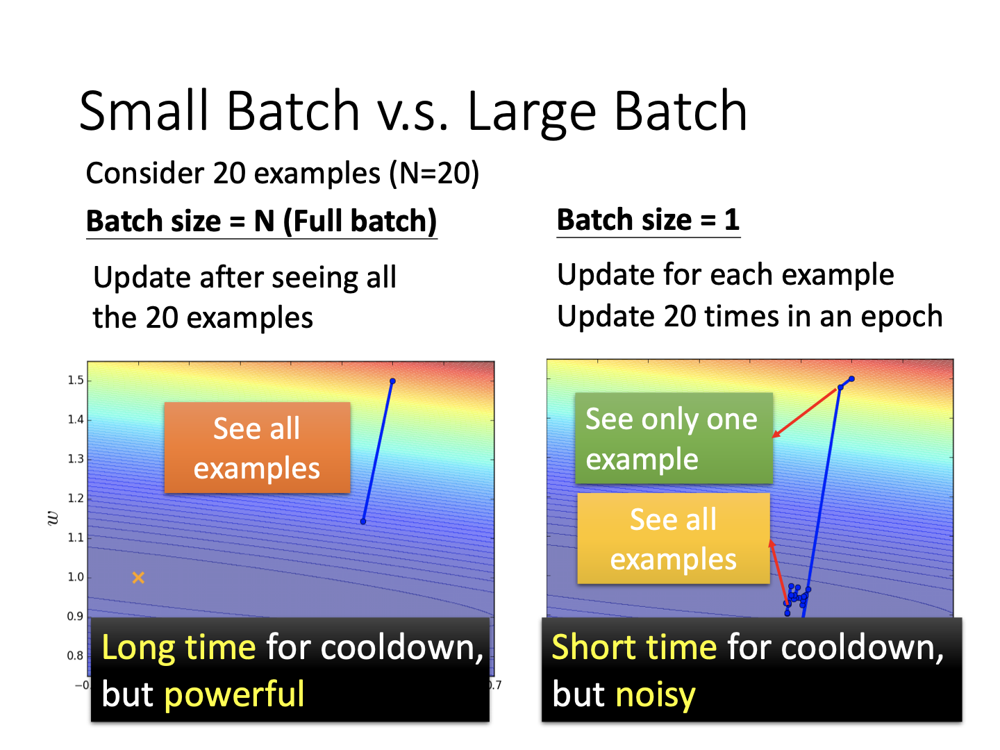

不难发现，对全体数据进行优化，确实带来了比较大的下降，而对一个batch更新一次参数，会有更多曲折的下降路径。由此，我们不禁会问，这是否说明同一个epoch内，batch越小越好呢？

**运行时间**

使用小batch不可避免的头号问题就是运行时间的增加。虽然我们在同一个epoch里头做出了更多的优化，但实际上因为优化次数的提升，时间也是在不断增加的。

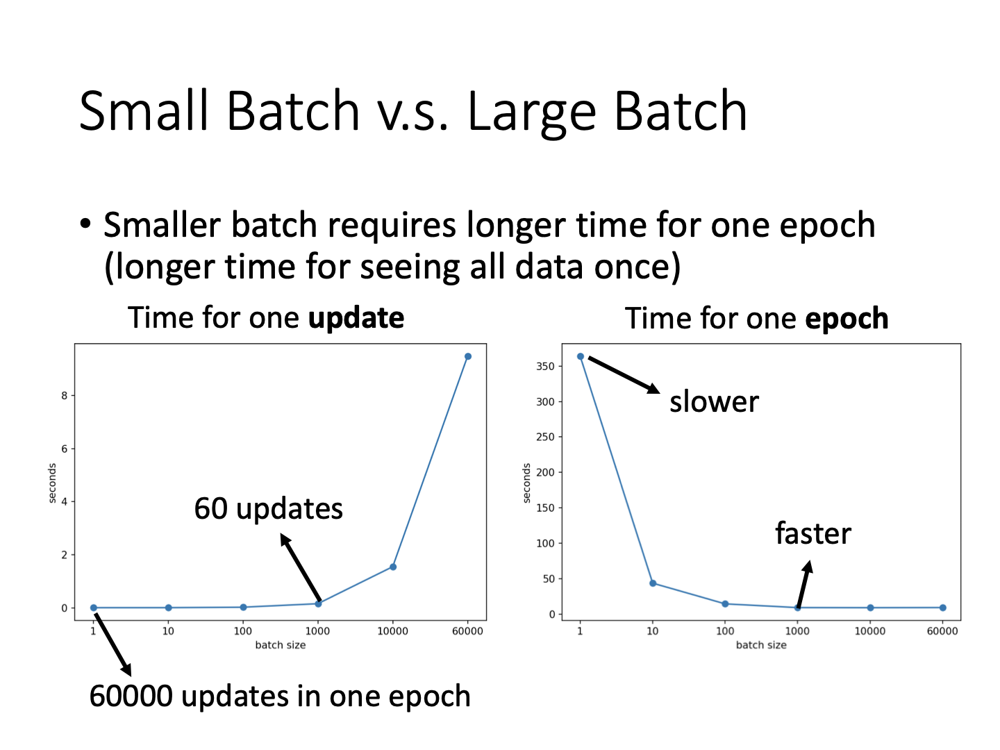

随着硬件的发展，实际上在计算的时候有并行计算的加持，在不超过某个数据阈值的情况下，更大的batch并不意味着更高的时间（相接近），所以在这一区段内选用稍大的batch可以让同样的运行时间下能探索更准更大的方向，从而在相似的总运行时间内走的更准。

**训练准确率**

实际上通过实验发现，训练集和测试集的准确率都会随着batch size的增加而下降：

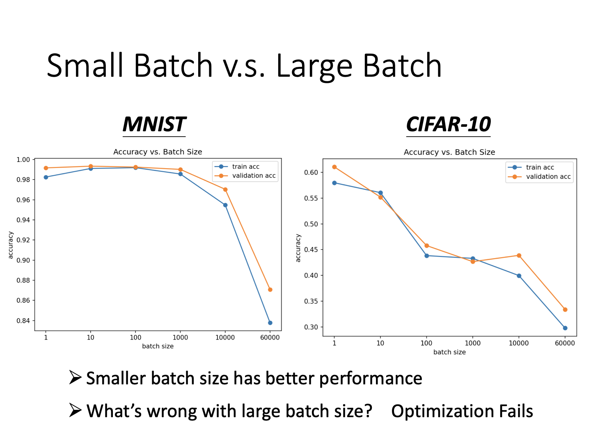

我不确定这个对比是否是在同样的epoch上做的。在同样的epoch上，则batchsize小者有更多的update，当然有可能下降的更快。若上图是对相同的优化时间来做对比的话，对小batch优势的说明更加明显：

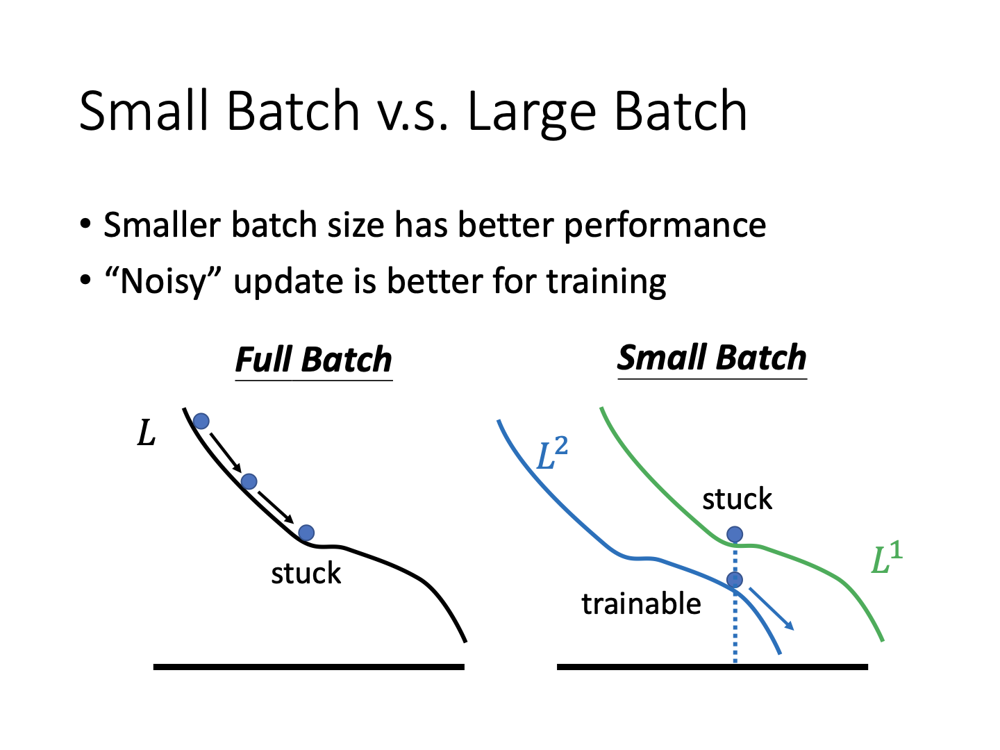

对于一个full batch，下降的过程永远是相同的，所以如果卡在了一个plateau，那么就难以迈过。而对于使用了小batch，因为每次更新用的梯度都来自于不一样的数据集，所以它们的error surface有细微差异，这种噪声反而帮助损失函数下降，因为在$L^1$上的plateau可能是$L^2$上能够直接下降的点。

***Small Batch的巨大优点***

有实验证明，小的batch size在测试集中会达到更好的效果。一种直观的解释是，大的batch会找到比较sharp的minima，而小batch因为不断震荡，找到的minima应该是大家都认为的较为平缓的最低点。也就是说最后实际上得到的是比较稳定的结果。而测试数据一般和训练数据有略微的偏移，那么这样一来，平缓的minima经过移动，误差不会太大，而sharp的minima则导致了天差地别的结果。

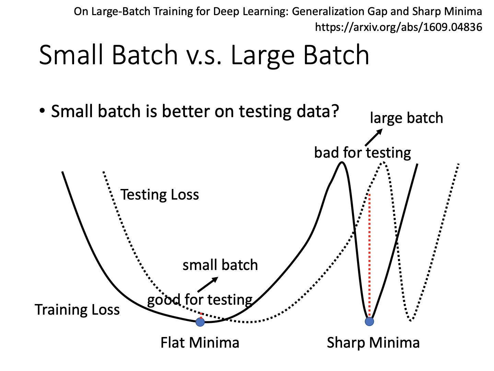

### Momentum

在物理世界中，一个小球从高坡滚落，途中也许会遇到平原、谷地，但是因为其携带的重力势能，它还是能够有机会直接滚下去，而不是困在某处，直到达到某个它认为的低点。在梯度下降的过程中，我们利用同样的思想，这就是动量Momentum。

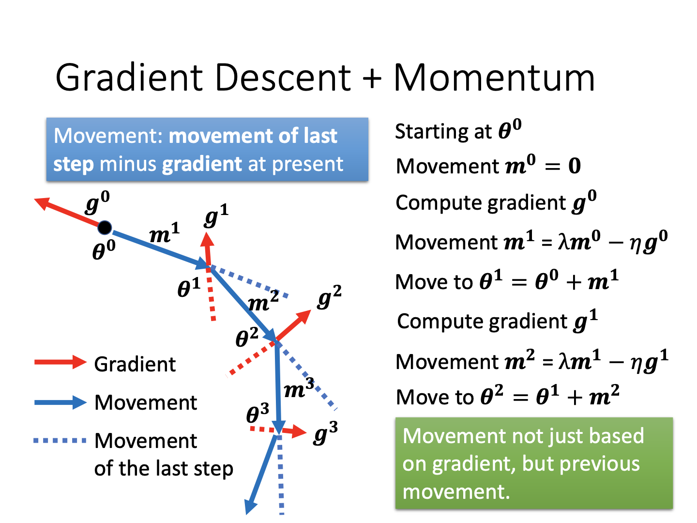

如图，通过综合当前梯度和上一次前进的方向，我们所走的路线得到了折衷。反映在下降图像上：

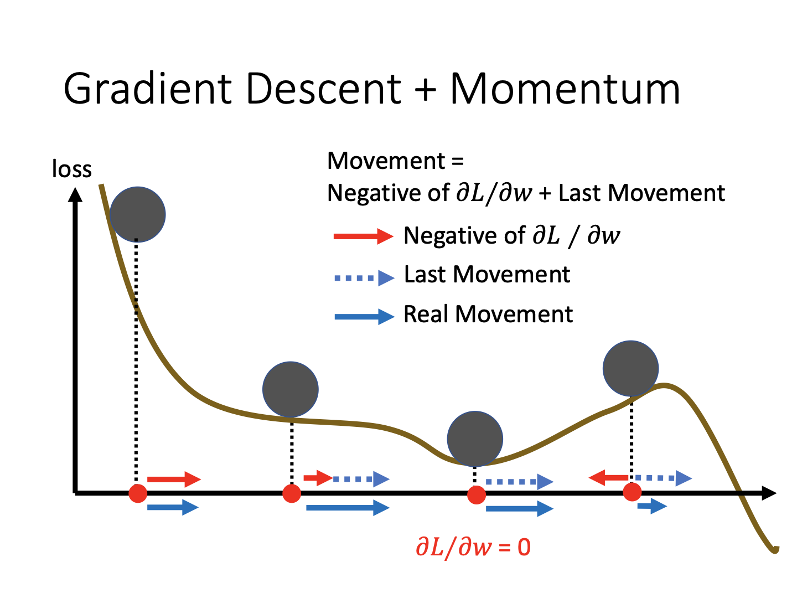

不难看出，在某些平缓地区，小球本来无法滚动，但因为momentum的存在，导致它能够继续向前。所以一旦有合理的momentum设置，小球就可以不断搜寻最优值，直到yigelocla minima。