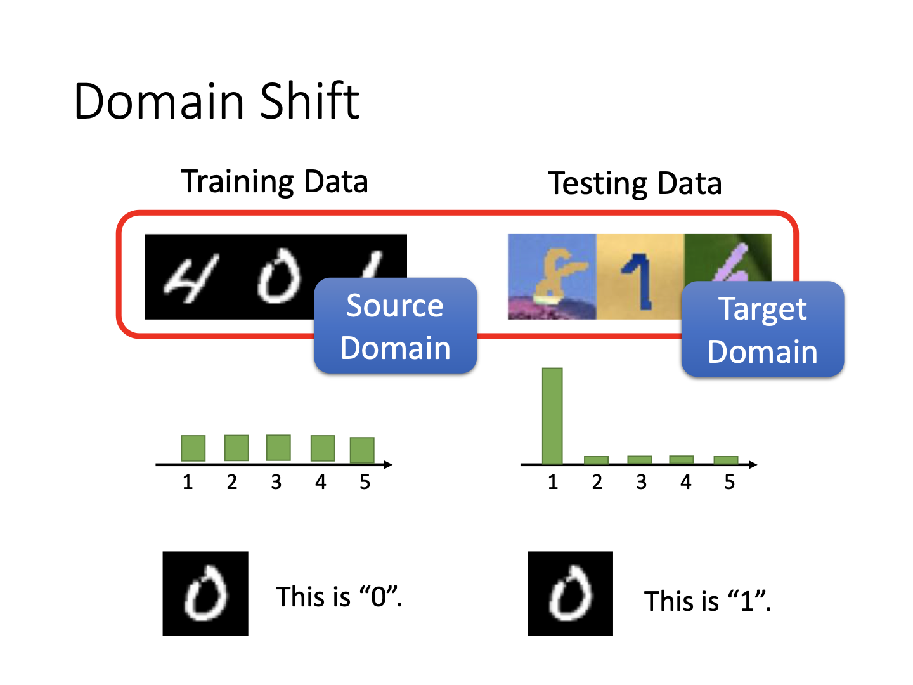
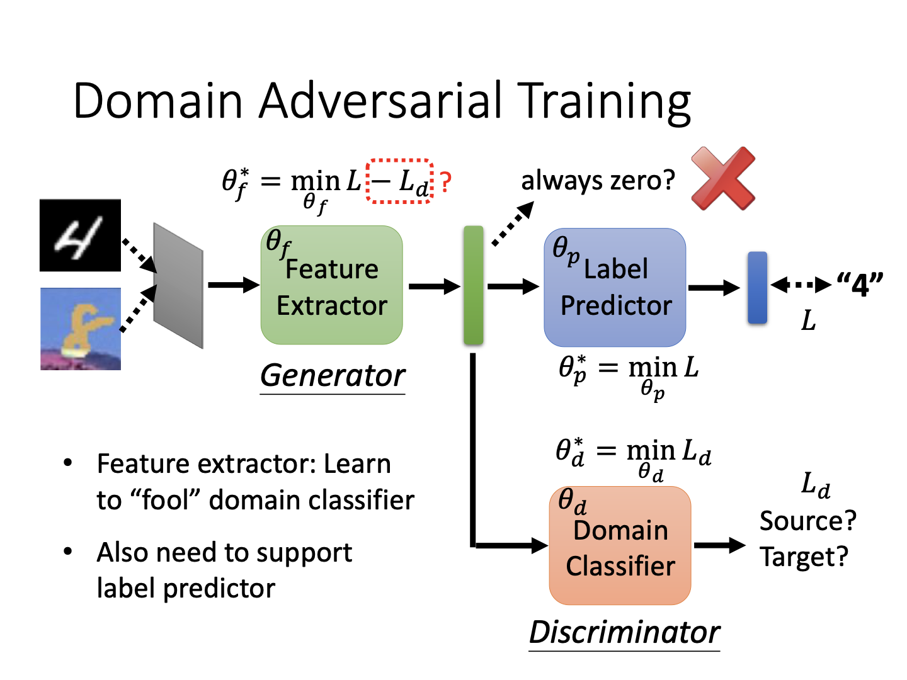
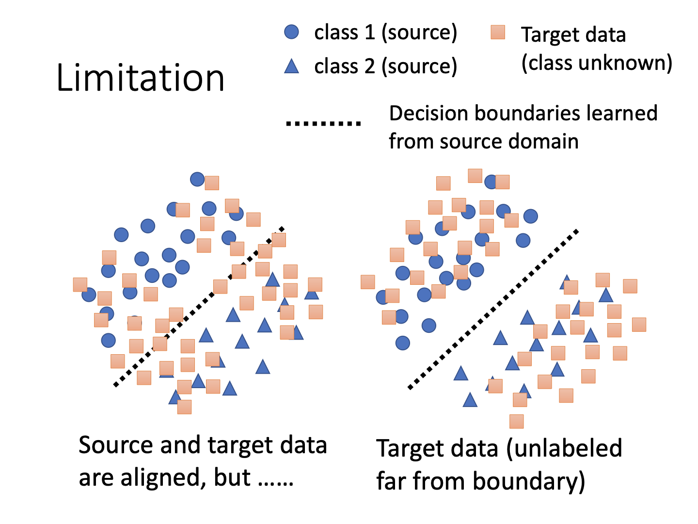
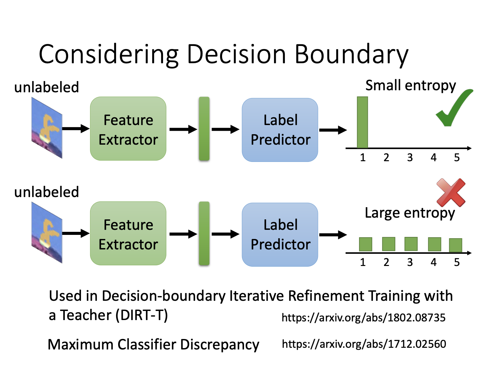
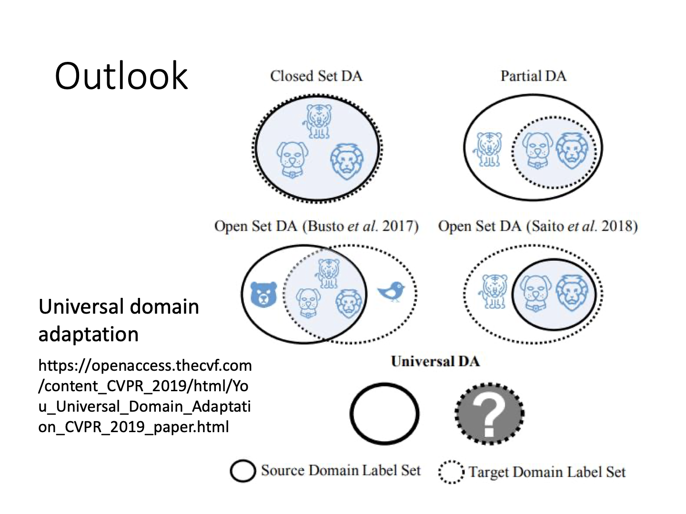
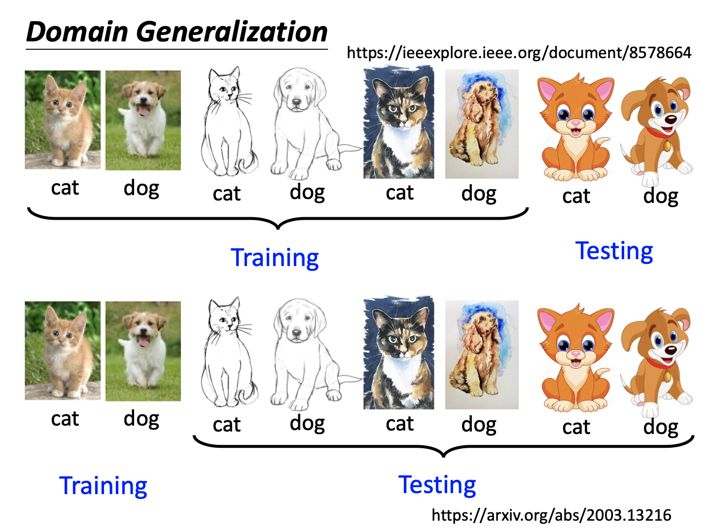

# Domain Adaptation

### Domain Shift

在机器学习任务中，有一类任务的训练数据与测试数据分布不同，会导致分类困难的问题。

### 如何解决？Adaptation

测试与训练数据分布不同的情况较多，主要有以下几种：

- Little but labeled
- Large but unlabeled
- Little but unlabeled
- None

#### Little but labeled

对于测试数据少但有标注的情况，可以通过在源域训练好模型后，在目标域小数据上fine-tune来完成迁移，这也是迁移学习的做法。需要注意在迁移训练过程中的过拟合。

#### Large but unlabeled

真实世界中的场景多为用某些数据训练完后，实际情况的数据有更多不同类别且无标注数据。处理这种情况的基本思路是，对训练与测试数据，使用特征提取器，找出两个不同域数据的共性特征，滤过它们的差异，最终用这些特征训练模型，对目标域数据进行预测。 

实际上对于CNN任务而言，可以将网络中的前部看作特征提取器，后部看作标签预测器。当然，到底把多少部分看作不同的功能组由我们而定，是一个超参数。那么，对于这样一个特征提取器，我们让目标域数据通过它们后，和源域数据通过它们得到的分布越接近越好就足够了，这需要一个domain classifier。同时，目标也包含让源域数据的分类结果越准确越好，否则特征提取器可以无论任何数据均输出同样结果，从而“骗过”domain classifier。此时，定义domain classifier的任务是一个二元分类，loss为$L_d$，而源任务仍然是普通的数据分类任务，此时定义整体的任务最小化数据分类误差，又最大化$L_d$（从而让domain classifier分不出输入数据来自哪个domain，以让特征提取器达到混淆输出提取的目的），就得到了下图中$\theta_f$的问题定义式。老师提到图中这种简单的定义误差并非最好，因为feature extractor做的和domain classifier完全相反。

另外，以上过程和GAN已经十分类似了，都存在一种“拮抗”的思想。

观察结果发现，如果目标域数据有标签，那么90%+的准确率并不难得到，但无标签时，源域数据训练得到的模型对目标域数据毫无办法。但是使用这种拮抗过程后，准确率均有较大提升，达到了可用的程度。

**分类训练中的小问题**

上述任务是无监督的，所以输出的标签完全不可知。观察下图发现，我们的分类任务显然要远离决策边界。

当然，target domain任务的决策边界未可知。如果我们并不知道决策边界，那么不如人为将输出的分布加以控制，从而改变目标训练过程。这和semi-supervised learning中的实践比较类似，不再赘述。

**其他小问题**

标签的存在问题，比数据的域迁移来的更加复杂。上述任务仍然在讨论数据分布不同但标签相同的情况，实际上源标签包含目标标签、两个域互相不全包含、目标域标签包含源标签等情况均会涉及，需要进一步的研究。

#### Little but unlabeled

关于目标数据少且未标注，可以使用Testing Time Training的方式解决，详见论文https://arxiv.org/abs/1909.13231。

#### None

如果对目标域一无所知，需要机器通过对原始任务的学习，获得处理的能力，就可以使用domain generalization的方式。比如通过在源域数据进行数据增强之类的方式去让机器获知域的偏移，从而自动学会提取数据特征，完成在Large but Unlabeled这一块中介绍到的过程。

