# Explainable AI

**为什么要追求可解释性**

随着机器学习/深度学习模型的性能提升，其结果背后的产生机制也受到了各种质疑。这就好像传说有一匹马能够算出数学算式并跺脚对应的次数。而有人去测试发现，马不过是观察周围人的反应来停止跺脚，以获得奖励罢了，他并不了解算数背后的逻辑。

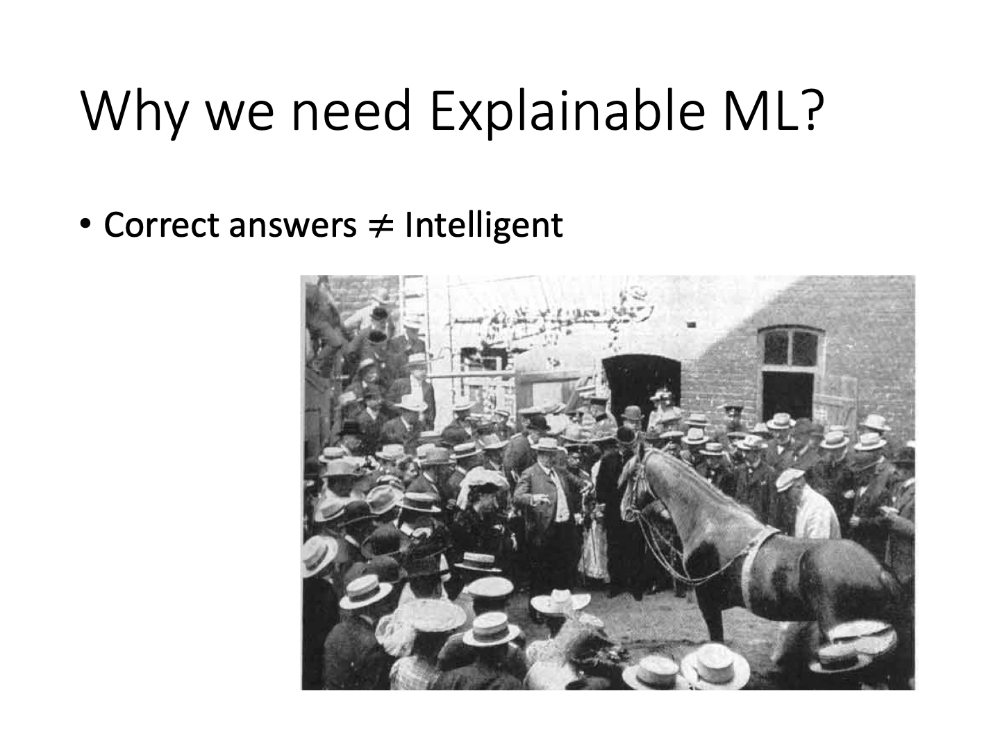

同样地，如果一个机器学习模型是通过莫名其妙的方式得到正确的答案，那么这些答案的解释度便会存疑。在面对法律判决、疾病诊断、自动驾驶等任务的时候，模型对于结果产生的合理机制比结果的正确性更加让人关注。

***切莫因噎废食***

当然，不能因为模型的解释度差就弃之不用。毕竟许多模型已经能够做到非常好的结果了。而目前具有可解释性的模型中，线性模型是不够强大的，性能远落后于不可解释的深度学习模型。

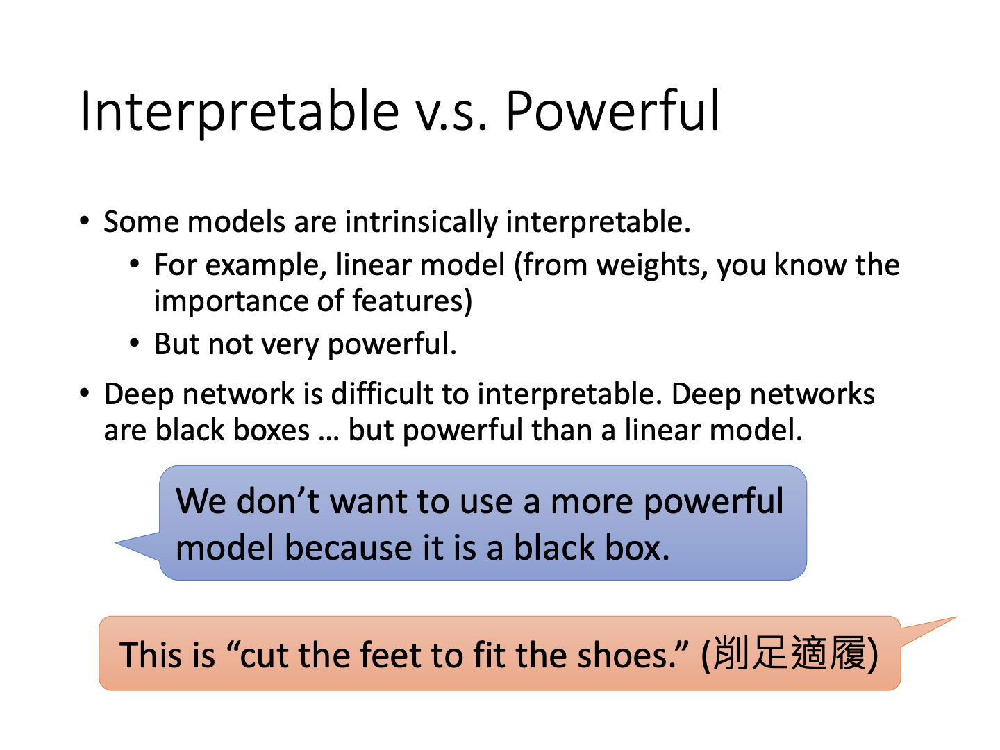

此外，决策树模型的解释性倒是不错。但是实际应用中为了保证效果，使用的是多层、多棵决策树（Ensemble），面对种类繁多的子树，做出解释同样不容易。

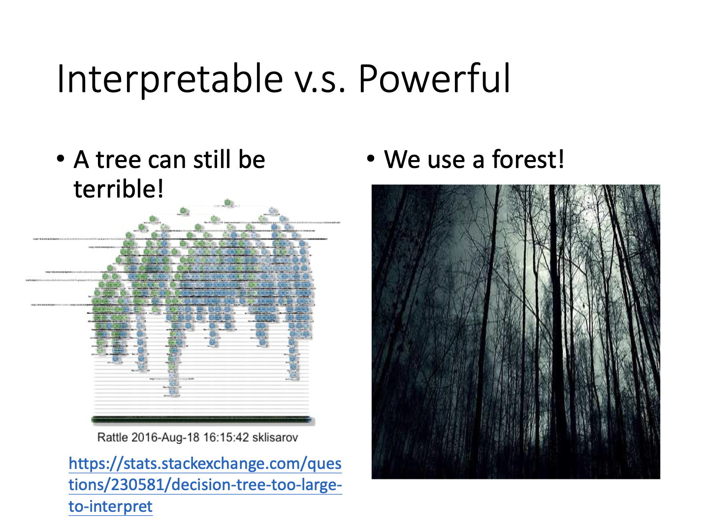

**可解释模型的目标是什么**

模型的可解释性是一个标准不一的目标。公说公有理，婆说婆有理，所以只要模型的某种结果在某种程度上让人信服就足够了。核心是**让人信服**，而不是整个模型得多“透明”。

### Explainable ML

一般来说，可解释模型分为两类：**local explanation**与**global explanation**。

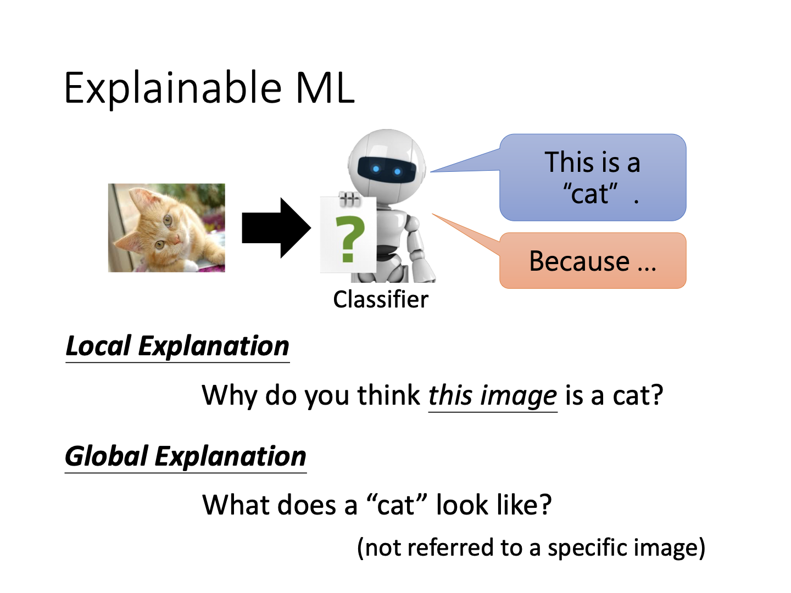

拿关于猫的图片分类任务举例。“Local”关心的是，为什么当前的某张图片是或不是猫，也就是关心模型对某个具体数据的判定依据。而“global”高于数据本身。它更关心，对于训练好的模型权重，猫的判定标准是什么。

### Local Explanation

**Patching**

通过在某张图片上加上色块，再观察图片分类的结果，就可以确定计算机认为图片的那些位置比较重要。

上图为某实验结果。第一行为图片，第二行为预测结果。第二行的对应位置为在第一行放色块后模型的预测准确度，红色为高，蓝色为低。显而易见，对预测狗的任务而言，用色块遮住狗的身子不大影响准确率，但遮住脸会带来准确率下降；而识别轮胎的任务里就不能遮住轮胎等。所以说图像识别模型在某种程度上是具有可解释性的。

**Saliency Map**

另一种方法是对某些数据做出微小扰动，观察最终损失函数的变化情况，后者与前者的比值越大，就说明改变这部分数据会让模型结果变化明显。通过这一思路可以画出如下图片：

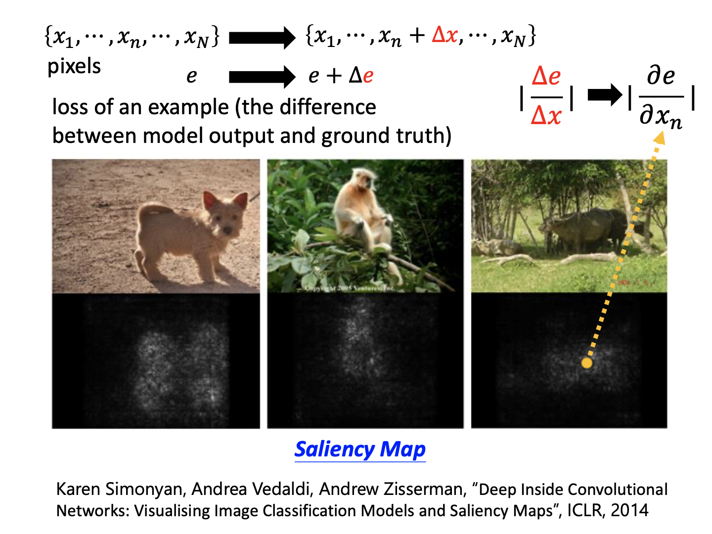

图中白色点代表比值高的区域。我们惊喜地发现，三张识别动物的图片中，白色点均分布在动物区域，而不是背景中，这也能说明图像识别模型的可解释性。

#### 寻求可解释性中的障碍

有些图片的识别难度较大，产生的saliency map是模糊的，有人提出可以随机添加不同的噪声，形成不同的图片，再取平均，从而消除无关内容对解释性的影响：

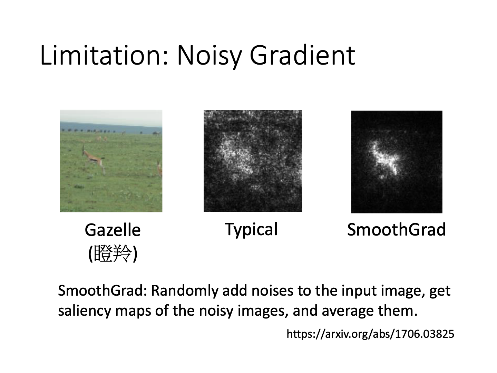

另一个问题是梯度饱和。用一个直观的例子来理解，如果大象的鼻子长到一定程度，那么它再长也只是大象，所以鼻子长度的变化并不会对“梯度”产生影响，这时候所谓的梯度对重要性的衡量效果就不够准确了。

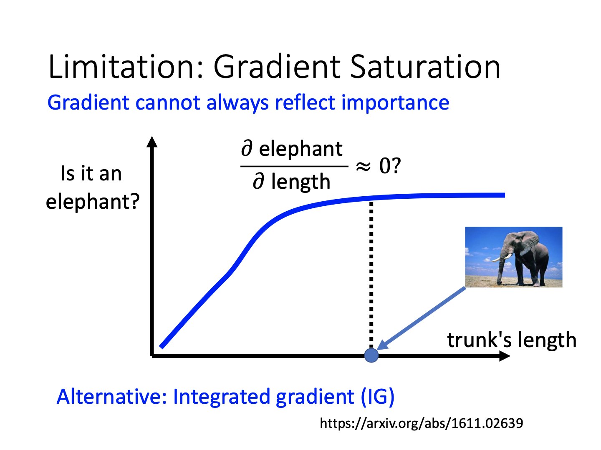

#### 输入的数据在网络中如何存在

早在2012年，Hinton等人就尝试将语音信号的MFCC图通过低维映射转为二维图像，发现不同的人（图上的不同颜色）说同样的一系列内容，产生的特征五花八门：画出的图像毫无重叠。但是经过多层神经网络后，同样内容的不同语音数据隐变量就被展现到了相近的位置，这也说明这些数据背后拥有共性。

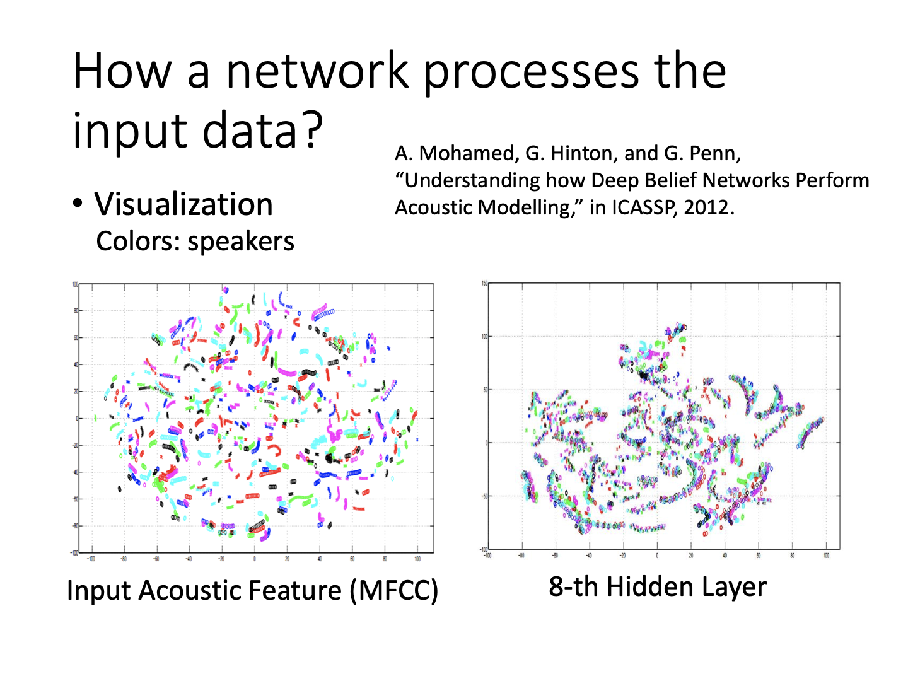

类似地，对一个多层的语音-文字感知任务，可以抽取其中间得到的embedding，丢到文字-语音模型中，研究其生成的语音内容。随着抽取信息的层数增加，计算机也许就得到了语音数据背后的特征。面对某人的言语，反向得到的语音数据也许听不出说话者是谁。换言之，通过这种方法，可以研究神经网络是怎么“听”到声音，如何处理数据的。

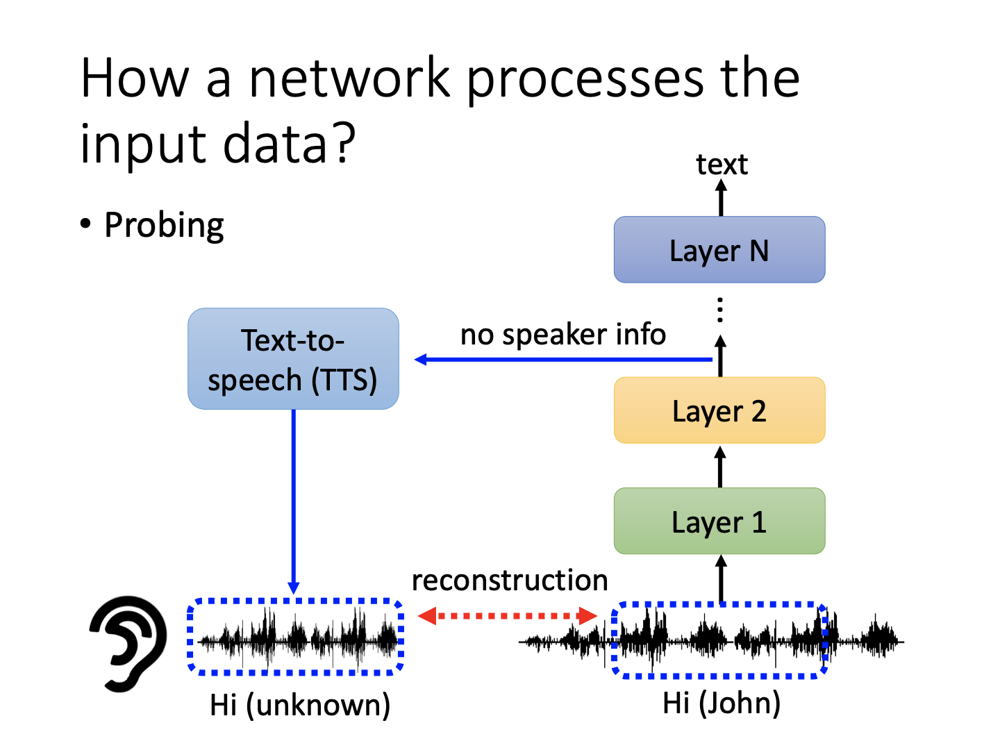

### Global Explanation

与local不同，global更加关心模型对于某一类数据的识别产出能力。例如，模型会如何看待一只猫的图片？它和人眼看到的有多接近？

#### filter看到了什么

对于图像任务，激活函数是选取最大的数值进行呈现。所以对于训练好的分类器，由其确定一个使得某filter输出最大的输入，再观察输入图片的样子，就能在某种程度上展示什么类型的图片会让这个filter反应最明显。推而广之，也可以通过最大化网络对某一类别的分类概率，从梯度上升的方式反推什么样的图片对应这样的概率，从而输出图片（和adversarial attack一样生成图片）。

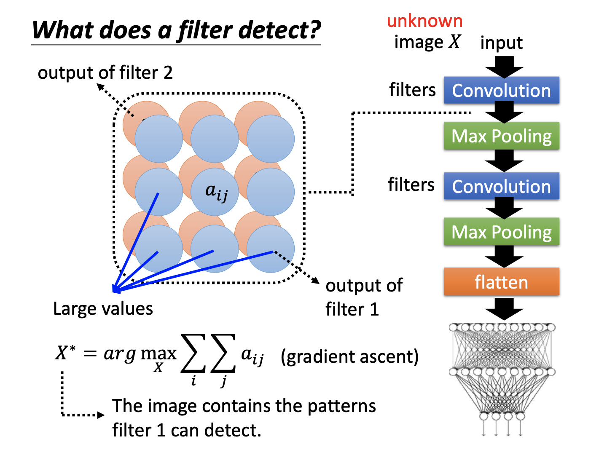

当然，在一开始并非一帆风顺，比如通过这一方法确定识别Mnist的网络对不同数字的识别情况。下图左发现无论是什么数字，在机器看来都是一团杂讯：

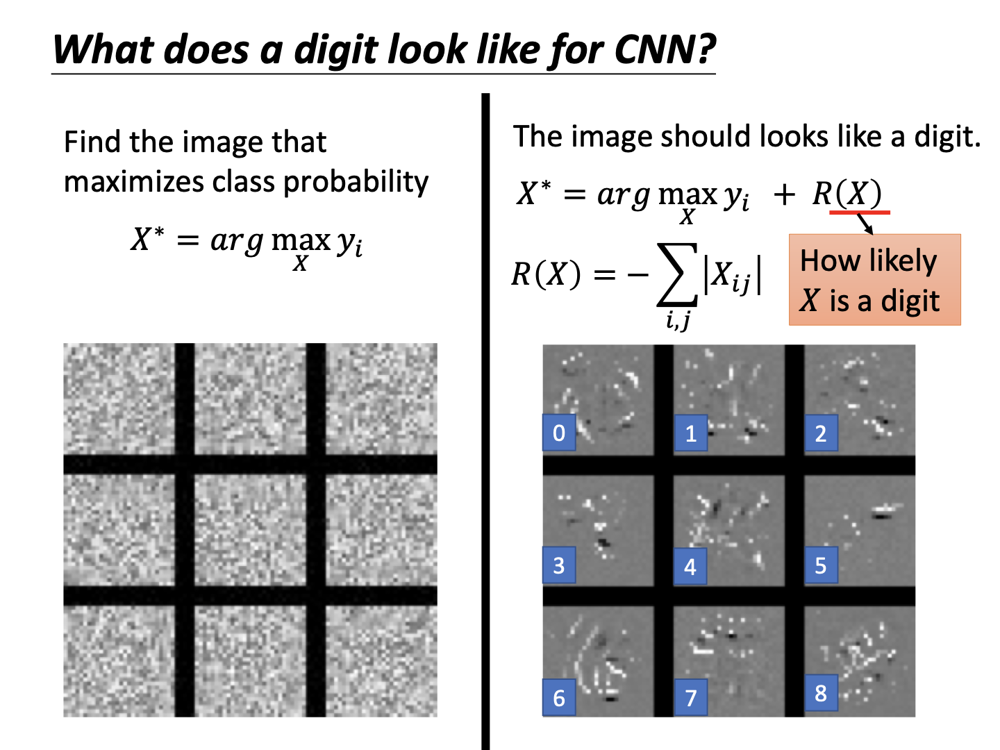

为了增加可解释性，必须加入限制，比如数字图片存在大量空白，将这一信息考虑进来，就可以迫使输出更靠近只有少量线条组成的图像，最终产生了一些似是而非的结果。比如这里的数字6对应的图片，确实有了一些相似的纹理。**然而我们发现，这实际上是需要通过各种限制来让图片变得“符合人的认知”。所以本质上可解释性只是在满足人的需求，毕竟机器可能有自己的理解。**

另一方面，加入限制的思想其实和GAN重合了。我们不妨将classifier当作一个discriminator，这样和一个generator共同训练，让generator生成的图片能够被classifier识别成某些分数较高的图片，从而观察generator产生的图片内容，达到解释模型的目的。确实这样流程下，可以看到较为有意义的图片内容。

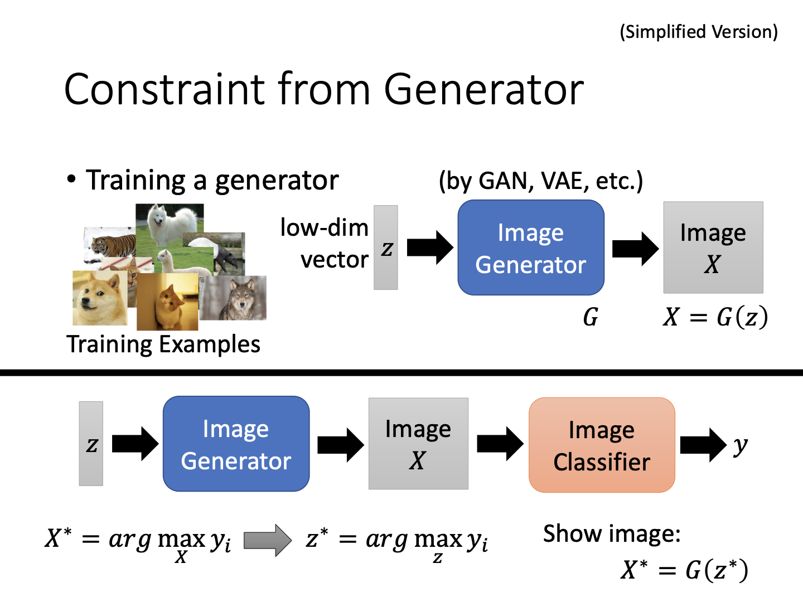

#### 跳出模型的解释

如果可以用一个简单模型来模拟复杂模型的行为结果，那么通过简单模型的解释，就可以映射复杂模型的解释性。例如对于神经网络，训练同样输入的线性模型，让输出和神经网络尽量接近，就可以用线性模型解释神经网络结果，例如一些输入特征在结果中的占比之类。

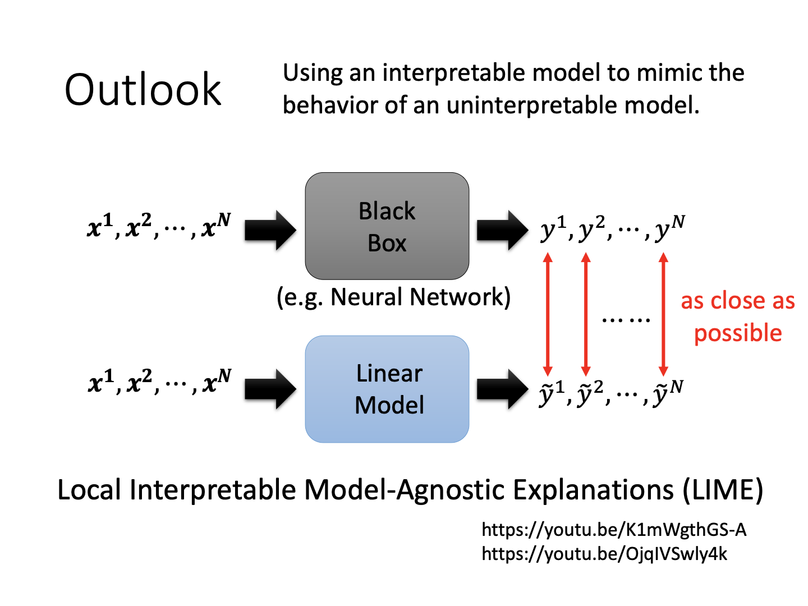

