# Generative Model

在传统的神经网络任务中，输入不同的x，给出不同的y。然而该网络无法处理对于确定输入产生多个输出的问题。例如，对于预测游戏画面，角色在某分叉点可能执行不同的下一步操作，但对应的前序训练资料可能相同，从而网络会产生误解。此时对不同的分叉结果赋予不同的采样概率，即可解决这一问题。如下图所示，当输入x时，同时输入一个分布的采样。对于不同的x选取同一个分布的不同采样，从而输出的y也开始遵循某一个分布。

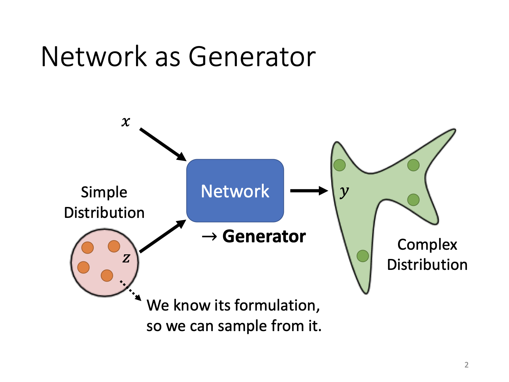

需要注意的是，用于采样的z分布必须足够简单（能够了解其分布），以便于采样。

***为什么需要分布信息？***

如上所述，当单输入可能对应多输出时，网络将需要数据的更多信息以处理。拟人化讲，这是一种“创造性”的要求。所以对于画面生成、聊天机器人等任务会更多地要求这一特性。

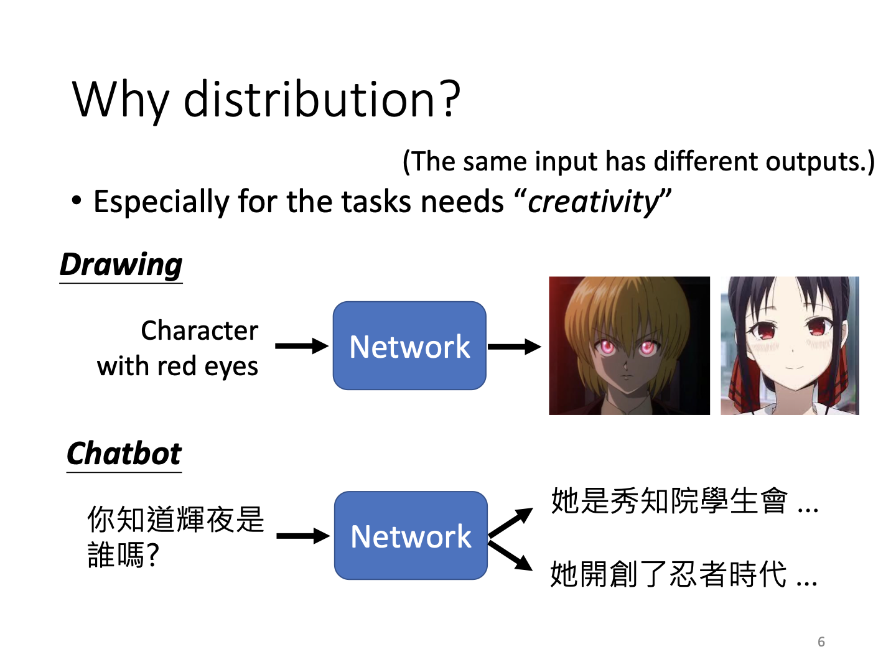

### GAN: Basic

首先以动漫人脸生成任务为例。输入不同的人脸数据x，同时辅以不同的分布向量，网络将会学习并输出对应的复杂分布输出y。

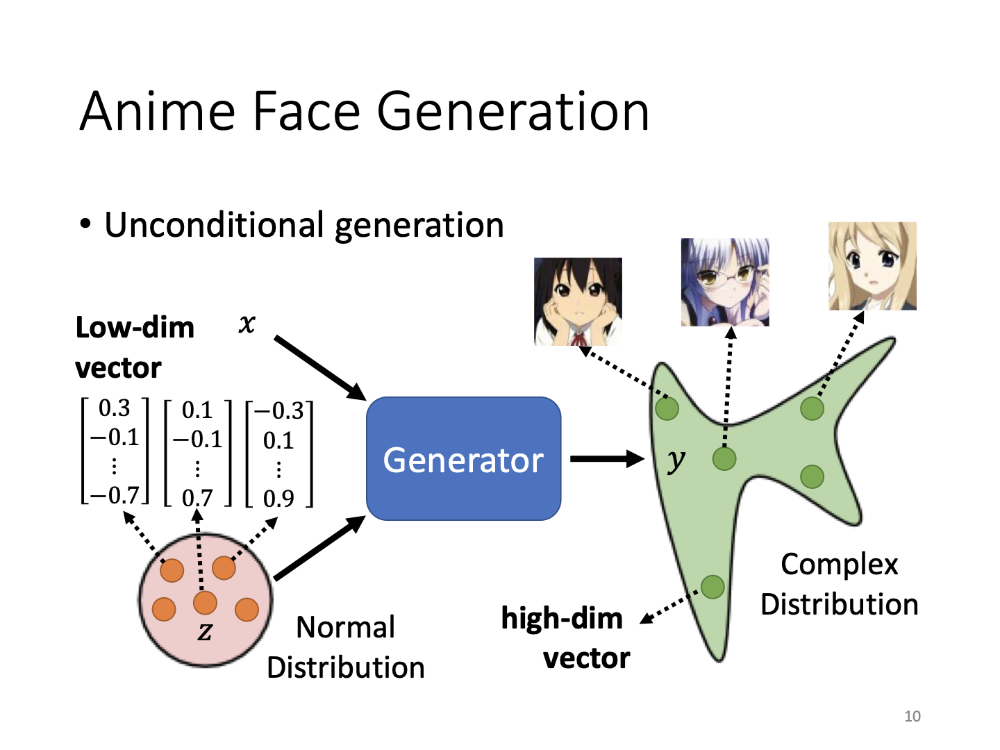

在这一过程中，产生了**Discriminator**的概念。Discriminator，即对某输入进行判定，并输出一标量值。通常定义其输入0-1间的实数，数值越大表明结果越接近。这里的接近是以我们的任务目标来判定的。例如对于动漫人脸生成，如果机器生成的图和目标的动漫人物图风格相似，那么分数将会较高。

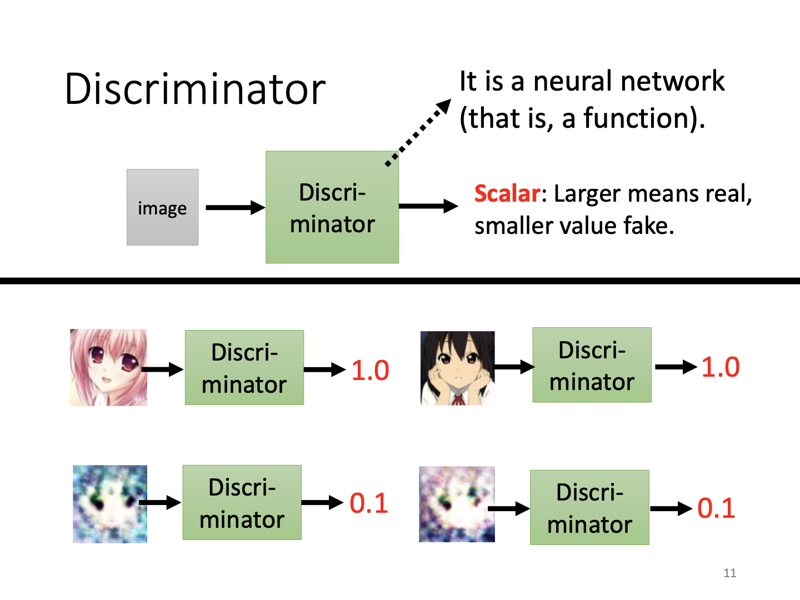

#### 基本思路

***仿生学角度：演化***

通过generator进行生成，再通过discriminator进行判别筛选，实际上是一种仿生学过程。首先discriminator判定生成的东西好坏，接下来generator通过这一判定来改进自己的生成结果，再用discriminator进行判别，如此循环。这也是GAN中对抗**adversarial**的由来。但在机器学习任务里是一种合作关系。

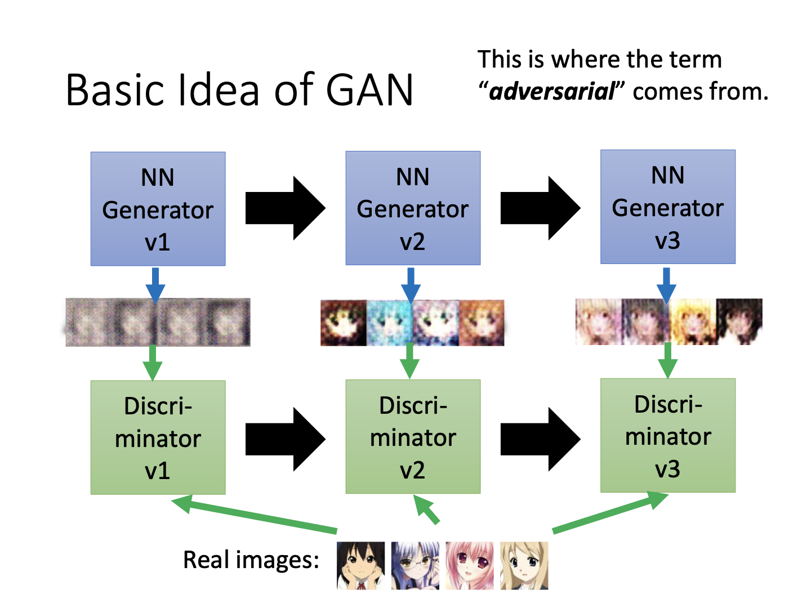

#### 训练流程

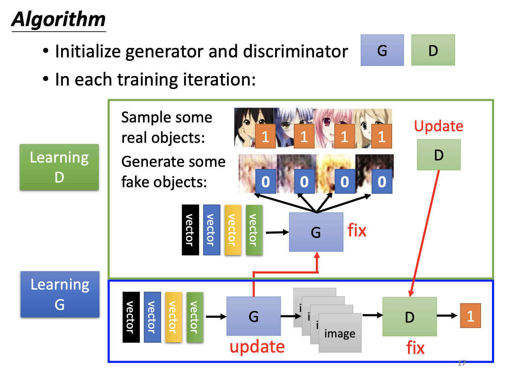

GAN的训练流程为：首先固定generator，训练discriminator对generator生成的内容和目标内容进行判定。此时discriminator对从数据库中选取的目标内容给予高分，而对生成内容给出低分；接下来固定该discriminator，将generator更新，其发现discriminator的偏好，修改自己的参数，以使得生成结果能够获得高分。如此往复多次，最终完成训练。

在新世代，GAN的效果可以以假乱真，不仅是针对动漫图片，对真实人脸也可达到类似效果。另外，对于某两角度不同的人脸，甚至可以输出其中间的变化：从左脸转动到右脸间的所有图片。

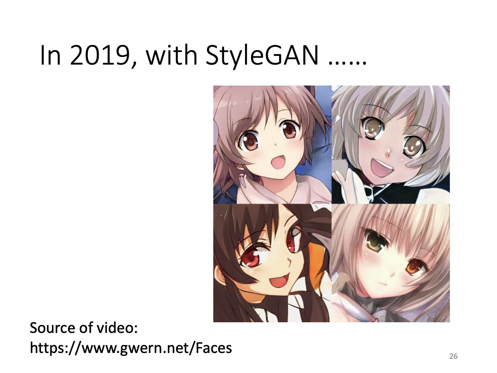

### Theory behind GAN

GAN的目标是让generator生成的内容与真实数据的分布尽量接近：

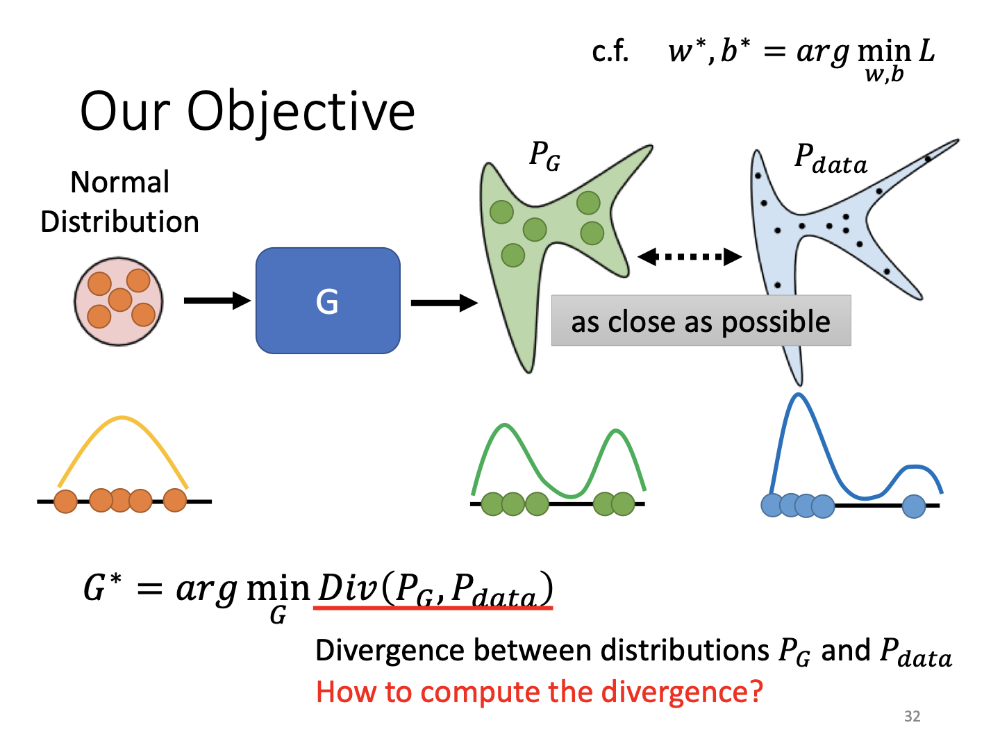

而这一系列分布间的衡量方式就是所谓的散度**divergence**。如果无法写出原始数据分布$P_{data}$和生成数据分布$P_G$，从对散度的定义来说，取出这些分布中的数据进行计算同样可以衡量分布的相似性。

我们先从discriminator的分类任务看起。其所做即为将来自两组不同数据集的抽样尽量分开。对于这样一个discriminator（记作D），要求输入的数据来自原始数据集时有较大分数，来自生成数据集时分数变小。最终定义出衡量数据相似性的目标函数$V(G, D)$，训练目标变为最大化这一函数。

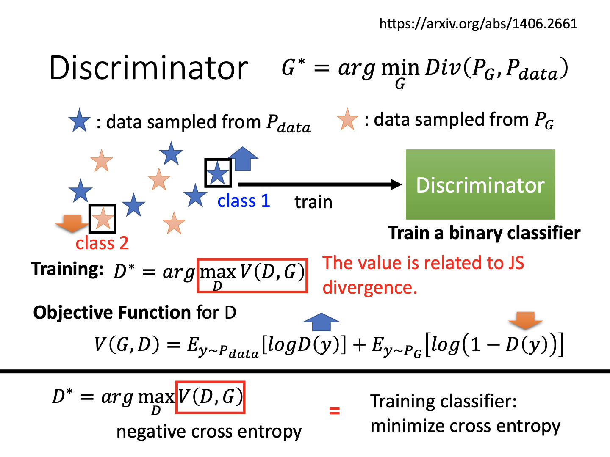

由需要可以定义出其中一种目标函数式如上，其实际上和二元分类的交叉熵定义相同。实际上$\max_DV(G, D)$和JS散度相关（证明忽略），所以求最大值后这一结果就变为了我们需要的散度。

既然得到了散度的结果，将这一结果代入先前对generator的优化函数里头，我们就得到了如下的式子：

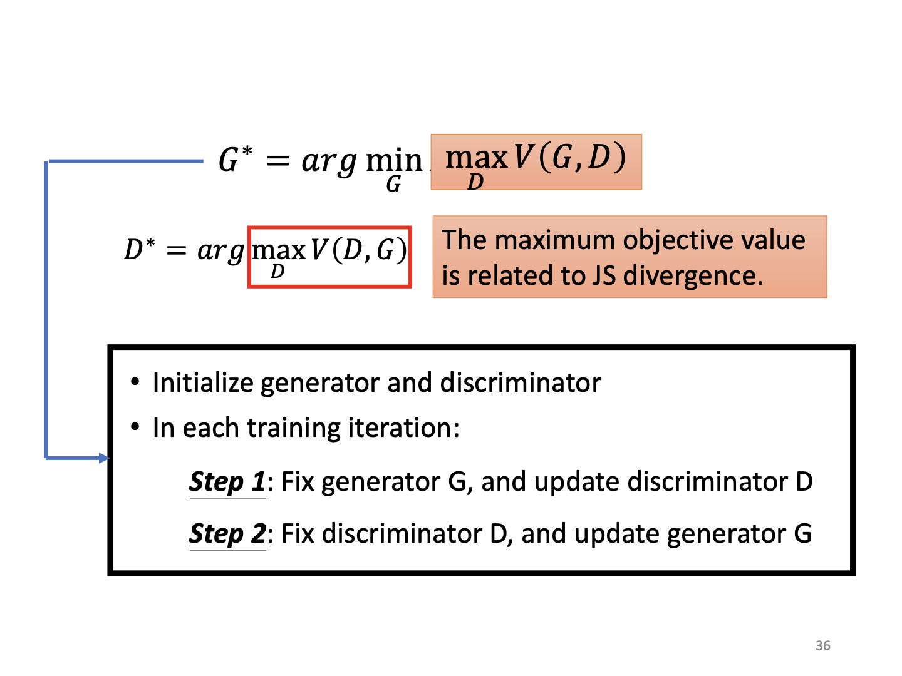

可以发现，这是一个minimax问题。所以需要先让D的目标函数最大，即红框部分最大。接下来固定D，更新G，即为在D的基础上优化G的目标函数。这实际上来自于minimax优化问题的思想，即先求出最大值，再对这个最大值求最小。当然其中还涉及到对偶理论的问题，就不再赘述了。需要注意的是，由这一训练过程，我推算出GAN的训练过程在每一轮对抗中是对同一批数据进行的。比如，将某一批真数据和某一批生成数据送入D，并让D的目标值最大；再将这一批生成数据和标签送入G，进行梯度下降修改G的参数。由此才可完成一轮训练。

### Tips for GAN

因为特殊的优化问题存在，所以GAN其实很难训练。

#### 目标函数的问题

实际上，在高维空间下，原始图像分布$P_{data}$和生成器分布$P_G$的重叠度并没有想象的高。随着维度增长，这类分布可能存在于高维空间中的子空间，从而难以重合（比如二维空间里头的两条线）。另外，抽样时可能无法充分，从而导致分布重叠的部分并未被完全考虑。

使用前述的JS散度时，低重叠度带来的恶果是，如果两个分布完全不重叠，那么计算得到的散度永远是固定常数。按照网络训练的想法，应该从两个不相似的分布逐渐靠近，这一过程在目标函数上体现为数值变化。然而当分布没有重叠（却在互相接近）的过程中，JS散度不变从而梯度下降没有任何帮助。

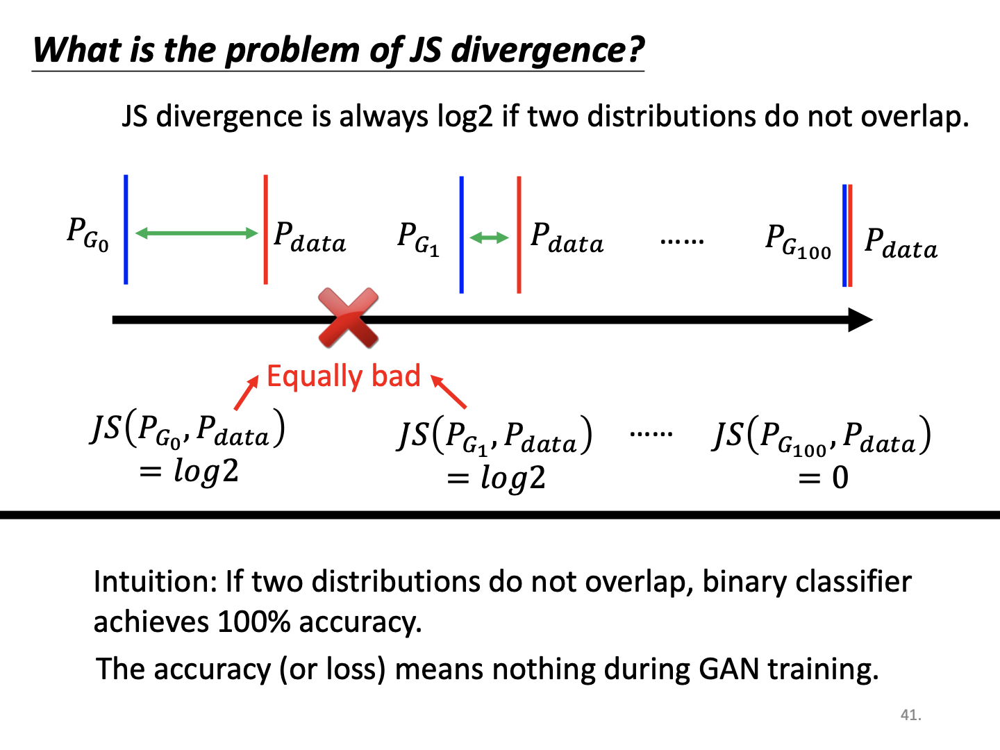

**Wasserstein Distance**

面对这一问题，改进目标函数成为当务之急。一种做法是定义衡量两个分布距离的函数。其中，将某一分布P移动到另一分布Q所需要的距离（开销）被定义为wasserstein distance。

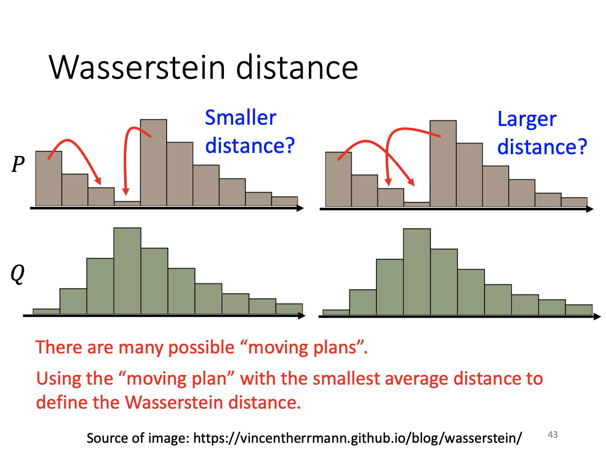

实际上因为数据的不同，这一分布有多重计算方法。为计算方便，定义将两个分布移动到相似位置的最小距离为所谓的wasserstein distance。这样一来，将两个分布从远处拉近，这一过程就可以体现在目标函数之中。

#### WGAN

使用上述距离，WGAN就产生了。

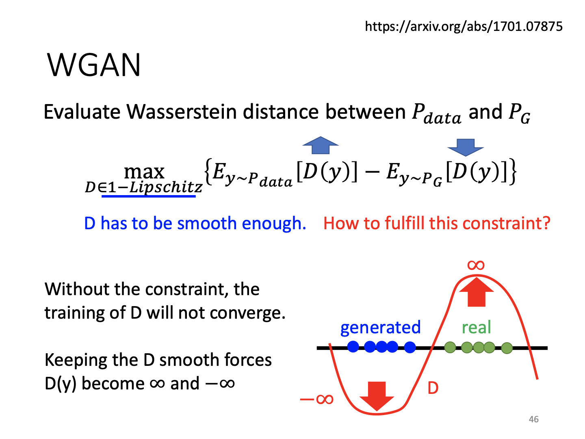

WGAN的目标函数定义和前述JS散度的类似，对真实数据目标分数最大化，生成器数据分数最小化。注意到这里的判别函数D有$1-Lipschitz$的限制，即表示有平滑度的要求。当两个不同数据集接近时，为表现出分数差别，D的取值会达到$\pm\infin$，这就违背了平滑度要求。这一限制可以使得两个数据集接近时，D必须较平滑，从而对两个数据集输出的分数相类似；而数据集远时，D可以有较大的波动。

为实现这一限制，一般有如下三种手段：

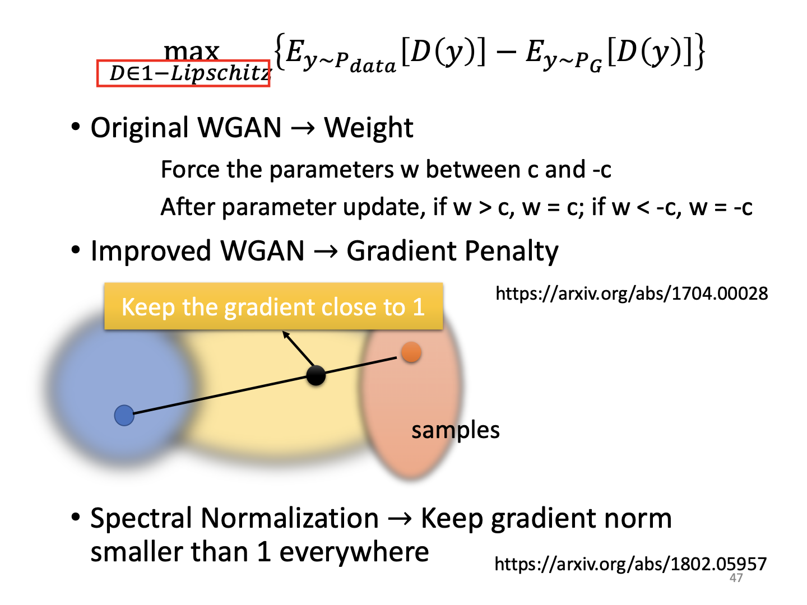

1.截尾。通过对权重限制，使得函数空间不会过于曲折，但效果一般；

2.梯度惩罚。让两个不同数据集间的判别函数梯度近似为1，也是一种平滑方式，当数据集分布接近时，该函数将被强制平滑，从而对两个数据集输出类似的值；

3.谱正则化。让梯度的范数处于某个限制。