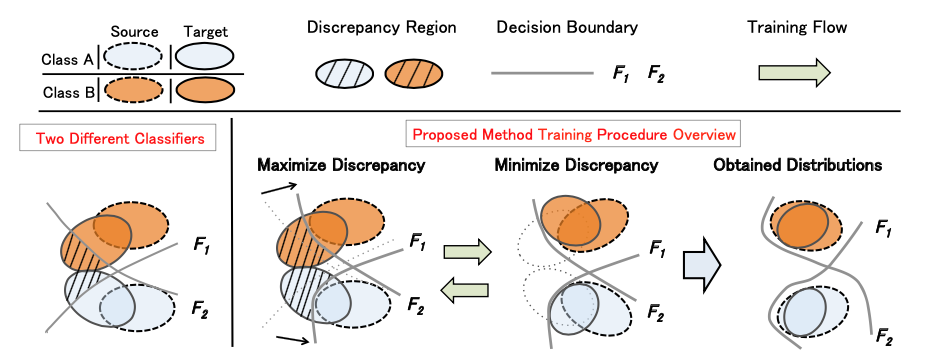

# Report

### 作业心得

该作业培养我们对adaptation的掌握。其目的为，通过自适应，让一个拥有较少真实图片（源）和较多手绘图片（目标）的网络能够在手绘图片上产生较好的分类预测结果。其中手绘图片没有标签。这里我主要是用的是DaNN模型。该模型将CNN当作一种encoder-decoder，此时encoder（feature extractor）应该尽量做到对于源集的数据和目标集的数据提取出来的特征尽量接近。在这一基础上，decoder对源集能够正确识别，也就能够对目标集正确识别了。为了实现这一目标，实际上网络就转化为了GAN。此时GAN需要想办法让encoder得到的两种不同数据集的feature越接近越好。在这里我将GAN中区分两个数据集的模块叫做domain classifier。助教在DaNN中实现的训练过程大致为：

1.训练domain classifier

从encoder得到的结果放入domain classifier，训练一步。此处的loss为：

```Python
loss = domain_criterion(domain_logits, domain_label)
```

其中criterion为nn.BCEWithLogitsLoss()，即二值交叉熵。

2.训练encoder和label classifier

将encoder提取出的源数据特征丢进label classifier，得到预测值。同时将所有数据特征放入domain classifier，将得到的值和domain label做差。前者用来训练正确的分类器结果，从而倒推让encoder和标签分类器得到训练；后者类似于GAN中的思想，让目标数据的域标签和源标签尽量接近，从而混淆目标数据和源数据。其loss为：

```Python
loss = class_criterion(class_logits, source_label) - lamb * domain_criterion(domain_logits, domain_label)
```

其中class_criterion为nn.CrossEntropyLoss()。

另外，为了获得更高的分数，我也参考了作业中提到的其他论文，并选定了*Maximum Classifier Discrepancy for Unsupervised Domain Adaptation*作为参考。通过阅读其论文与源代码可知，该方法利用一个generator和两个classifier，主要分为三个步骤。

1.利用源数据训练所有模块

此时源数据通过encoder后得到的特征被送入两个classifier，执行一次更新。

2.固定generator，训练discriminator

此时两个classifier充当encoder的判别机器。此时loss由两部分组成。一部分与1同，是两个classifier对于源数据得到的提取特征和源标签的差值之和。这里的差值可以是CrossEntropy。

```
loss_s1 = criterion(output_s1, label_s)
loss_s2 = criterion(output_s2, label_s)
loss_s = loss_s1 + loss_s2
```

另一部分是两个classifier对于目标数据得到的提取特征之差。作者认为这一部分越大越好。

```Python
loss_dis = self.discrepancy(output_t1, output_t2)
```

因此最终的loss为

```Python
loss = loss_s - loss_dis
```

3.固定discriminator，训练generator

这里的generator其实就是encoder。此时两个classifier输入同样是目标数据，但要最小化它们的差距。以下的num_k是内迭代的轮次，即可以对这一过程作出比前两个过程更多的更新。

```Python
for i in range(self.num_k):
  feat_t = self.G(img_t)
  output_t1 = self.C1(feat_t)
  output_t2 = self.C2(feat_t)
  loss_dis = self.discrepancy(output_t1, output_t2)
  loss_dis.backward()
  self.opt_g.step()
  self.reset_grad()
```

做个总结，个人认为，以上三个步骤首先是让所有模块对源数据有正确的分类。其次在对源数据正确分类的情况下，再让两个classifier对目标数据的分类结果产生分歧。这一过程是让它们的功能产生分化。最终，面对能分化预测结果的两个分类器，训练generator让两个classifier对目标数据的分类越接近越好。我认为这是让generator能有效提取出最共性的特征。根据论文的配图如下：



用形象的语言解释就是，让两个classifier对于和原始数据差异较大的部分产生分歧，再调整generator让分歧减少，推动这些差异变小。最终这一拮抗训练的过程能让generator和两个classifier将不同数据的特征分布拉到他们的source data上，并进行适应的分类。

### 训练日志

07.16

首先跑了一遍DaNN基础代码，200epoch，同时我设置$\lambda$为0.3，public score为0.58448，差一点超过。为了节省时间，我直接开始尝试boss baseline的实现。经过论文挑选，我选择了大致能理解透彻的MCD方法，并构想了其实现。但构思完成后我注意到已有代码，于是直接使用其实现，经过修改后移植。但最终public为0.44508。无奈之下，我重回DaNN，设置300epoch，$\lambda$为0.4，意外地发现结果为0.63382，成功超过medium。看来并不是什么方法都适用啊。