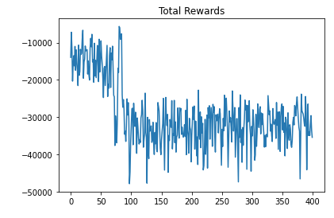

# Report

### 作业心得

该作业意在让我们熟悉基本的强化学习方法，主要实作了policy gradient和actor-critic两种。前者只需要记录reward的时候加入衰减系数，而后者需要重新定义网络。

1.Policy gradient

本作业中的策略是计算当前动作收到的所有奖励时，对越远的奖励乘上一个更小的衰减系数，即：
$$
R_t=\sum_{i=1}^T\gamma^{i-t}r_i
$$
代码中体现为：

```Python
for i in range(len(rewards) - 1):
    rewards[i] += pow(gamma, len(rewards) - 1 - i) * rewards[-1]
```

其中rewards为存储每个episode到当前所获的的奖励。训练的时候每5个动作-奖励序列为一组堆积送入网络进行loss学习。

2.Actor-critic

关于该方法，我直接实现了共享网络权重的技术。网络层代码如下：

```Python
class sharedNetwork(nn.Module):
    def __init__(self):
        super(sharedNetwork, self).__init__()
        # Shared FC
        self.sfc1 = nn.Linear(8, 16)
        self.sfc2 = nn.Linear(16, 32)
        self.sfc3 = nn.Linear(32, 32)

        # Actor FC
        self.actorfc1 = nn.Linear(32, 16)
        self.actorfc2 = nn.Linear(16, 4)
        # Critic FC
        self.criticfc1 = nn.Linear(32, 8)
        self.criticfc2 = nn.Linear(8, 1)

        self.relu = nn.LeakyReLU()
    
    def forward1(self, input):
        x = self.relu(self.sfc1(input))
        x = self.relu(self.sfc2(x))
        x = self.relu(self.sfc3(x))
        x = self.relu(self.actorfc1(x))
        return F.softmax(self.actorfc2(x), dim=-1)

    def forward2(self, input):
        x = self.relu(self.sfc1(input))
        x = self.relu(self.sfc2(x))
        x = self.relu(self.sfc3(x))
        x = self.relu(self.criticfc1(x))
        return self.criticfc2(x)
```

可以看到，对于actor和critic模块，它们的前部都需要通过共有的模块。因此这是一种共享的过程。因为担心原始的激活函数和网络结构过于简单，我进行了些微调整。另外，该网络的学习过程如下：

```Python
def learn(self, state, state_next, rewards, log_probs, gamma):
        # Learn critic
        value = self.network.forward2(state)
        value_next = self.network.forward2(state_next)
        td = rewards + gamma * value_next - value
        loss_critic = torch.square(td).sum()
        self.optimizer_critic.zero_grad()
        loss_critic.backward(retain_graph=True)
        # Learn actor
        loss_actor = -log_probs * rewards
        self.optimizer_actor.zero_grad()
        loss_actor.backward()
        
        self.optimizer_critic.step()
        self.optimizer_actor.step()
```

具体的算法过程参考如下图，也参考了https://zhuanlan.zhihu.com/p/110998399。

### 训练日志

09.08

运行了助教给出的基础代码，效果一般。因中途colab崩溃，所以最后的测试过程没进行完毕。

09.09

编写完policy gradient代码并测试，效果不错。最终平均总奖励为16.56。所使用的网络结构如下：

```Python
class PolicyGradientNetwork(nn.Module):
    def __init__(self):
        super().__init__()
        self.fc1 = nn.Linear(8, 16)
        self.fc2 = nn.Linear(16, 16)
        self.fc3 = nn.Linear(16, 4)
    def forward(self, state):
        hid = torch.tanh(self.fc1(state))
        hid = torch.tanh(self.fc2(hid))
        return F.softmax(self.fc3(hid), dim=-1)
```

打印出的total reward结果如图：


同时我也看了一下最终步的奖励：


09.10

今日写完actor-critic共享权重网络并调通，但训练结果极差，测试集平均最终奖励为-663.59，观察动作分布发现全程只执行了一个动作。total reward如下：



可见该结果比policy gradient差了太多。另外，final reward基本为-100：


因此可能我写的代码完全没有有效的训练，不知道是不是我参考的代码有问题。

另外，我也对原始的policy gradient网络结构做了改动，包括增加隐层单元、更改激活函数，但奇怪的是total reward一直在-10000左右震荡。最后我不得已，恢复原始网络后，仍然震荡，和9日的结果完全不同。当我要继续测试的时候colab又崩溃了。。。好不容易重新跑完训练，到调用测试的时候继续崩溃，看来没法继续跑了。重新用9日的网络得到结果如下：


可见RL的训练过程存在大量的不确定性，十分困难。作业到此结束。