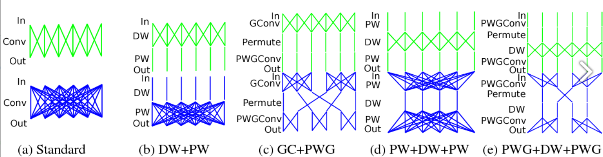
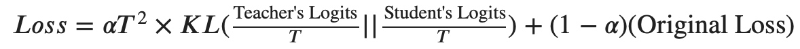

# Report

### 作业心得

本作业主要实践网络压缩和知识蒸馏。

**网络压缩**

本作业的网络压缩主要关心结构设计上的压缩。例如MobileNet里头常用的Deptiwise Convolution和Pointwise Convolution。



```Python
def dwpw_conv(in_chs, out_chs, kernel_size, stride, padding):
    return nn.Sequential(
        nn.Conv2d(in_chs, in_chs, kernels, stride, padding, groups=in_chs),
        nn.Conv2d(in_chs, out_chs, 1),
    )
```

实际上就是分组通道内卷积与跨通道卷积。根据计算，一般能压缩计算量至原网络模型的$\frac{1}{D_k^2}$，其中$D_k$是原卷积核的长宽（假设正方形）。同时参数量也有较大压缩。例如，原始某模块参数量为$D_{in}*D_{out}*D_k^2$，其中前两个变量为输入与输出通道数量。而压缩后模块参数量为$D_{in}*D_k^2+D_{out}*D_{in}$，也有较大压缩。

**知识蒸馏**

知识蒸馏以教师网络的输出为目标，让一个结构更简单的学生网络进行学习，通过优化学生网络与教师网络输出的差值，从而完成学生网络的训练。其损失函数例：



代码实现为：

```Python
def loss_fn_kd(outputs, labels, teacher_outputs, alpha=0.5):
    hard_loss = F.cross_entropy(outputs, labels) * (1. - alpha) 
    T = 2
    # ---------- TODO ----------
    # Complete soft loss in knowledge distillation
    temp = torch.log(teacher_outputs / T) - torch.log(outputs / T)
    KL = torch.sum(torch.mul(teacher_outputs / T, temp), axis=1)
    soft_loss = alpha * pow(T, 2) * KL
    return hard_loss + soft_loss
```

由于助教提供的教师模型灭失，无法进行后续知识蒸馏过程，故作业到此为止。