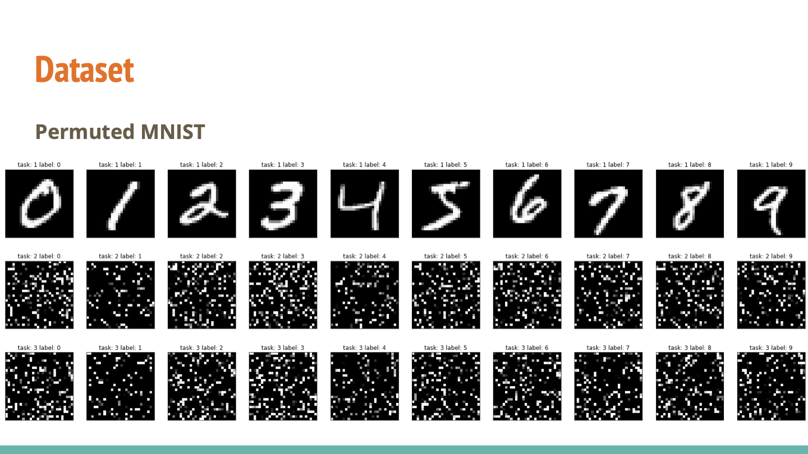

# Report

### 作业心得

本作业实践了各类终身学习方法，通过在loss中融合参数信息进行优化调整。

因时间有限，外加所有内容均已由助教实现，因此本作业的手作部分为0。考虑到训练耗时太长，故不进行模型训练，直接使用助教结果。

本例中将Mnist手写数字识别任务的数据进行随机排序，从而人为制造出多个不同任务。数据可视化结果如下：




评估方法为，针对每个任务的每个epoch，跑完后对所有任务的测试数据进行输出，并平均结果，作为当前训练后的总体多任务结果。该过程在代码中有直接体现。我的理解是，第一个任务为正常的任务，而后面的任务是无意义的学习。通过对后面的任务加以学习，如果能够仍然保持对所有任务（特别是第一个任务）有较好的结果，那么就说明达到了终身学习的目的。毕竟按照任务顺序来排，第一个任务是最早完成的，也是最应该被拿来检验的。

在作业中，主要涉及Regularization-based方法，即在损失函数后加入关于参数的正则项（新旧参数的差值）。从而在训练新任务的时候，限制参数的大量移动。

**1.Baseline Model**

基准模型并未对参数更新的权重作出更改，仅定义了代码结构，故不讨论。其第一个epoch和最后一个epoch结果分别为94.17999999999999与83.206，说明经过多轮训练后，平均准确率下降明显，即并未达到终身学习的目的。

**2.EWC**

EWC方法中，系数矩阵的公式定义如下：


体现在代码中为：

```Python
for data in dataloader:
  self.model.zero_grad()
  # get image data
  input = data[0].to(self.device)
  # image data forward model
  output = self.model(input)
  # Simply use groud truth label of dataset.  
  label = data[1].to(self.device)
  # print(output.shape, label.shape)

  ############################################################################
  #####                     generate Fisher(F) matrix for EWC            #####
  ############################################################################    
  loss = F.nll_loss(F.log_softmax(output, dim=1), label)             
  loss.backward()                                                    
  ############################################################################

  for n, p in self.model.named_parameters():
    # get the gradient of each parameter and square it, then average it in all validation set.                          
    precision_matrices[n].data += p.grad.data ** 2 / number_data   
```

其求解过程为，从log损失函数中求取梯度信息后，将每个参数的梯度信息取平方。而其定义的产生任务本身训练loss的函数为：

```Python
def penalty(self, model: nn.Module):
  loss = 0
  for n, p in model.named_parameters():
    _loss = self._precision_matrices[n] * (p - self.p_old[n]) ** 2
    loss += _loss.sum()
    return loss
```

可以看到，其loss为每个参数元素位的对应系数乘上该参数新旧值的差值平方。这一方法能够比baseline进步不少。其最终头尾结果为93.89和91.09400000000001。对比baseline结果发现，学到最后，模型的性能下降量减少了，说明该方法有效保护了参数，不至于被过度改动。

**其他方法**

助教还实现了MAS、SI、Remanian Walk等方法，时间关系，并未仔细研究。