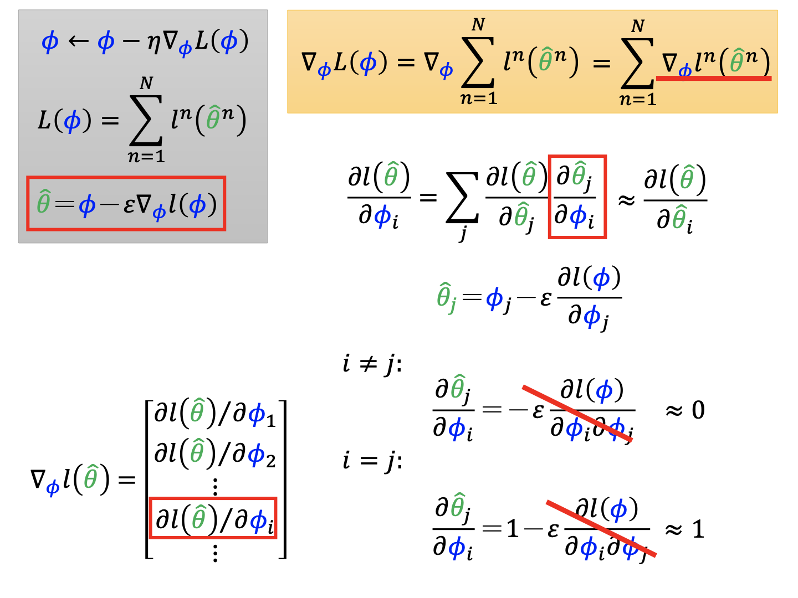

# Report

### 作业心得

本作业考察对MAML方法的理解。给出的任务是Omniglot字符识别。代码均由助教实现，故我并未进行运行。但是，对于其中涉及的两个变体，仍进行了理解。

**1.FOMAML**

FOMAML是对MAML的一阶近似。首先，MAML的主要过程可以概括为：在训练任务中选采样点→进行梯度下降得到更新参数→各个任务用自己更新的参数，从而得到一个所有任务的损失函数→进行梯度下降过程。所以，这时候所求的梯度是对原始采样时候模型参数的二阶梯度。



如图，$\phi$为原始参数，而$\theta$为各子任务在原始参数基础上更新的参数。而模型的目标是，对于使用新参数$\theta$的各个任务，找一个下降梯度。所以这时候继续对$\phi$求导，就产生了二阶过程。根据上图推论，如果将二阶导数忽略，即使用一阶导数，能够避免大量求和计算（毕竟根据$\theta$算出的模型结果也由原始参数$\phi$决定，因此需要逐个求导）。上述过程相当于，inner loop里头迭代后不保留计算图，而是直接更新参数。当进入outer loop更新参数的时候，是在已更新过的参数$\theta$上进行更新，避免了计算图的复杂求导。其代码如下：

```Python
def inner_update_alt1(fast_weights, loss, inner_lr):
    grads = torch.autograd.grad(
        loss, fast_weights.values(), create_graph=False)
    # Perform SGD
    fast_weights = OrderedDict(
        (name, param - inner_lr * grad)
        for ((name, param), grad) in zip(fast_weights.items(), grads))
    return fast_weights
```

注意，原始的MAML也用这段代码，唯一的区别是create_graph=True。

**2.ANIL**

ANIL是“Almost no inner loop”的缩写。一般的MAML在子任务和全体任务的参数更新中都要走一步。然而ANIL为子任务更新的参数移动量增加了限制，这就是“Feature Reuse”的思想。实际上在代码中体现为，几层网络的参数不参与子任务更新。


```Python
def inner_update_alt2(fast_weights, loss, inner_lr):
    grads = torch.autograd.grad(
        loss, list(fast_weights.values())[-2:], create_graph=True)
    # Split out the logits
    for ((name, param), grad) in zip(
        list(fast_weights.items())[-2:], grads):
        fast_weights[name] = param - inner_lr * grad
    return fast_weights
```

可以看到，这里的fast_weights里，只有部分参数被拿来求导，只留下了初层网络。