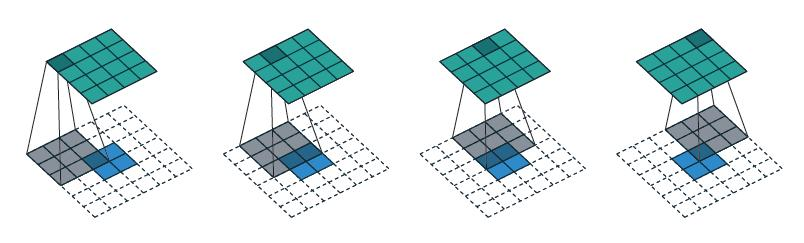

# Report

### 作业心得

该作业为使用GAN进行动漫头像生成任务，以熟悉GAN的使用。

作业代码基本如助教所示，无需过多更改。simple baseline为跑完代码，并且因为GAN的结果不稳定，也需要一定的运气。medium为将模型架构切换为助教内置好的WGAN，strong为使用DCGAN+SNGAN，boss为使用各种ppt中列出的奇怪GAN。该作业与我的领域相关不大，因此我只大致阅读了代码，并未运行。关于WGAN的内容，在GAN的笔记中有详细说明。

关于代码，GAN因为有特征提取与重建，需要将维度压缩再放大，需使用到nn.ConvTranspose2d，具体介绍请参考：https://www.freesion.com/article/53151034051/。它在小图像上扩大卷积，从而提升信息的维度，以完成decoder的功能。其过程如下：

易知，其实际上是一种维度扩大的卷积操作，也被称为反卷积。

### 训练日志

无