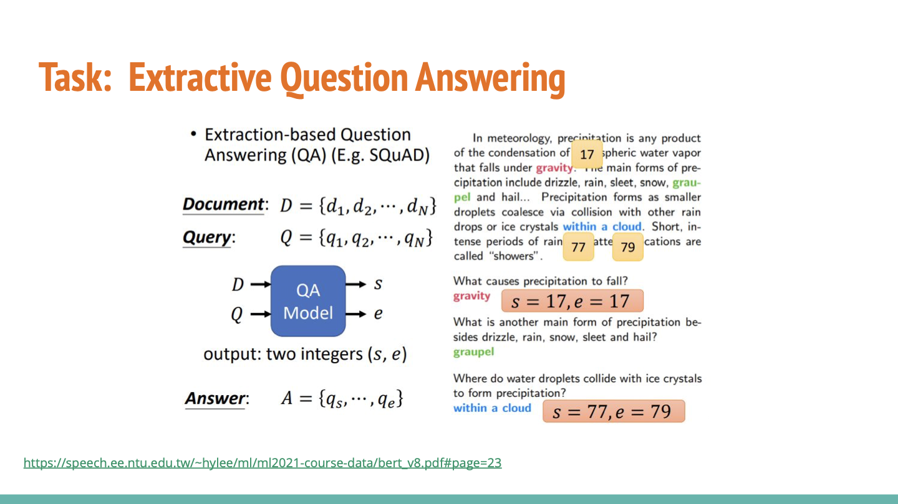
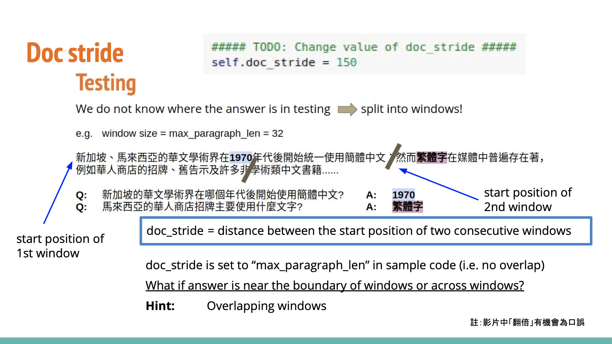

# Report

### 作业心得

本次作业要求从一个BERT预训练模型开始进行fine-tune，以完成文档抽取（Extractive Question Answering）的下游任务。该任务输入为词句token，输出为指示答案的开始与结束token位置。运行基础代码就可以通过simple baseline，使用学习率下降和调整doc_stride就能通过medium baseline，加上preprocessing和使用其他预训练模型是通过strong baseline的条件，而boss baseline则需要改进postprocessing和对以上技巧的深入使用。



助教提示对于medium baseline，需要使用线性学习率下降和修改doc_stride。前者是对于每一个训练步，下降一次学习率。但我在实作中是针对一个epoch（包含很多step）下降一次，所以可能没有达到预期效果。另外，doc_stride涉及到问答任务的一个关键问题。首先，我们在测试时，无法知道答案的位置，所以是对一段话使用多个滑动窗口进行扫描：



理想的做法是每次均扫描模型所能处理的最大长度，但是处在窗口边界的问答信息可能由此被截断。所以可以通过调整重叠的大小。例如，将doc_stride改为100，则两个窗口之间相隔100个token。对于最大长度150token的窗口，两个窗口之间就产生了重叠，对于边界的数据有效地进行了处理。

助教代码中默认问题的答案处在需要分割的训练数据窗口中间，因此定位到答案后，取其前后相同长度的窗口进行训练。但这一方法同样存在局限性。若答案处在一段话的末尾，则这种数据产生方法会把与答案不相关的内容加入训练，造成不必要的噪声。因此需要进行preprocessing操作。我的思路是检查将答案置中算出的数据窗口结束处和答案之间的token，如果出现分号、句号等明显表示分段的token，则从这个token开始往前截取数据窗口长度。

我在训练中使用过别的预训练模型，在训练开始的效果比较好，但后期过拟合严重，且最终效果不如基准模型。考虑到时间关系，我并未尝试过多的预训练模型。

关于postprocessing，从预测结果中看不出问题。提示中言明需要考虑如果预测的结束位置比开始位置靠前的情况。个人直觉感受，这一情况可能造成句子倒序，但答案中暂未发现。我想到的处理方法是在挑选时考虑位置信息的顺序，如果找到结束位置比开始位置靠前，则抛弃这一选择。同样由于时间关系，我并未实现。最终模型差点通过medium baseline。

### 训练日志

05.18

运行代码，实现preprocessing：

```Python
# Judge if sentence split is located between answer and end of the paragraph
temp_paragraph = tokenized_paragraph.ids[answer_end_token : paragraph_end]
temp_idx = -1
for j in cutFlag_tok:
  i = j[0]
  if i in temp_paragraph:
    temp_idx = temp_paragraph.index(i)
    break
    mid = (answer_start_token + answer_end_token) // 2
    len_left = self.max_paragraph_len - temp_idx
    if temp_idx != -1: # should be cut before the paragraph_end
      paragraph_start = max(0, min(mid - len_left, len(tokenized_paragraph) - self.max_paragraph_len))
      paragraph_end = paragraph_start + self.max_paragraph_len
```

该代码意为，对于预先找到的在答案两侧的文本，观察选取的paragraph_end到答案之间是否有某些表示结束的标点，若有则将句子向前平移，以避免出现跨句子的训练产生干扰。

另外，助教提到，在测试时，原始的做法是对于一段文字，不重叠地切分，在每个分段内寻找答案。但是一旦答案出现在分段的边界，就有可能导致答案被切断，造成预测错误。所以doc_stride这一参数可以选择比max_paragraph_len更小，从而在搜寻的时候使用重叠的窗口。我将这一参数从150调为100。

经过以上努力，一个epoch的训练结果如下：


此时kaggle的分数为0.67162。但同时我留下doc_stride，关闭preprocessing后，发现训练过程：


易见在一开始的准确率其实比加了preprocessing高。因为只是一个epoch，所以不能完全说明问题。在后续的训练中我还会保留这些内容。

05.19

使用模型wptoux/albert-chinese-large-qa，一开始的acc就很高，但是随着训练进行，val的准确率不断下降。加上scheduler = torch.optim.lr_scheduler.StepLR(optimizer, step_size=1, gamma=0.9)后，10epoch后结果如下：


此时，public score为0.55091，效果并不好。

重新换回原始的预训练模型，9epoch后，分数为0.66018。

