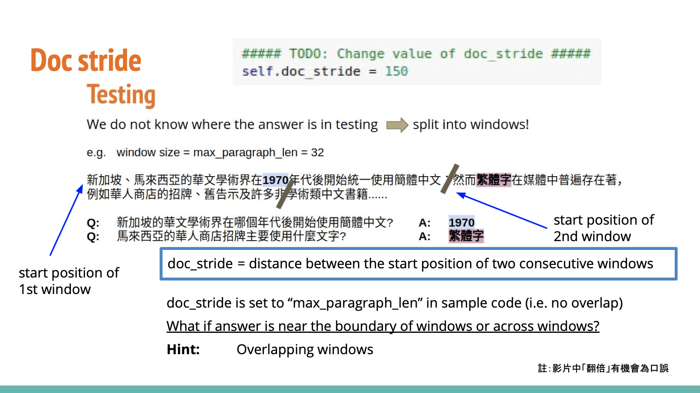

# Report

### 作业心得


### 训练日志

05.18

运行代码，实现preprocessing：

```Python
# Judge if sentence split is located between answer and end of the paragraph
temp_paragraph = tokenized_paragraph.ids[answer_end_token : paragraph_end]
temp_idx = -1
for j in cutFlag_tok:
  i = j[0]
  if i in temp_paragraph:
    temp_idx = temp_paragraph.index(i)
    break
    mid = (answer_start_token + answer_end_token) // 2
    len_left = self.max_paragraph_len - temp_idx
    if temp_idx != -1: # should be cut before the paragraph_end
      paragraph_start = max(0, min(mid - len_left, len(tokenized_paragraph) - self.max_paragraph_len))
      paragraph_end = paragraph_start + self.max_paragraph_len
```

该代码意为，对于预先找到的在答案两侧的文本，观察选取的paragraph_end到答案之间是否有某些表示结束的标点，若有则将句子向前平移，以避免出现跨句子的训练产生干扰。

另外，助教提到，在测试时，原始的做法是对于一段文字，不重叠地切分，在每个分段内寻找答案。但是一旦答案出现在分段的边界，就有可能导致答案被切断，造成预测错误。所以doc_stride这一参数可以选择比max_paragraph_len更小，从而在搜寻的时候使用重叠的窗口。我将这一参数从150调为100。



经过以上努力，一个epoch的训练结果如下：


此时kaggle的分数为0.67162。但同时我留下doc_stride，关闭preprocessing后，发现训练过程：


易见在一开始的准确率其实比加了preprocessing高。因为只是一个epoch，所以不能完全说明问题。在后续的训练中我还会保留这些内容。

05.19

使用模型wptoux/albert-chinese-large-qa，一开始的acc就很高，但是随着训练进行，val的准确率不断下降。加上scheduler = torch.optim.lr_scheduler.StepLR(optimizer, step_size=1, gamma=0.9)后，10epoch后结果如下：


此时，public score为0.55091，效果并不好。

重新换回原始的预训练模型，9epoch后，分数为0.66018

