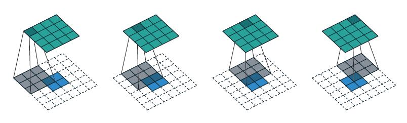

# Report

### 作业心得

本次作业为训练一个异常检测器。其实现思路是通过使用大量同类型数据训练encoder-decoder，再用其他类别数据输入该网络，若重建结果与输入数据相差较大，说明不符合encoder-decoder提取的数据特征，从而无法重建。重建结果和输入数据之间的差异度即被定义为异常分数。该准则可以是MSE。

该作业中，输入数据为图片。助教给出了几种模型结构，包括全连接网络（FCN）、CNN、VAE、ResNet等。时间问题，我主要在CNN和ResNet上进行了试验。因为encoder提取数据特征并降低维度，而auto-encoder要求最后输出的是原尺寸数据，所以图像任务在decoder中使用到了nn.ConvTranspose2d，具体介绍请参考：https://www.freesion.com/article/53151034051/。它在小图像上扩大卷积，从而提升信息的维度，以完成decoder的功能。实际上在HW6中已经出现。



助教代码中已经给出FCN、CNN、VAE、ResNet等网络架构的encoder。时间有限，我只尝试了CNN和ResNet，发现后者过于复杂，反而不如CNN好。strong baseline的要求是加入batchnorm和更多次训练。而boss baseline要求用一个额外的分类器来控制输出图像的质量、加入随机噪声构成的异常图片进行数据增强、训练基于GAN的分类任务等。我只做了简单尝试，将CNN的两层剔除，加入bn层。最终public score为0.72015。作为对比，medium为0.75719，simple为0.64046。可见训练网络也是一门技术，这里实在是没法再提高了，可能要从网络结构上进行穷举，并不符合我学习的目的，遂停止。

### 训练日志

05.18

尝试用ResNet跑，发现public score为0.37654，过于低了，说明可能需要超长时间的训练，遂弃用该方法。

05.19

原有CNN分数为0.67605，超过simple baseline。为响应更高分数的要求，作出如下修改：

```Python
class conv_autoencoder(nn.Module):
    def __init__(self):
        super(conv_autoencoder, self).__init__()
        self.encoder = nn.Sequential(
            nn.Conv2d(3, 12, 4, stride=2, padding=1),
            nn.BatchNorm2d(12),         
            nn.LeakyReLU(),
            nn.Conv2d(12, 24, 4, stride=2, padding=1), 
            nn.BatchNorm2d(24),       
            nn.LeakyReLU(),
			      nn.Conv2d(24, 48, 4, stride=2, padding=1), 
            nn.BatchNorm2d(48),          
            nn.LeakyReLU(),
            # nn.Conv2d(48, 96, 4, stride=2, padding=1),   # medium: remove this layer
            # nn.ReLU(),
        )
        self.decoder = nn.Sequential(
            # nn.ConvTranspose2d(96, 48, 4, stride=2, padding=1), # medium: remove this layer
            # nn.ReLU(),
			      nn.ConvTranspose2d(48, 24, 4, stride=2, padding=1), 
            nn.BatchNorm2d(24),
            nn.LeakyReLU(),
			      nn.ConvTranspose2d(24, 12, 4, stride=2, padding=1), 
            nn.BatchNorm2d(12),
            nn.LeakyReLU(),
            nn.ConvTranspose2d(12, 3, 4, stride=2, padding=1),
            nn.BatchNorm2d(3),
            nn.Tanh(),
        )

    def forward(self, x):
        x = self.encoder(x)
        x = self.decoder(x)
        return x
```

将48-96通道的卷积删去，分数提高到0.72015。


