# Course Introduction

### 机器学习的定义：自动寻找一种函数

#### Regression：

函数的输出是标量，表示为输出与输入的数值关系。

#### Classification：

**二元分类**：给定输入，确定二分类输出；

**多元分类**：给定输入，确定多分类输出，如图像分类。

#### Structured Learning：

生成文句or图像。

### 如何告诉机器找到函数-以Youtube观众人数预测为例

**1.Fuction with Unknown Parameters**

利用一些未知参数与输入$x$共同构建一个函数输出$y=b+wx$，一个建模的过程。

**2. Define Loss from Training Data**

Loss是一个函数，输入是模型参数（**实际上所谓的输入是指以模型的当前参数为例，将数据输入**），输出的是函数结果的优劣性，即衡量模型输出和真实输出之间的差距。

***常用损失函数***

一般用MAE、MSE等，对于概率分布数据，可用Cross-Entropy。

通过定义损失函数，可以算出误差函数关于不同的模型参数的等高线图“Error Surface”。

**3. Optimization**

一般用**Gradient Descent**。

以一个参数$w$为例：

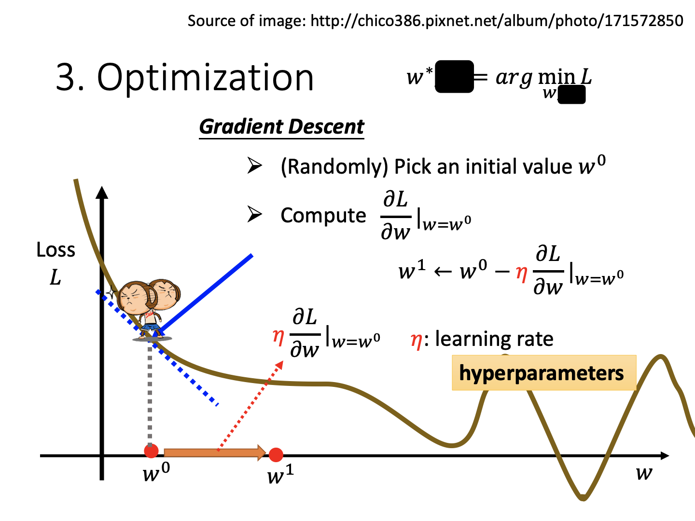

通过计算梯度，以图例一维下降为例，对于一个最小化问题，负梯度代表我们需要增加$w$，否则减少。

在下降时，可以自己设置一个优化步长$\eta$，由此确定下降，该步长称为**hyperparameter**。

从图上容易看出，该下降过程有可能并没有真的下降到最低，而困在前一个低谷，即**local minima**。

对于用Youtube频道观众数量进行下一天的预测这一任务，简单的单变量线性模型表现极其一般，但是观众数量基本都是周期性变化的（一周），所以如果考虑周期性会怎样：

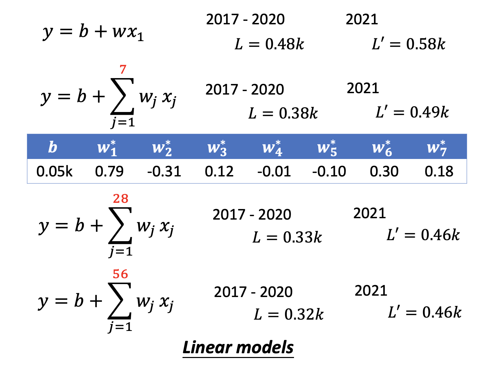

可以看到，这一系列模型都是将输入$x$乘上一个$w$（可能是向量），再加上一个bias即得，这称为**Linear Model**。

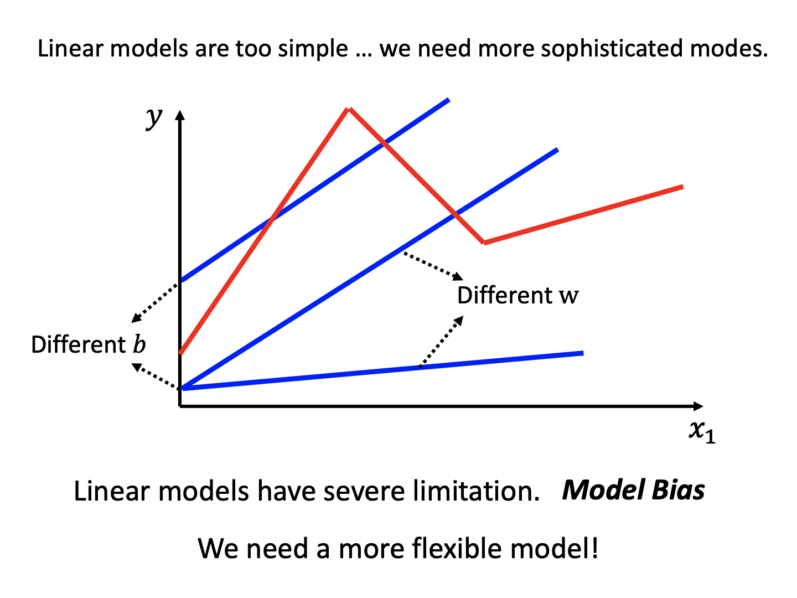

线性模型存在极大的限制性，这称作**Model Bias**。但我们渐渐发现，其实多个不同的线性函数组合可以得到比较复杂的函数，渐渐地，它们就有能力组合成一条曲线，从而描述更加复杂的关系。

### 不同的函数模型？

#### Sigmoid函数

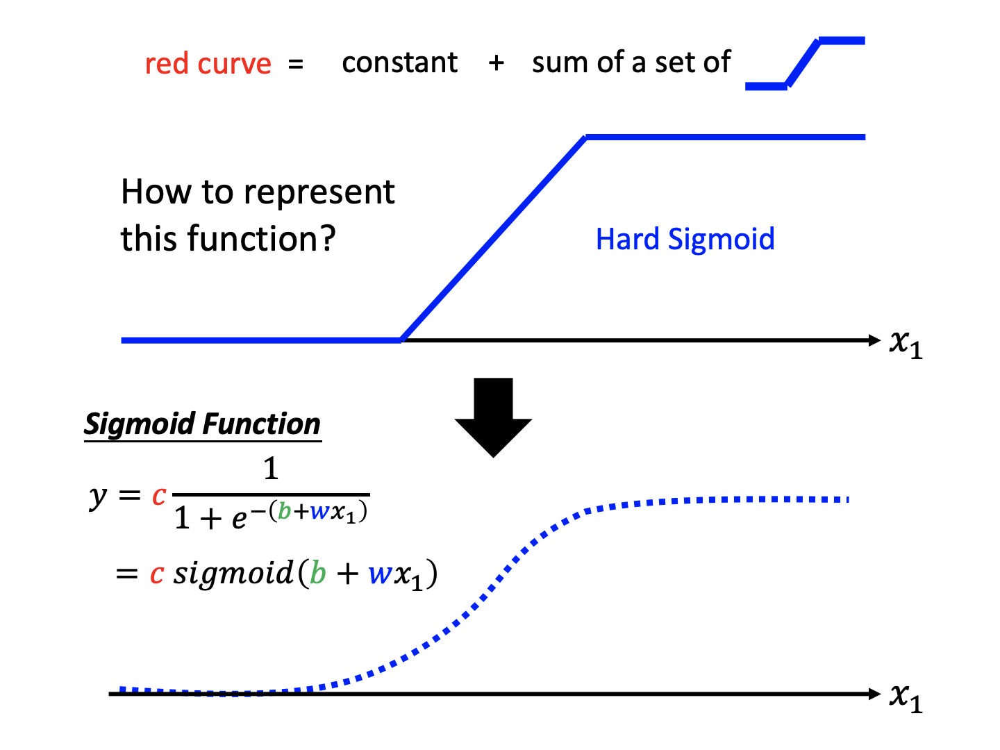

此处介绍一种新的函数Sigmoid，实际上可见其和折线段也是比较接近的，通过调节参数可以得到各种不同的结果。通过复合不同的函数、增加输入的数量，得到一个全新的模型：

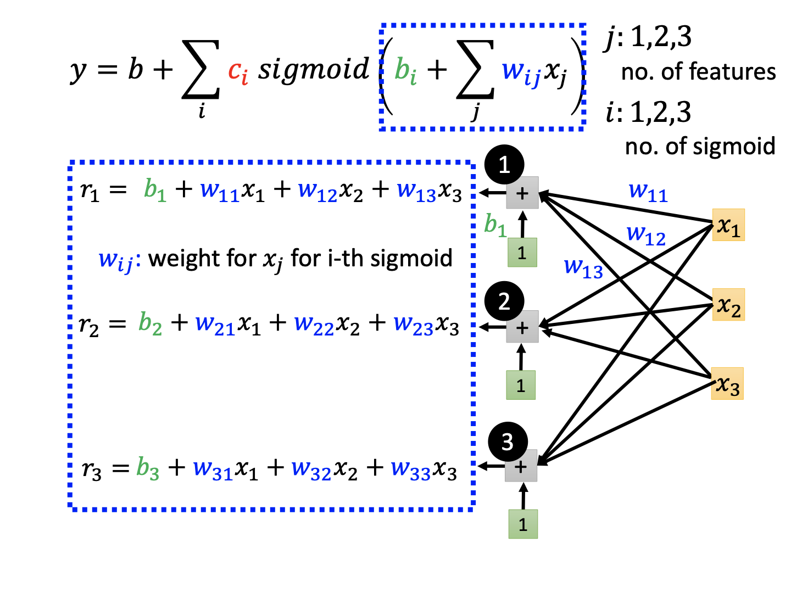

将三个$x_i$分别映射到三个不同的Sigmoid函数之中。使用矩阵写法可以将上述运算简写：$\boldsymbol r=\boldsymbol b+\boldsymbol W\boldsymbol x$

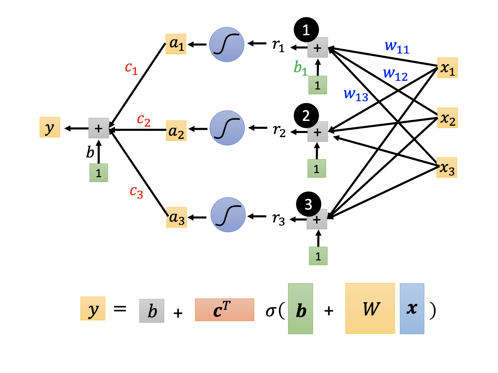

通过矩阵表示，我们改写出了一个新的函数。

#### 优化一个通用模型

将上述的各类参数拼成一个向量$\boldsymbol\theta$，就可以写出关于其的梯度下降过程：

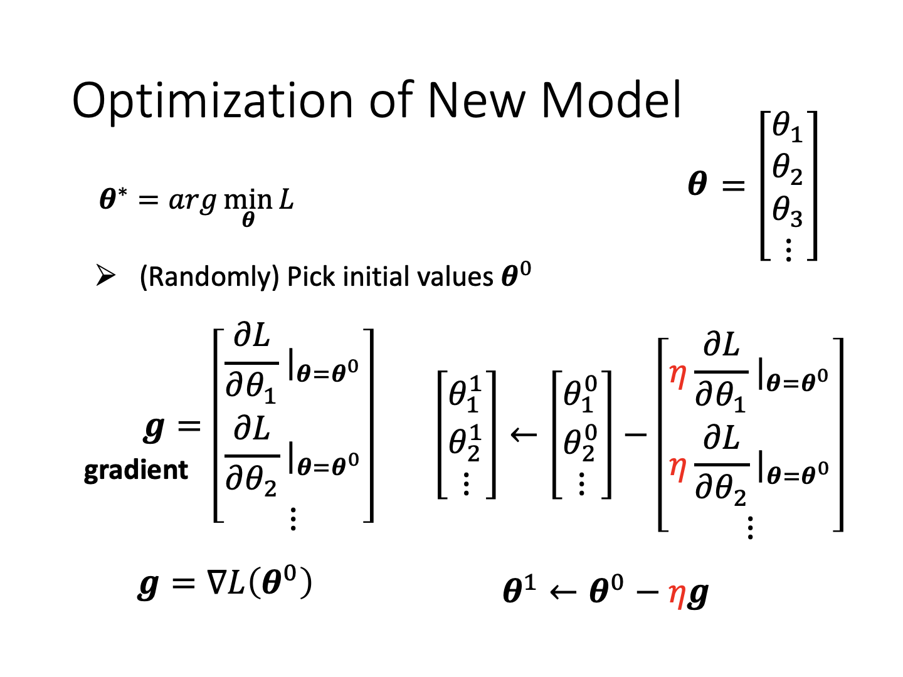

实际上在优化的过程中，不用全体数据集进行计算，而是对每一batch的数据进行训练更新，每一次更新称为**update**，而经过所有batch数据的过程称为一个**epoch**。

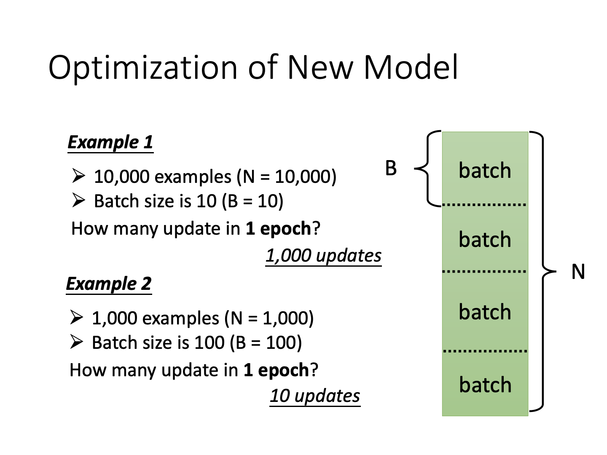

在一个epoch中，参数的update次数是不一定的，根据batch size而变。

#### ReLU

另外一种函数叫做Rectified Linear Unit

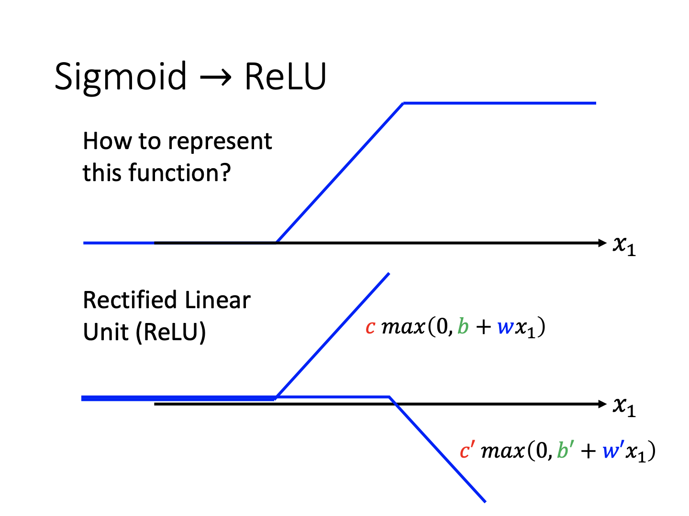

实际上ReLU的组合也可以作出Sigmoid的近似。

通过复合实际上可以将这些函数模型进行叠加，产生足够复杂的模型：

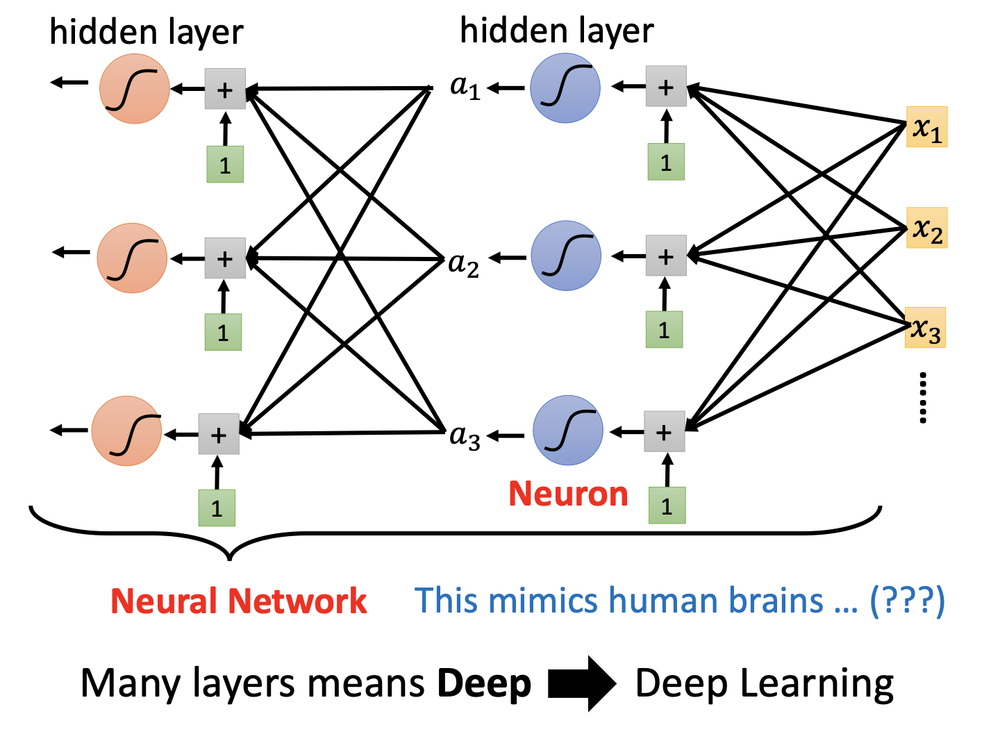

每一个函数都叫一个**Neuron**，而一系列Neuron组合成一个**Hidden Layer**。一系列的layer结合，产生了**Deep Learning**。

当然，训练深度模型也是有诀窍的，比如这里的模型在4层的时候在训练结果特别好，但是在测试数据2021年上居然比三层结果变差了，这就是**Overfitting**。

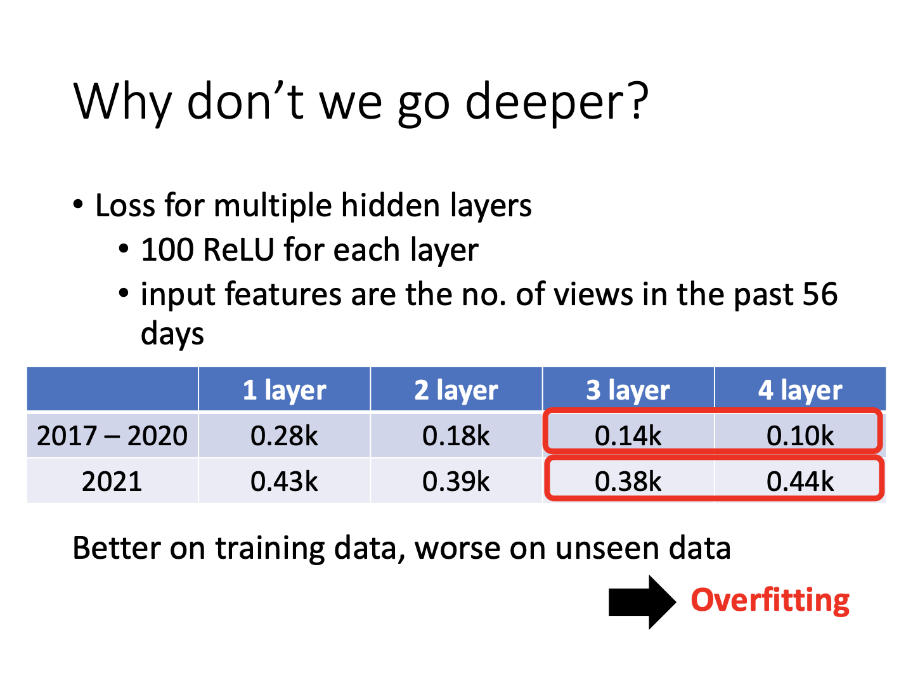

