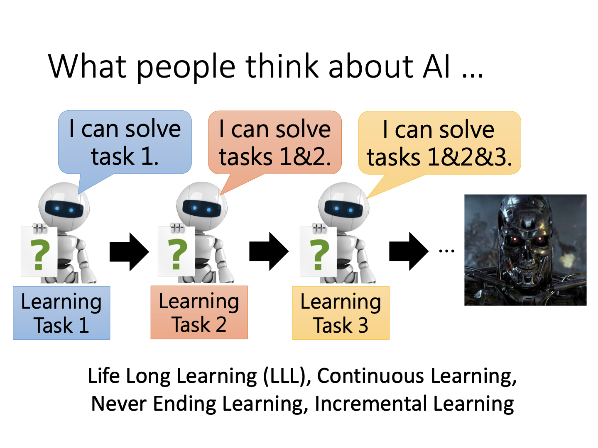
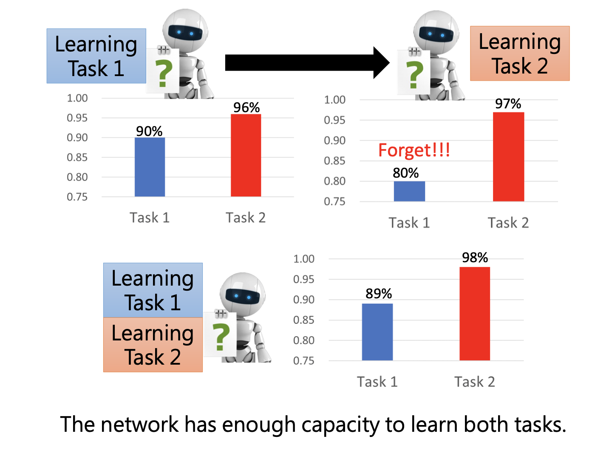
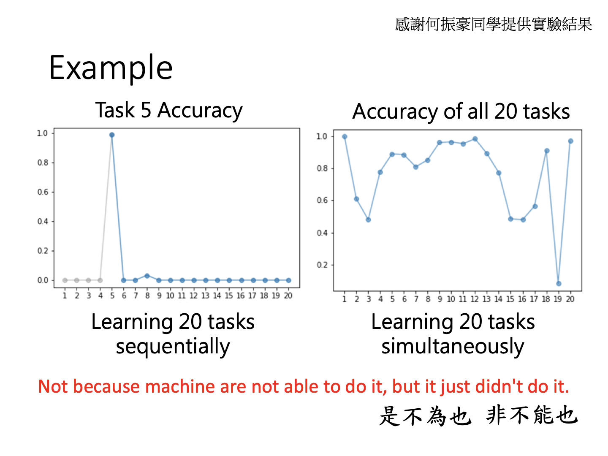
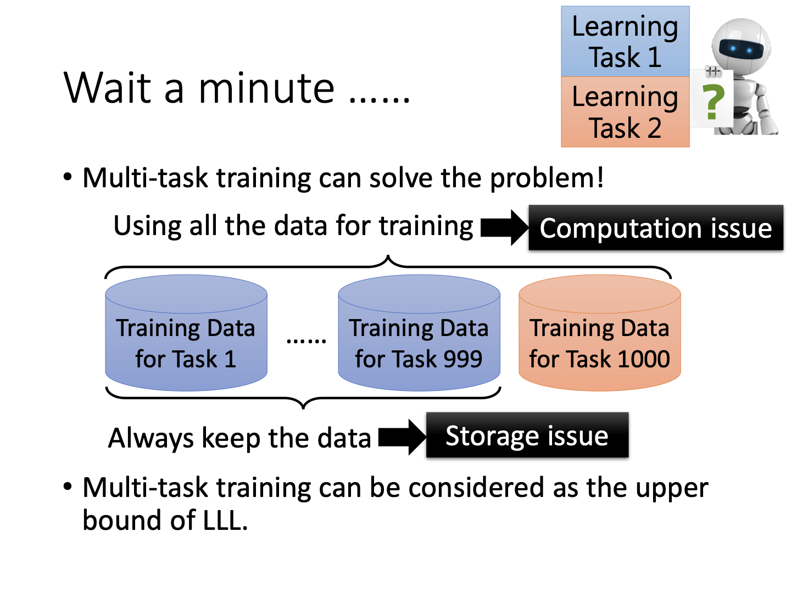
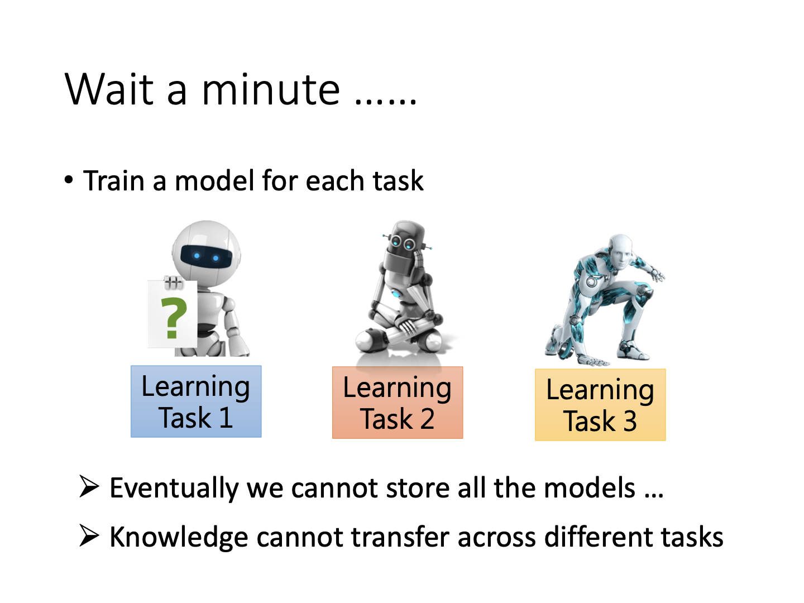
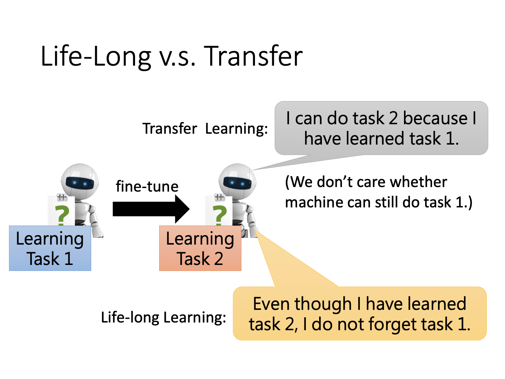
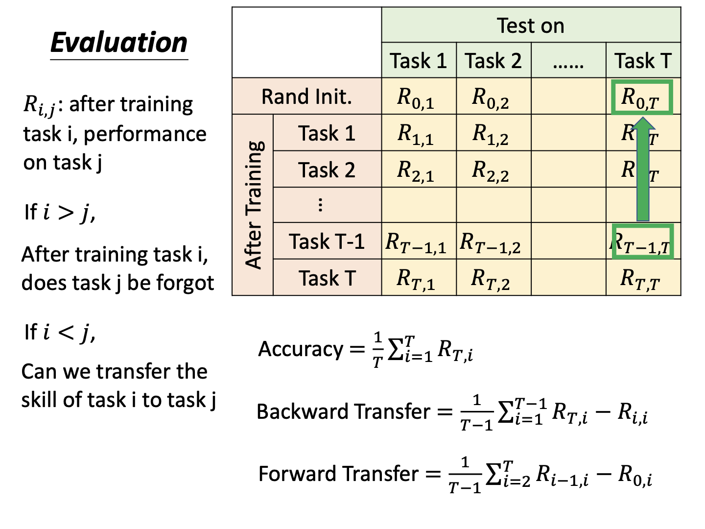

# Life Long Learning

终身学习（Life Long Learning，LLL）的概念原本是对人类而言的，如今在机器学习上也引入这一概念，表明了人对于AI能力进步的一种期望。终身学习可以表现为机器不断学习新任务，从而可以解从其诞生开始学习过的所有任务。在实际应用中，利用某批数据训练得到模型，与在线应用、用户交互后得到反馈数据并更新模型，也算作一种终身学习。

然而，对于大量的任务，如果让机器每次只训练一个，会得到什么结果？一份针对Mnist数据集的实验给出了答案：

Task1是对手写数据添加大量噪声，Task2则是原始数据。可以看到，先学习任务1，在任务1与2都得到了较好的表现。接下来如果继续用这套参数学习任务2，那么任务1的表现大幅度下降。另外，将两个任务数据混合，机器的效果还不错。

### Catastrophic Forgetting

对于以上的结果，研究者将其称为灾难性遗忘。另一个更直观的例子是对20个简单的语言问答任务进行测试。我们以任务5的准确率来评估，左图表示顺序学习20个任务，横坐标为学习的任务编号顺序，纵坐标为准确率，表示在学习到第x个任务时任务5的准确率；右图为同时学习20个任务，横坐标为每个任务的编号，表示第x个任务的准确率。

不难看出，对于顺序学习，在任务1-4中，任务5的准确率几乎为0，这可以理解为暂时未学到相关知识。在任务5被学到的时候，其准确率飙升至1，但随着后续任务的学习，模型权重直接被调整，准确率回到了惨不忍睹的结果。而对于将数据一起丢进网络的右图结果，有大部分任务的准确率都较高。以上实验表明，机器并不是没能力同时做多个任务，而是这种普通的训练方式无法让它达成目的。

#### 为什么不同时训练

同时训练包括“同时使用所有数据”与“同时训练多个模型”两种概念。

**同时使用所有数据**

同时使用所有数据，也被称为多任务学习（Multi-task learning）。不难看出，该方法需要处理的数据数量相比训练一个任务多得多。并且为了这最后一个任务，前面的任务数据都需要保留。所以会带来计算和存储开销增大的问题。当然，该方法效果确实好，所以可以被当作LLL的一个性能上界。

**同时训练多个模型**

如果同时训练多个模型，同样地需要存储大量模型，造成存储开销。并且从直觉来看，有些相关的任务也许数据、权重可以共享。换言之，任务之间的知识时可以联系的。如果独立训练模型，那么某些数据对于其他数据本具有数据增强的效果，却被人为取消了，同样是个弊端。

#### 和迁移学习的关系

迁移学习针对两个不同的任务，目标任务在源任务学习得到的模型上微调参数，但它抛弃了前一个任务的性能。而终身学习要求同时吸收多个任务，不能为了某个任务去降低其他任务的结果。

#### 评估标准

在终身学习中，可以通过如下表格记录每个任务的准确率。其中下标i与j的大小表示任务的顺序关系。若i>j，则表示学习i后，j的准确率，也就是被遗忘的程度；而i<j表示学习了i而不知道j时，对j的表现如何，也就是无师自通的能力。

从而，我们有三种评估指标：accuracy、backward transfer与forward transfer。

**Accuracy**

每个任务的accuracy表示训练完所有任务后，所有任务的平均准确率。

**Backward transfer**

BT是将训练完所有任务后的准确率与训练某个任务后测试该任务的准确率作差，将这一差值对所有任务的求和取平均。该指标用以指明当训练全部结束后，最终的准确率与只训练自己任务的最好准确率差距，用来真实地衡量遗忘的程度。

**Forward transfer**

FT表示训练在某个任务i时，在见过其前面所有其他任务后，与初始化参数$R_{0,i}$对比，究竟能“无师自通”多少。