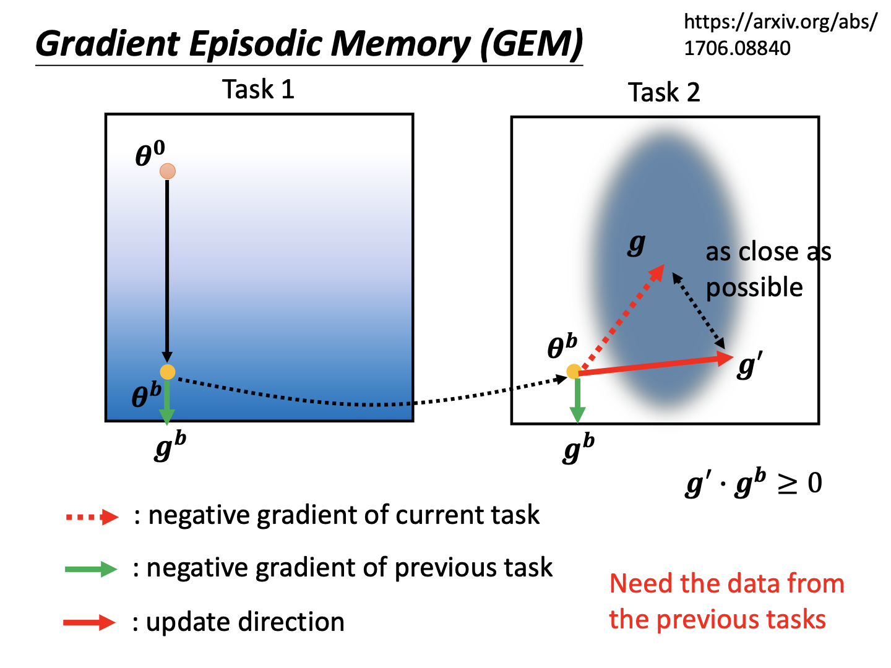
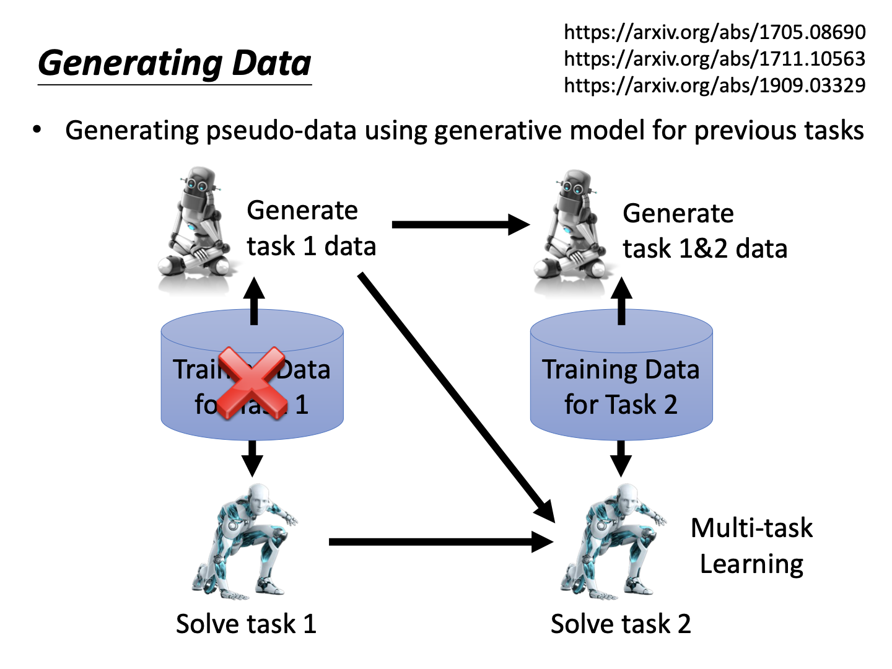

# Life Long Learning

终身学习（Life Long Learning，LLL）的概念原本是对人类而言的，如今在机器学习上也引入这一概念，表明了人对于AI能力进步的一种期望。终身学习可以表现为机器不断学习新任务，从而可以解从其诞生开始学习过的所有任务。在实际应用中，利用某批数据训练得到模型，与在线应用、用户交互后得到反馈数据并更新模型，也算作一种终身学习。

然而，对于大量的任务，如果让机器每次只训练一个，会得到什么结果？一份针对Mnist数据集的实验给出了答案：

Task1是对手写数据添加大量噪声，Task2则是原始数据。可以看到，先学习任务1，在任务1与2都得到了较好的表现。接下来如果继续用这套参数学习任务2，那么任务1的表现大幅度下降。另外，将两个任务数据混合，机器的效果还不错。

### Catastrophic Forgetting

对于以上的结果，研究者将其称为灾难性遗忘。另一个更直观的例子是对20个简单的语言问答任务进行测试。我们以任务5的准确率来评估，左图表示顺序学习20个任务，横坐标为学习的任务编号顺序，纵坐标为准确率，表示在学习到第x个任务时任务5的准确率；右图为同时学习20个任务，横坐标为每个任务的编号，表示第x个任务的准确率。

不难看出，对于顺序学习，在任务1-4中，任务5的准确率几乎为0，这可以理解为暂时未学到相关知识。在任务5被学到的时候，其准确率飙升至1，但随着后续任务的学习，模型权重直接被调整，准确率回到了惨不忍睹的结果。而对于将数据一起丢进网络的右图结果，有大部分任务的准确率都较高。以上实验表明，机器并不是没能力同时做多个任务，而是这种普通的训练方式无法让它达成目的。

#### 为什么不同时训练

同时训练包括“同时使用所有数据”与“同时训练多个模型”两种概念。

**同时使用所有数据**

同时使用所有数据，也被称为多任务学习（Multi-task learning）。不难看出，该方法需要处理的数据数量相比训练一个任务多得多。并且为了这最后一个任务，前面的任务数据都需要保留。所以会带来计算和存储开销增大的问题。当然，该方法效果确实好，所以可以被当作LLL的一个性能上界。

**同时训练多个模型**

如果同时训练多个模型，同样地需要存储大量模型，造成存储开销。并且从直觉来看，有些相关的任务也许数据、权重可以共享。换言之，任务之间的知识时可以联系的。如果独立训练模型，那么某些数据对于其他数据本具有数据增强的效果，却被人为取消了，同样是个弊端。

#### 和迁移学习的关系

迁移学习针对两个不同的任务，目标任务在源任务学习得到的模型上微调参数，但它抛弃了前一个任务的性能。而终身学习要求同时吸收多个任务，不能为了某个任务去降低其他任务的结果。

#### 评估标准

在终身学习中，可以通过如下表格记录每个任务的准确率。其中下标i与j的大小表示任务的顺序关系。若i>j，则表示学习i后，j的准确率，也就是被遗忘的程度；而i<j表示学习了i而不知道j时，对j的表现如何，也就是无师自通的能力。

从而，我们有三种评估指标：accuracy、backward transfer与forward transfer。

**Accuracy**

每个任务的accuracy表示训练完所有任务后，所有任务的平均准确率。

**Backward transfer**

BT是将训练完所有任务后的准确率与训练某个任务后测试该任务的准确率作差，将这一差值对所有任务的求和取平均。该指标用以指明当训练全部结束后，最终的准确率与只训练自己任务的最好准确率差距，用来真实地衡量遗忘的程度。

**Forward transfer**

FT表示训练在某个任务i时，在见过其前面所有其他任务后，与初始化参数$R_{0,i}$对比，究竟能“无师自通”多少。

### 三种解决方案

#### Selective Synaptic Plasticity

此方案翻译为“选择性突触可塑”，即在训练中只有部分的参数会被改变。换言之，这是一种基于正则化的方法。

为了阐释该方法的意义，我们以一个2参数（可以可视化）的网络为例，画出两个任务的error surface：

对于任务1，$\theta_2$较小的地方都是loss较低的，而对于任务2，只有中间的一块区域才是。然而在任务1中，参数按照梯度下降的方式更新到$\theta^b$后，再挪到任务2学习，就会因为其loss下降的方向，被移动到$\theta^*$，而这个参数在任务1中并不是loss最低点。明眼人都知道，只要把$\theta^b$向右移动一点就好了，那么该怎么做呢？这就引出了该方法的具体过程，对不同的参数施加不同的系数限制：

在该方法优化过程中，最终损失函数添加上一个衡量当前参数和过往参数的差值项，看起来和正则项极其相似。$b_i$是人为调控的参数，当其趋于0，表示新的参数相比过去的参数调整很多都没有影响（等于毫无限制的终身学习，当然会产生灾难性遗忘）；而趋于1则表示新的参数必须忠于老的参数（从而难以学入新的任务）。

定义了新的损失函数，接下来的研究重点就是$b_i$的确定。这里的想法和可解释性中类似，移动某个参数值，观察损失函数的变化，若变化不大，说明该参数的变化影响较小，就可以设置比较小的$b_i$。

从实验结果也可以看出，普通的SGD在经过新的任务学习后，对旧的任务效果不断减低。L2正则化等同于参数$b_i$设为1，对新任务很难学进去，效果也不好。而EWC代表上面提到的根据不同的模型参数情况设定不同的$b_i$，综合效果不错。

还有一种与参数限制相关的方法叫GEM（Gradient Episodic Memory），通过结合其他任务参数，合力确定梯度下降方向。

这一方法需要使用到过往任务的数据，但因为只是确定大致梯度，所以数据并不多，还算符合终身学习的要求，否则就会变成多任务学习了。

#### Additional Neural Resource Allocation

另一种方法将网络资源看作是可变化的，在学习中去调控增加，以记忆不同的任务：

如图，如果在训练任务2的时候，使用任务1的参数，但开启一个新的模型来进行训练任务2，就可以不折损任务1的效果，并让任务2能够用到任务1学到的模型信息，以此类推。这种方法最大的问题就是，它仍然需要一个任务对应一个模型，只是某种程度上的权重共享，仍有存储爆炸的缺点。也有方法提出，在一开始就使用一个比较大的网络，对任务1训练完后剪枝留下一部分参数，再把空出来的参数留给任务2，以此类推。当然这个方法和前一种相比有点朝三暮四了。

#### Memory Reply

本课介绍的最后一种方法主要提到了生成数据的想法。

当机器解任务1时，同时得到一个能够生成数据1的生成器，在任务2训练中，利用生成的数据1和数据2合并训练，做一种多任务学习。同时，机器将让生成器学习同时生成数据1与数据2，以此类推。这样，不需要存储所有任务的数据，而是通过存储一个生成器，在需要的时候产生数据即可。但该方法显然带来计算上的开销。老师提到，这一方法可以让模型性能逼近上界。这也不奇怪，毕竟上界就是多任务学习产生的。所以这一过程的核心主要是对生成器的训练了。