# Meta Learning

## Meta Learning

### Introduction of Meta Learning

Meta Learning（元学习）是一种让机器学习如何学习的方法。下图为一种机器学习流程，通过训练数据集对分类器$f*$进行学习，在测试数据集上进行验证。这一过程表述为任务函数F。然而，是否有方法对F进行学习，即获得一种，遇见不同数据集，都能学到对应$f*$的算法？

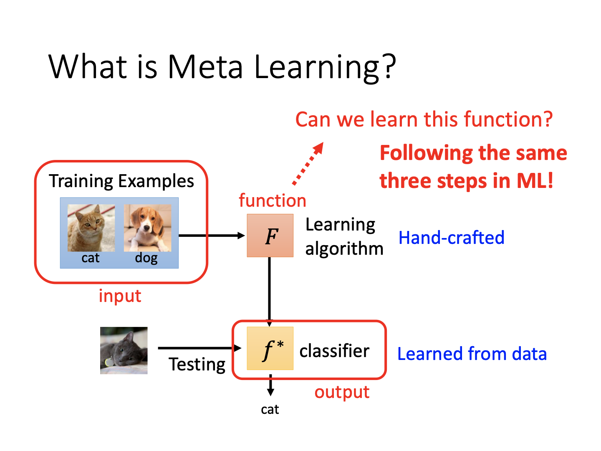

#### 训练三步骤

**1.学什么**

对于上述的学习任务，实际上可学习的也是网络中的各类参数，包括超参数。

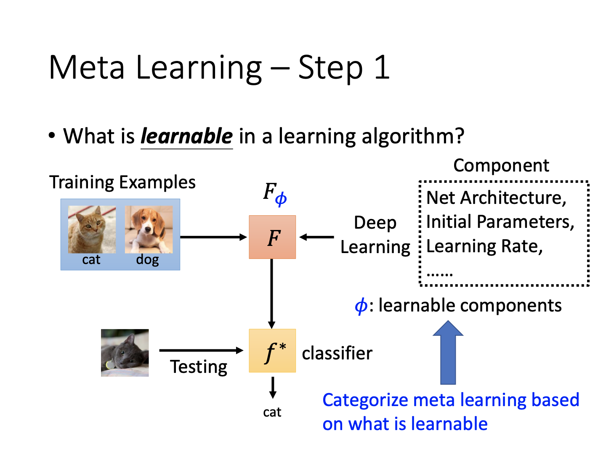

**2.定义损失函数**

对于传统机器学习任务，在训练集进行训练后，与测试集作损失函数计算即完成任务。而元学习则需要对所有任务所对应模型参数的损失函数结果相加（也有其他加权方法）。

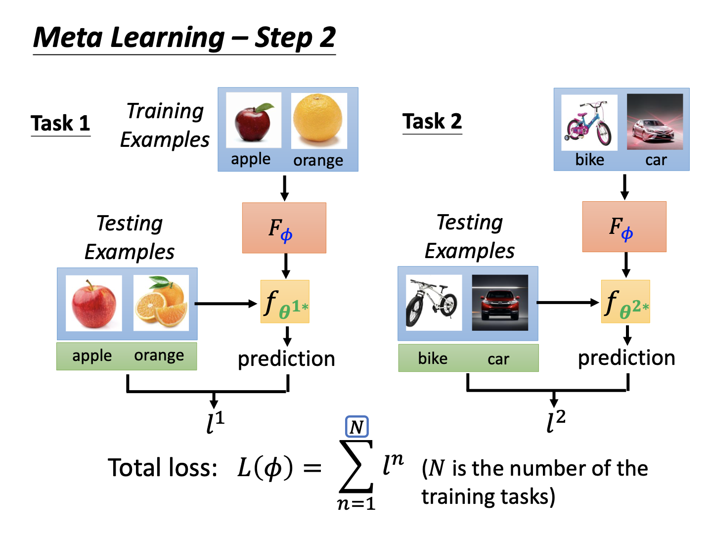

**3.进行优化**

最小化所定义的损失函数。当然，此时也许无法进行梯度下降（毕竟所涉及的参数众多）。所以可能需要使用强化学习或进化算法。

***注：***在元学习中，训练过程的输入是一系列的任务，对每个任务，将训练集得到参数在测试集的损失作为总体损失的一部分。此时每个任务的测试集是可以被获取的。这时候对于元学习框架本身，其“训练集”是用来训练的任务的所有部分（包括任务的不同数据集），而“测试集”是用来测试的任务。此时，测试任务里头的训练和测试数据集对于元学习任务才是不可访问的内容。

#### 机器学习与元学习的对比

**目标**

机器学习找到一个映射函数$f$，其能完成某任务；元学习找到一个学习函数$F$，其能够找到映射函数$f$。

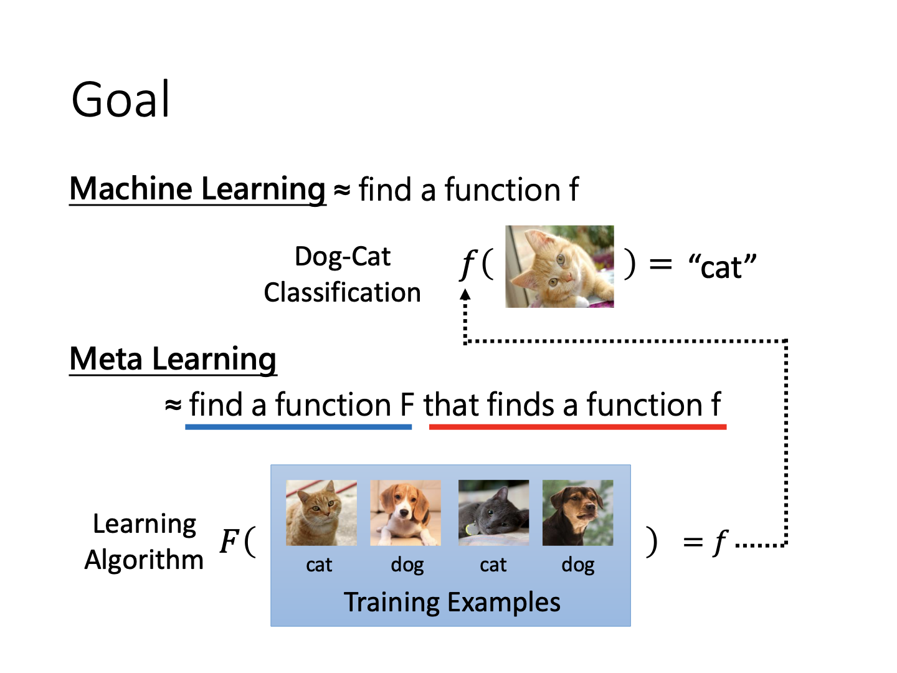

**训练数据**

机器学习针对自己的训练数据进行训练；元学习针对不同任务里头的训练与测试数据进行训练。

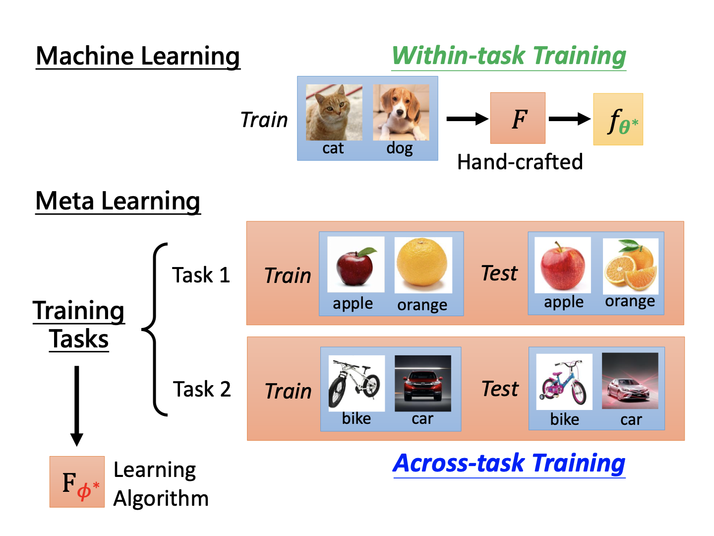

**损失函数**

机器学习的损失函数是任务里头所有样本损失函数总和；元学习的损失函数是所有任务的（各自所有样本）损失函数总和。

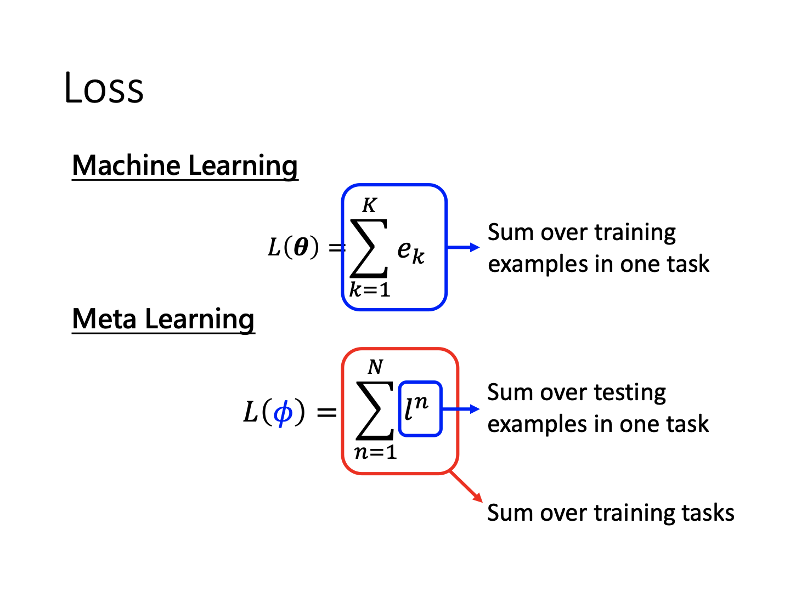

### What is learnable in a learning algorithm？

对于网络中究竟什么东西可学习，研究者也有诸多探索。

**参数初始化**

一般来说，元学习最重要的应用就是学习出一种能够快速初始化的参数，从而在遇见新任务时快速完成学习。类比人的认知过程，对于某些水果，认识到颜色、形状等特征后，在遇见新水果时候，可以合理推测它的种类、香味、口感等。实际上这种初始化的参数就有种寻找“物体本源”的意思。

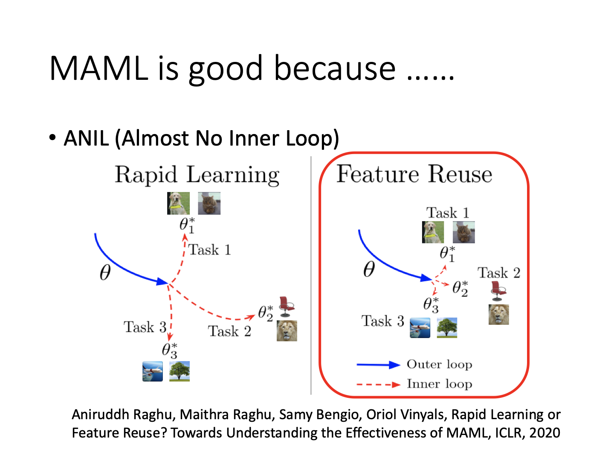

这里的MAML是model-agnostic machine learning，即不关心具体的模型内容，只要求找到一种合理的参数。由此，新任务进来时，通过该参数，能够快速让网络完成学习。也有观点认为，这是一种domain adaptation/迁移学习。

**优化器**

优化器中包含大量参数，这类参数同样可以通过学习确定。此处不赘述。

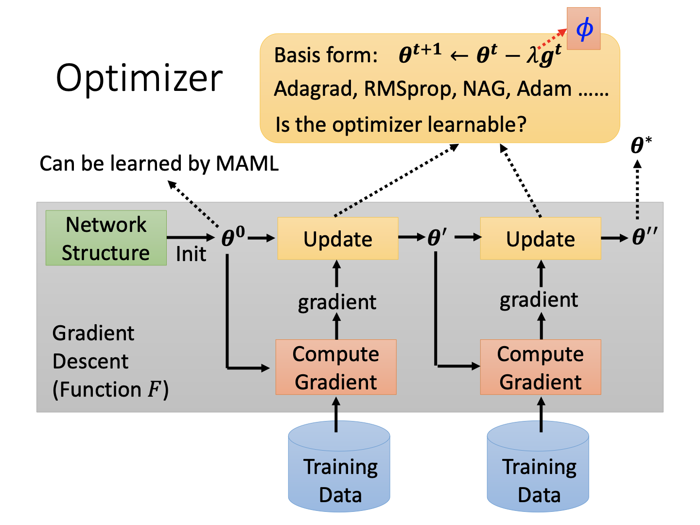

**网络架构搜索**

另一个可学习的内容是网络的结构。每次更改网络结构后，均可得到一个新的损失函数结果。通过强化学习或进化算法等方式，能够确定较优的网络结构。

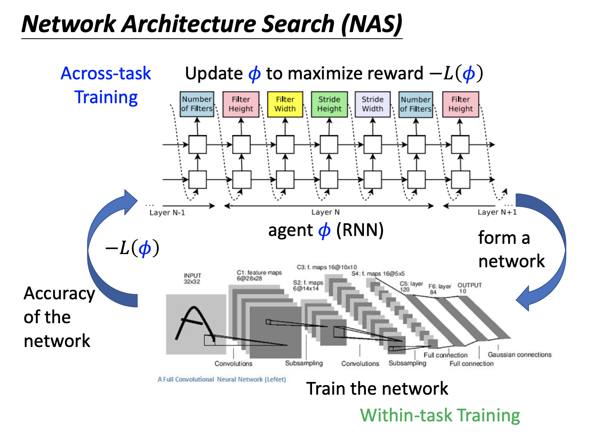

**数据处理**

输入的数据处理方法同样能够学习。比如不同的数据增强方式、数据样本权重等。

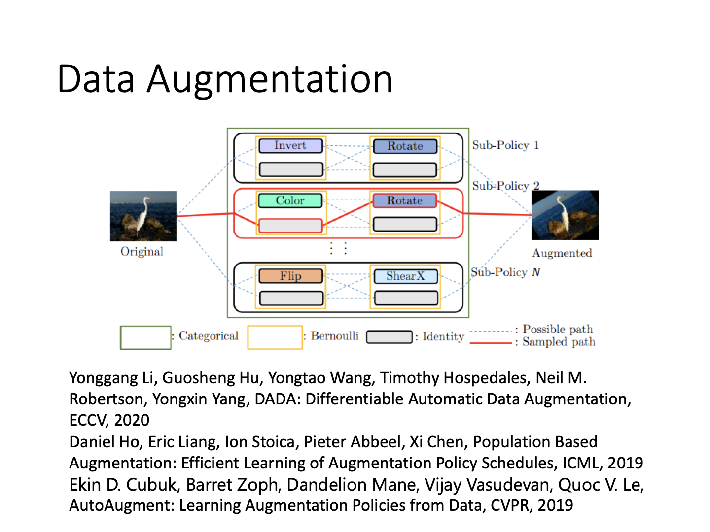

#### 应用

**Few-shot Image Classification**

对于少样本学习问题，元学习是一种合理的解决方法。通过接收大量仅有少样本的任务，算法得到一种学习手段（实际上也是一种初始化手段），从而面对新任务时能够较快地完成学习。此处出现“N-ways K-shot”的概念，即每个任务N类，每个类K张图片。需要准备一系列这样的任务对算法进行训练。个人推测，如果任务较多，也许就包含了测试任务的一部分信息，所以对于任务的分割需要谨慎。

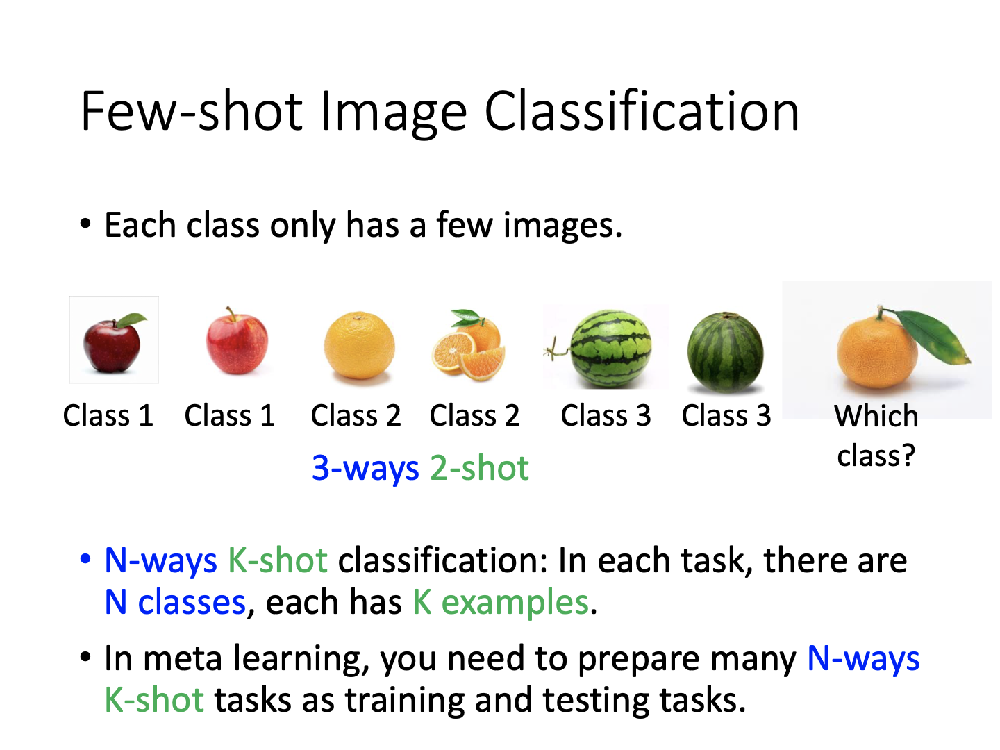

**Omniglot**

类似地，对于某些稀有语言文字的识别任务也可以通过元学习完成。其训练数据较少，类别多样，算法需要在仅有的训练数据中找到所需要的结果。

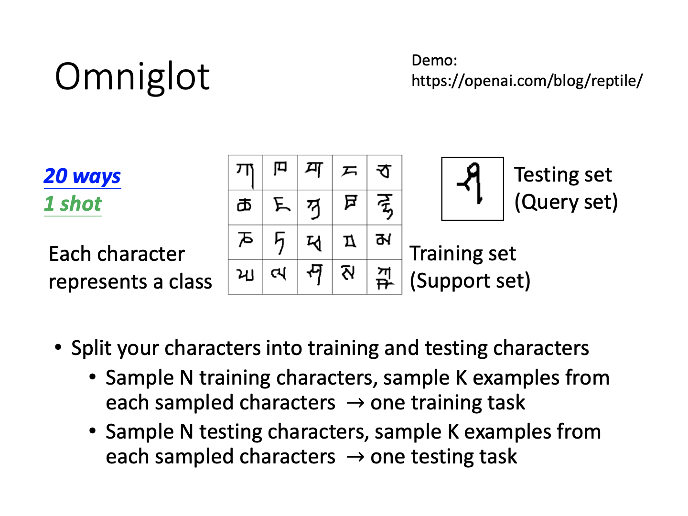

如图为一种学习方法：在20类文字中采样N类，每类采样K个字母，通过上述few-shot方式完成学习。对测试任务也做同样的采样（但是采样的类需要不同）。