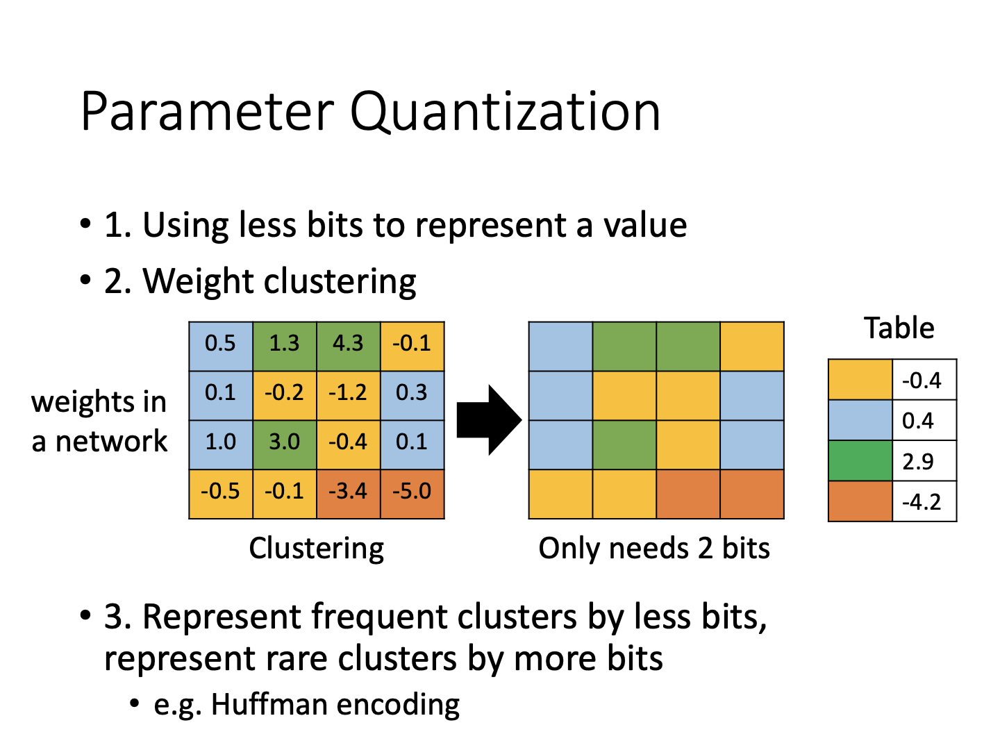

# Network Compression

网络压缩包含几个方面的思想。首先压缩的网络具有更少的参数，所需的存储空间、计算耗时会减少。其次，压缩的思想实际可以应用在边缘设备上，所以这些设备上的网络模型必须要更小的体积。另外这样的部署还可以避免数据的传输，带来隐私保护的效果。

### Network Pruning

一种观点是，网络的参数可能是冗余的，所以需要进行剪枝操作。一般来说，判断剪枝的条件是观察权重的绝对值是否较大（比如全为0说明对网络结果没影响）。通过诸如此类的操作，削减参数数量，即可完成网络的压缩。一般来说，剪枝操作是循序渐进的，每次推进一点点后，重新调节网络参数，再进行下一轮的剪枝，否则网络性能可能救不回来。

剪枝分为针对权重和针对神经元两种。

#### 两种剪枝方法

**Weight pruning**

针对权重的剪枝实际上是认为某些沟通神经元之间的权重无效，从而取消它们的计算参与。个人理解，比如在一个全连接层里头，这类似于把一个权重矩阵的某几个元素删掉。但这难以实现，所以一种模拟的方式是把这几个元素置为0，从而有和原始网络一样的权重矩阵结构。然而这样一来实际上参数的数量和存储并没有改变，并且实验发现，并不会对网络进行加速。

**Neuron pruning**

通过切断神经元进行剪枝，等效于把原来的权重矩阵维度减少，所以是货真价实的参数减少。这一方法容易实现，也可以达成加速的目的。

#### 为什么要剪枝

**Lottery Ticket Hypothesis**

大乐透假说（Lottery Ticket Hypothesis）认为，一个完整的网络里头包含多个子网络，从而它们极有可能拥有一个最好表现的小型子网络。因此从大网络开始进行剪枝，效果会更好。另外，通过大网络剪枝得到的心网络，进行初始化的时候还得用原始大网络对应参数的初始化值，以模拟出这个子网络在大网络里头的效果。

基于此，大量文章也对初始化这一话题进行了分析，甚至包括只用原始参数的正负符号来进行初始化等，都能有不错的效果（所以说这里就是玄学）。

因为玄学的味道太重，也有人对大乐透假说进行了打脸。一份研究表明，直接从小网络自己初始化开始，可能在迭代次数较少的时候不如大网络未剪枝的结果，但多迭代几次会超过。这也说明大乐透假说并不是完全成立，所以只是一个“假说”而已。这些作者发现只有用weight pruning或学习率较小的时候大乐透假说才成立，所以这可能也只是一些炼丹自high。

### Knowledge Distillation

知识蒸馏技术将原始大网络称作教师teacher network，需要压缩产出的网络称为学生student network。通过让学生的结果与教师接近，从而完成知识传递。以下为一个多分类任务的例子。

注意到，学习的不只是正确的类别标签，还有教师对于某个数据的预测偏向。例如，一张数字1的图片，其也具有部分数字7的特征，所以在输出的概率中应有一席之地。通过这种学习方式，学生甚至在没见过数字7的训练资料时，可以对7做出合理的预测。

**Ensemble**

知识蒸馏中也包含ensemble的概念，一般使用多个教师网络增强效果。为了压缩，可以让学生对这一系列网络的集合进行学习。

**Temperature**

在学习的过程中，极端标签值经过softmax会变得过于稀疏。通过添加系数，可以消除这一稀疏性，以便让学生能够更好地学习。

### Parameter Quantization

一般来说，参数量化包括直接降低比特精度、参数聚类、用更先进的编码方式减少内存占用等。

### Architecture Design

在架构设计上，主要考虑两种手段

**Depthwise Separable Convolution**

传统卷积对于每层output均有一个多层卷积核。设宽度为$k$，输入和输出通道分别为$I$与$O$，则所需参数数量为$I\times O\times k\times k$。然而，多层卷积的过程可以拆分为以下两阶段：

首先，获取空间关系的卷积仅在单层输入通道上进行，参数量为$I\times k\times k$。接下来，多层结果通过$1\times1$的pointwise卷积操作进行多层融合，避免对空间关系的重复计算，参数量为$I\times O$。实际上这一过程也大大减少了运算的数量。对于原始卷积，计算次数为$I\times O\times k\times k\times W\times H$，拆分后卷积计算次数为$I\times k\times k\times W\times H+I\times O\times W\times H$。无论是计算次数还是参数数量，新方法均为原始卷积的$\frac{1}{O}+\frac{1}{k^2}$。

不过，需要注意的是，这一方法虽然减少了参数量，但并非对原始方法的无损替代。因为原始方法的输入到输出，每一输出层对应的平面卷积（$k\times k$）都是不同的。而轻量化的设计下，平面卷积的参数进行了复用。但这种方法是出于对卷积的原理进行的改进设置，因此在其论文：*MobileNets- Efficient Convolutional Neural Networks for Mobile Vision Applications*中确实有媲美原始方法的实验结果。

**Low rank approximation**

上述方法实际上也是一种低秩方法。低秩方法通过安插低秩矩阵，从而大大减少运算数量。不过也有限制原始网络表达能力的缺点。

### Dynamic Computation

面对设备的计算能力差异化、电能等资源的限制，有必要针对进行模型部署。然而部署一系列模型的空间开销过大，因此考虑动态计算的技术。

**Dynamic Depth**

通过对中间输出层增加额外的出力，将结果合并与ground truth进行损失函数计算，从而让网络获得提早完成计算的能力。不过，面对不同的输入，网络的处理能力不足，从哪一层退出也是未定数。可以通过人为设定或让网络自己学习输入数据的“难度”。

**Dynamic Width**

另一种方法是改变网络宽度。在共享网络权重的前提下，调节参与计算的网络参数数目，从而调节网络大小。与上述方法类似，其也针对不同的结构，产生不同的输出，进行loss的减少。待需要时进行调用即可。

