# Reinforcement Learning

### 什么是RL

**回顾：机器学习三要素**

一个机器学习任务，归纳总共有三点：

1. 定义目标函数
2. 定义误差函数
3. 优化

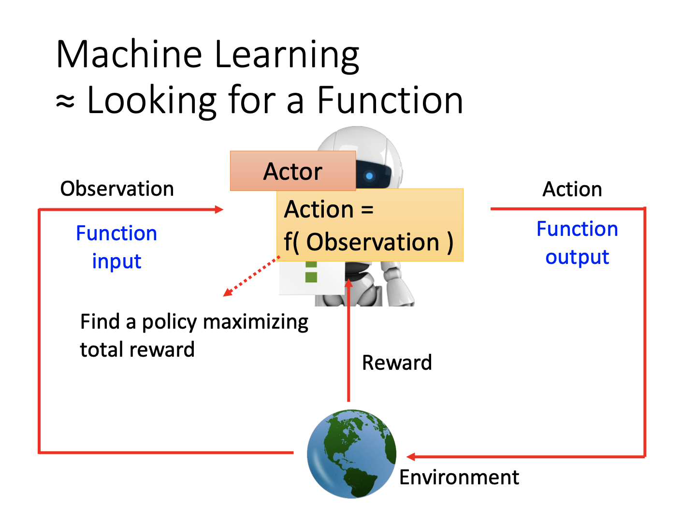

#### 实例：Space invader

我们以射击游戏为例，讲述强化学习的网络设计。

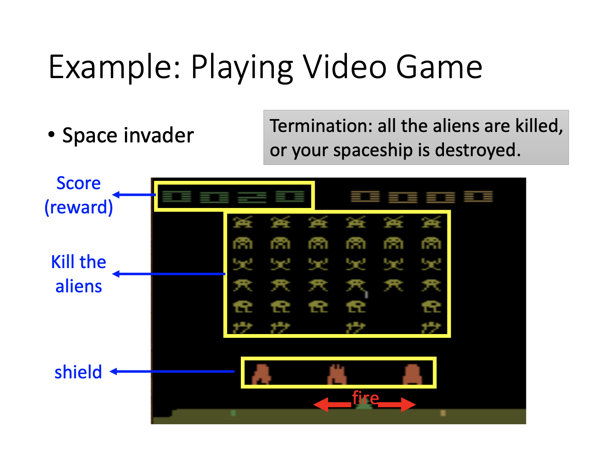

**第一步：定义目标函数**

首先，对于某种输入的游戏画面，可以通过神经网络，输出对应到几种不同的动作。并且对于动作，我们能够预先给出得分。当然，这一过程实际上就是分类任务，并且是监督学习。

**第二步：定义损失函数**

其次，我们开始探究每个动作的损失。这里的损失需要加上引号，因为在强化学习中，主要的目标是每个动作所产生的奖励。模型的评估标准是每个动作能获得多少的奖励。当然，奖励越大的结果越好，因此其目标是最大化奖励。如果加上符号，就是最小化问题，即可类比到传统的损失函数上，这也就归类到了我们的第二点上。

如图，我们可以看到移动飞船并不能获得奖励，但是杀死外星人可以获得奖励，这就是不同的动作带来的结果。

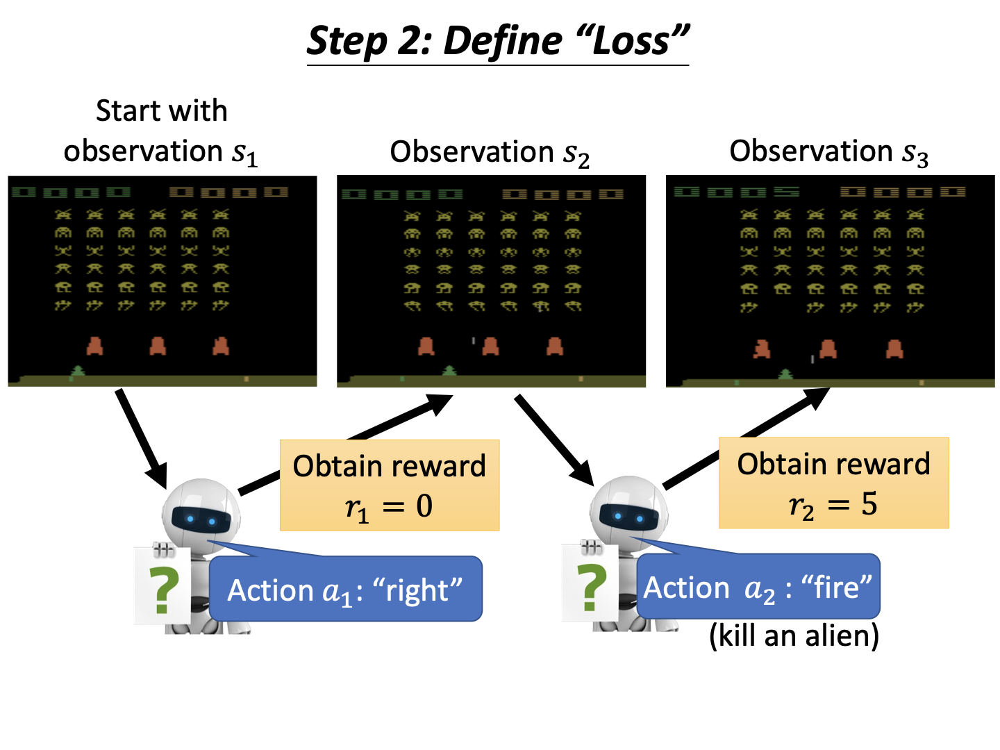

**第三步：优化**

我们的反馈函数actor对于不同的环境（游戏图像）输入$s_i$，均有不同的输出$a_i$，它们能够组成一个序列$\tau=\{s_1,a_1,...\}$。从开始到结束的这个序列$\tau$称作一个**episode**。而我们的“损失”函数$R(\tau)$定义为不同步骤输出的奖励之和。另外，考虑奖励必须加上输入和输出。比如上述游戏中，射击（输出）必须在击中外星人（环境输入）的情况下才有奖励。

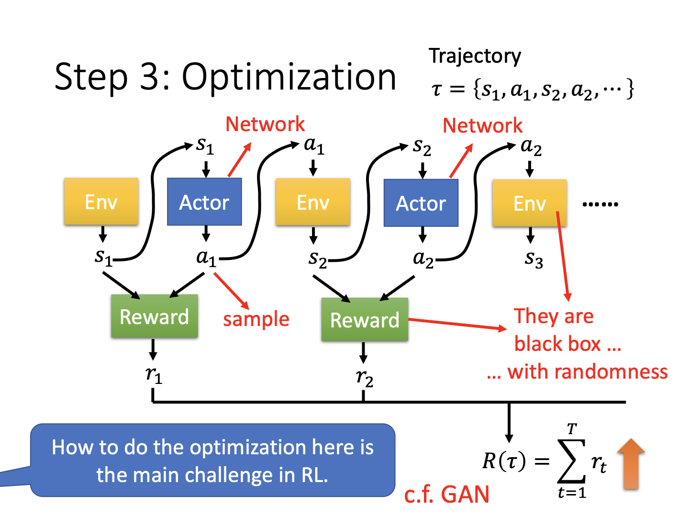

### Policy Gradient

#### 如何控制actor

同上，我们提到训练反应输出的函数可以是一个监督学习的过程。对于需要执行某个动作$\hat{a}$，则输出$a$和它的交叉熵越小越好，反之则越大越好，表示除了该动作，可以执行任意行为。

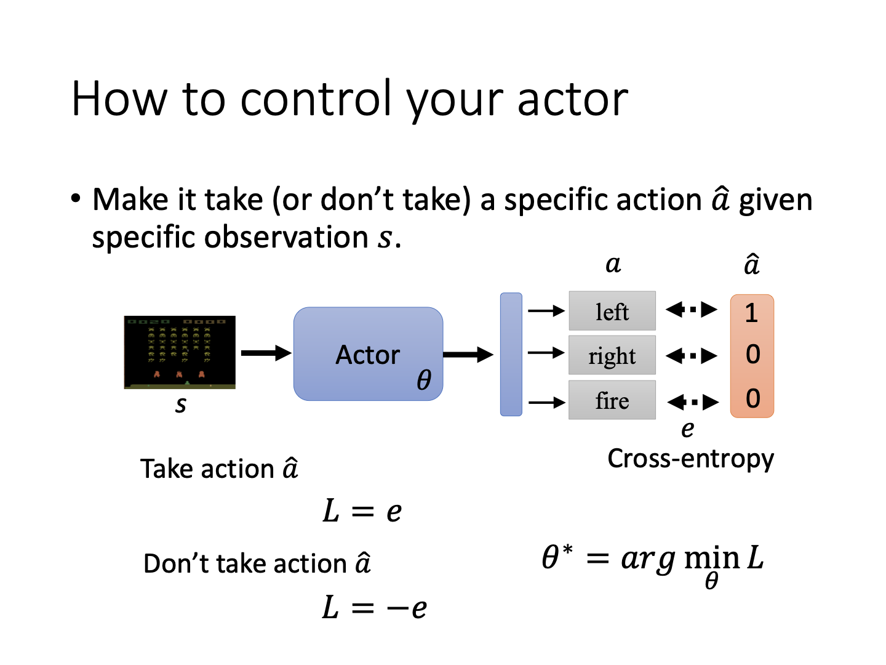

另外，对于序列化的动作，可以将每一个$s$对应的输出损失$e$加起来，表示最终的结果。如上，对于需要执行的动作，使用正号，否则负号，这样一来人为筛选确定不同动作序列对最终结果的影响。

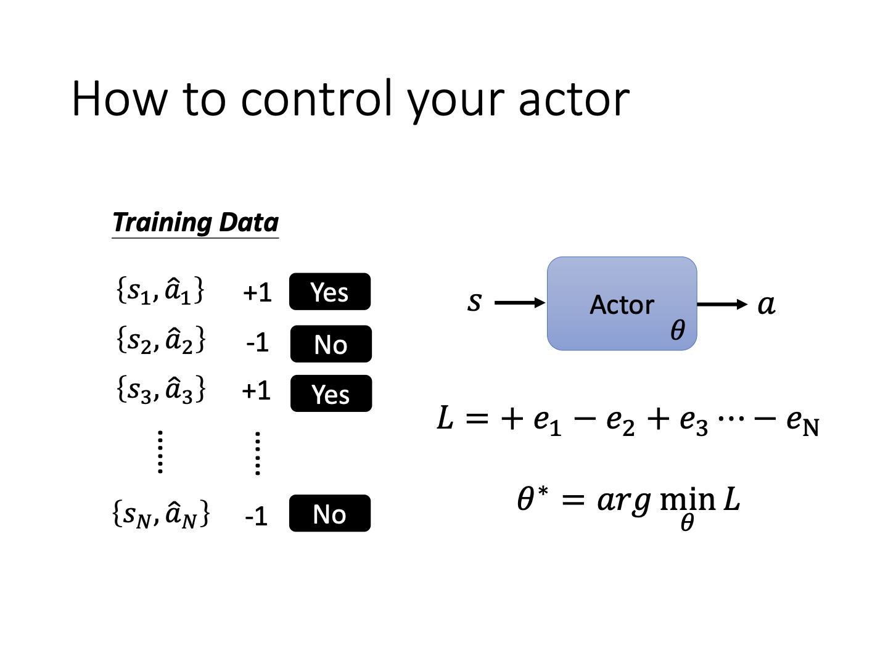

另外，我们不只是确定选用哪个动作，还可以设定不同动作的分数，以告诉模型究竟倾向于选用哪种动作：

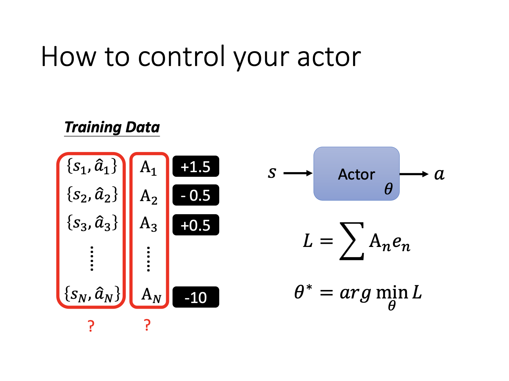

如图，其中的$A_i$表示第$i$步中的动作分数。

#### 定义动作分数的方式

关于动作分数的定义，方式多种多样，课中提到如下三种。

**Version 0**

普通版本即为上述的将分数加起来，但该方法存在的主要问题是会造成“短视”的结果。因为所有的选择都是基于当前步骤。但是存在的问题是，当前的观测、当前的结果都会影响后续的观测，从而改变后续的奖励。所以需要想个办法，考虑长期的奖励。

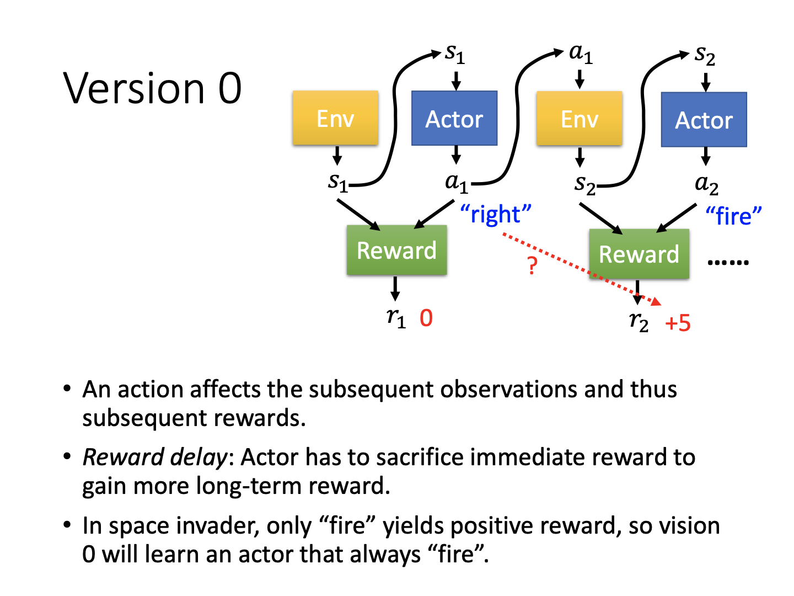

**Version 1**

改进一版在每个时刻考虑的奖励是该时刻到动作结束的所有奖励累加。如图，在时刻1，考虑的奖励为红框内$r_1$~$r_N$，以此类推。不过，在这种情况下，离得远的时刻奖励真的完全来自于第一个时刻的动作吗？这需要画个问号，这也催生了第二个版本。

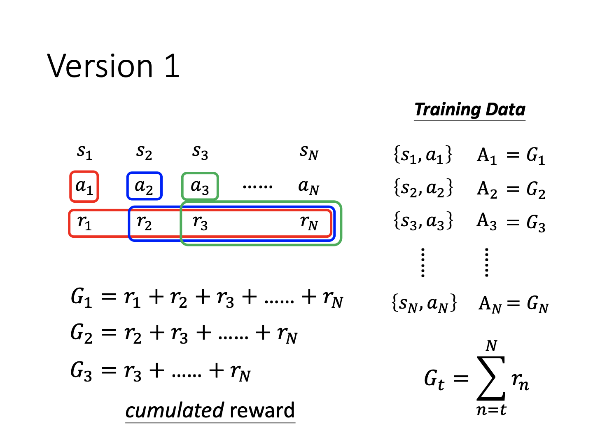

**Version 2**

如下图，可以在每个奖励前加上幂系数$\gamma$，一个小于1的折扣。

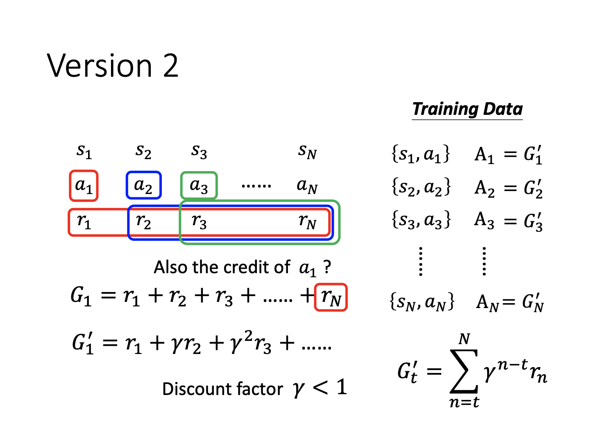

显而易见，当后续时刻距离当前越远，所能考虑到的奖励值越小。由此，模型既考虑了后续奖励，又让其占比较为合理。

**Version 3**

最后，我们仍应当注意到，奖励分数有必要进行标准化的操作。例如奖励均为正值，其符号就失去了意义，那么有些并不希望达成的操作仍然会被视作鼓励执行（虽然执行的分数不高）。所以可以进行标准化，让奖励重新具有双向的意义。一种简单的方法就是所有奖励减去一个固定的值。

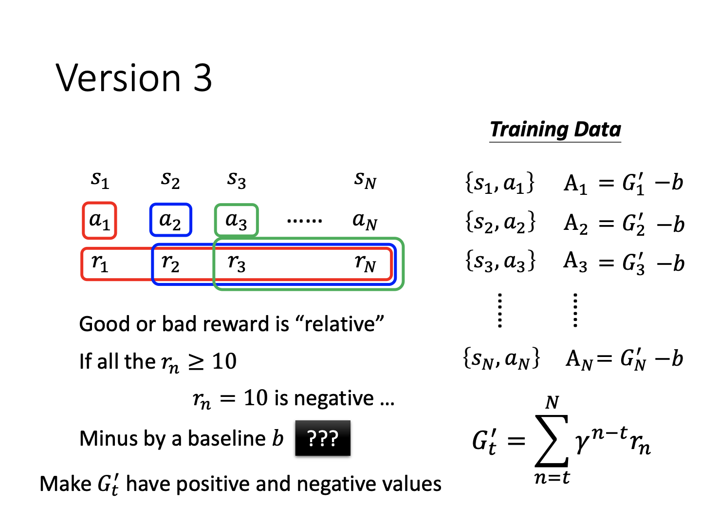

#### Policy Gradient

成功定义了奖励分数后，我们就可以考虑如何计算所谓的policy gradient。以下为伪代码：

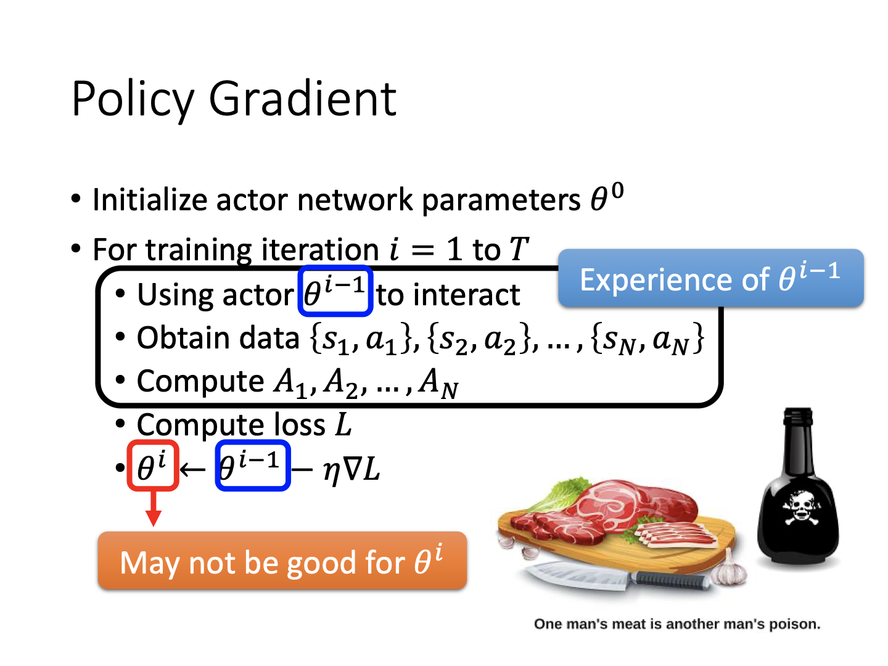

全过程可以概述为：进行交互、生成数据、计算奖励、计算最终“Loss”、梯度下降。一个不一样的点是数据的生成。该过程的生成需要在每个训练轮次内进行，因为不同的模型参数会对同样的动作输入产生不同的结果（本身也存在随机性），更别提后续动作会随先前结果而变。所以参数一改变，所有数据均有可能不同。训练中的时间瓶颈也来源于此。

#### On-policy v.s. Off-policy

关于生成的数据是否是当前模型参数的结果，可以将policy分为on和off两类。前者表示及时更新的参数，后者表示用之前的参数。其中一种off的方法叫**Proximal Policy Optimization (PPO)**，该方法虽然使用非实时参数，但是会考虑到不同的参数之间的效果差异。老师并未详解，给出过去的课程链接：https://youtu.be/OAKAZhFmYoI。

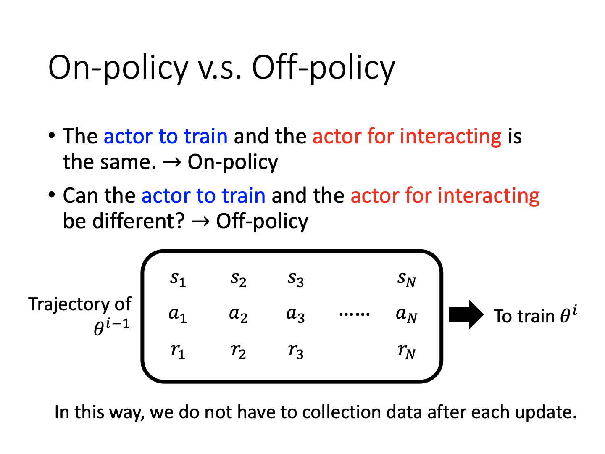

#### 数据搜集的探索过程

因为强化学习的重要一环就是数据的搜集，因此有必要对这一过程进行详解。

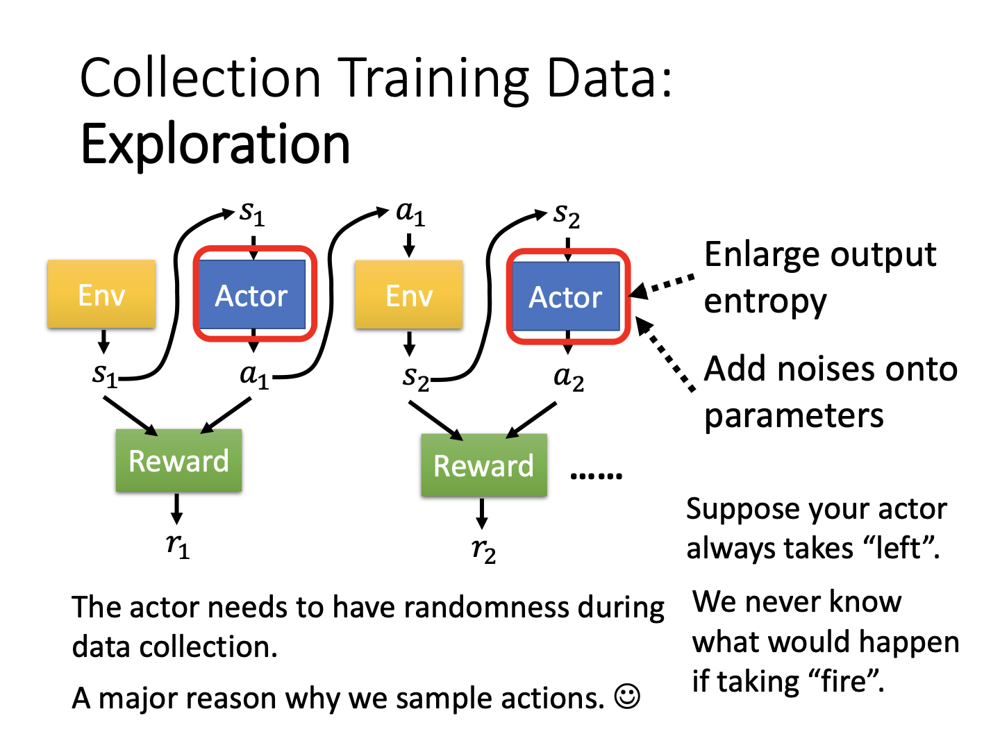

因为强化学习以不同的输入进行输出，因此随机性是一个很重要的因素。如果我们的数据生成过程永远一成不变，即有可能让某些动作永远不会开始，从而模型从未见过，无法获得该动作反馈并学会执行这一动作。为解决此问题，需要为模型参数增加噪声，或强制增大输出的熵（让输出分布更均匀）。

### Actor-Critic

### Reward Shaping

### No Reward: Learning from Demonstration

