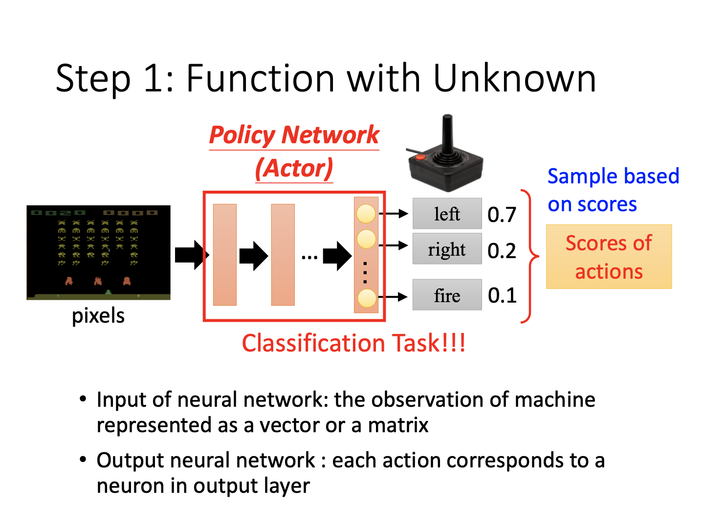
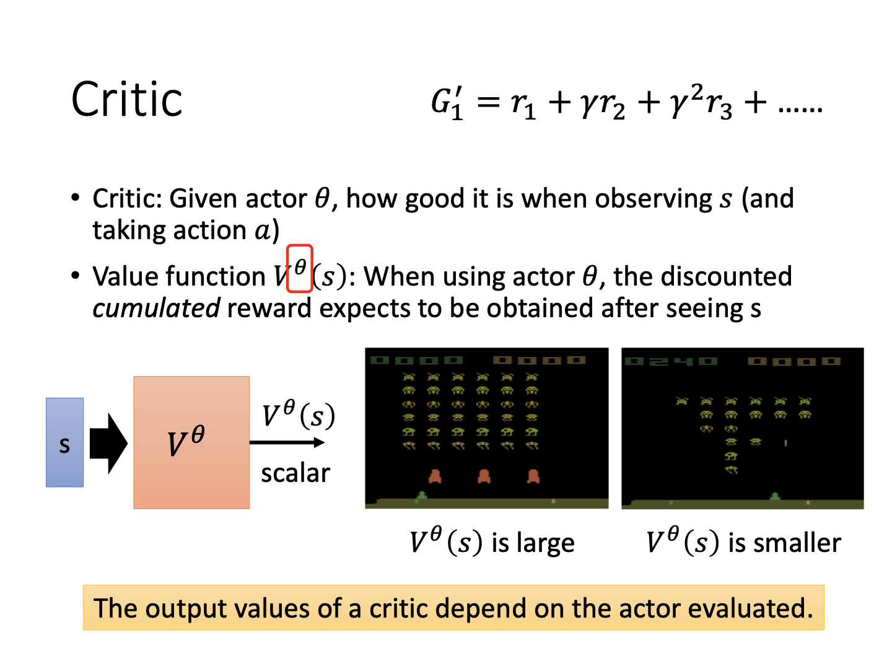
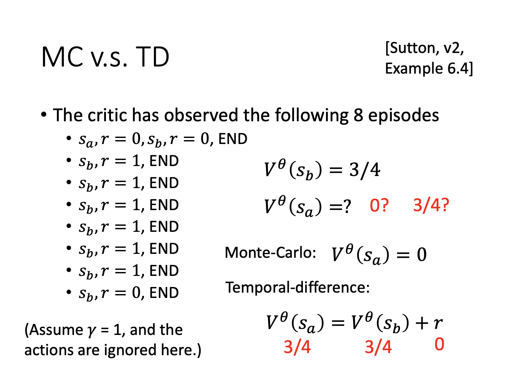
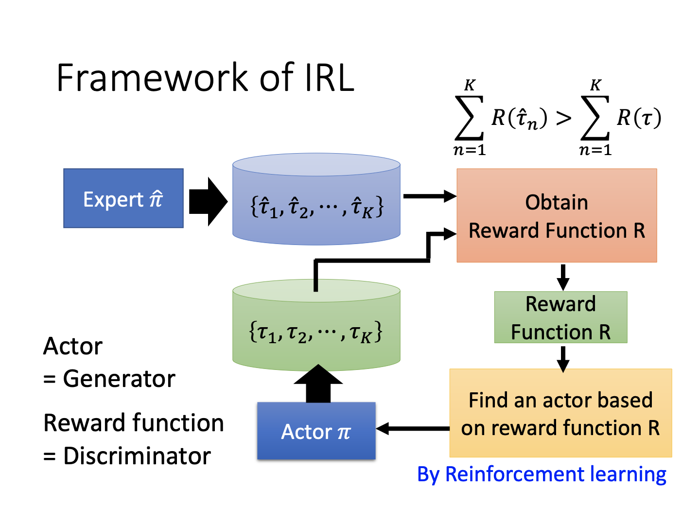

# Reinforcement Learning

### 什么是RL

**回顾：机器学习三要素**

一个机器学习任务，归纳总共有三点：

1. 定义目标函数
2. 定义误差函数
3. 优化

#### 实例：Space invader

我们以射击游戏为例，讲述强化学习的网络设计。

**第一步：定义目标函数**

首先，对于某种输入的游戏画面，可以通过神经网络，输出对应到几种不同的动作。并且对于动作，我们能够预先给出得分。当然，这一过程实际上就是分类任务，并且是监督学习。此处，我们把针对不同输入产生不同输出的网络称为**Actor**。

**第二步：定义损失函数**

其次，我们开始探究每个动作的损失。这里的损失需要加上引号，因为在强化学习中，主要的目标是每个动作所产生的奖励，即**reward**。模型的评估标准是每个动作能获得多少的奖励。当然，奖励越大的结果越好，因此其目标是最大化奖励。如果加上符号，就是最小化问题，即可类比到传统的损失函数上，这也就归类到了我们的第二点上。

如图，我们可以看到移动飞船并不能获得奖励，但是杀死外星人可以获得奖励，这就是不同的动作带来的结果。

**第三步：优化**

我们的反馈函数actor对于不同的环境（游戏图像）输入$s_i$，均有不同的输出$a_i$，它们能够组成一个序列$\tau=\{s_1,a_1,...\}$。从开始到结束的这个序列$\tau$称作一个**episode**。而我们的“损失”函数$R(\tau)$定义为不同步骤输出的奖励之和。另外，考虑奖励必须加上输入和输出。比如上述游戏中，射击（输出）必须在击中外星人（环境输入）的情况下才有奖励。

### Policy Gradient

#### 如何控制actor

同上，我们提到训练反映输出的函数可以是一个监督学习的过程。对于需要执行某个动作$\hat{a}$，则输出$a$和它的交叉熵越小越好，反之则越大越好，表示除了该动作，可以执行任意行为。

另外，对于序列化的动作，可以将每一个$s$对应的输出损失$e$加起来，表示最终的结果。如上，对于需要执行的动作，使用正号，否则负号，这样一来人为筛选确定不同动作序列对最终结果的影响。

另外，我们不只是确定选用哪个动作，还可以设定不同动作的分数，以告诉模型究竟倾向于选用哪种动作：

如图，其中的$A_i$表示第$i$步中的动作分数。

#### 定义动作分数的方式

关于动作分数的定义，方式多种多样，课中提到如下三种。

**Version 0**

普通版本即为上述的将分数加起来，但该方法存在的主要问题是会造成“短视”的结果。因为所有的选择都是基于当前步骤。但是存在的问题是，当前的观测、当前的结果都会影响后续的观测，从而改变后续的奖励。所以需要想个办法，考虑长期的奖励。

**Version 1**

改进一版在每个时刻考虑的奖励是该时刻到动作结束的所有奖励累加。如图，在时刻1，考虑的奖励为红框内$r_1$~$r_N$，以此类推。不过，在这种情况下，离得远的时刻奖励真的完全来自于第一个时刻的动作吗？这需要画个问号，这也催生了第二个版本。

**Version 2**

如下图，可以在每个奖励前加上幂系数$\gamma$，一个小于1的折扣。

显而易见，当后续时刻距离当前越远，所能考虑到的奖励值越小。由此，模型既考虑了后续奖励，又让其占比较为合理。

**Version 3**

最后，我们仍应当注意到，奖励分数有必要进行标准化的操作。例如奖励均为正值，其符号就失去了意义，那么有些并不希望达成的操作仍然会被视作鼓励执行（虽然执行的分数不高）。所以可以进行标准化，让奖励重新具有双向的意义。一种简单的方法就是所有奖励减去一个固定的值。

#### Policy Gradient

成功定义了奖励分数后，我们就可以考虑如何计算所谓的policy gradient。以下为伪代码：

全过程可以概述为：进行交互、生成数据、计算奖励、计算最终“Loss”、梯度下降。一个不一样的点是数据的生成。该过程的生成需要在每个训练轮次内进行，因为不同的模型参数会对同样的动作输入产生不同的结果（本身也存在随机性），更别提后续动作会随先前结果而变。所以参数一改变，所有数据均有可能不同。训练中的时间瓶颈也来源于此。

#### On-policy v.s. Off-policy

关于生成的数据是否是当前模型参数的结果，可以将policy分为on和off两类。前者表示及时更新的参数，后者表示用之前的参数。其中一种off的方法叫**Proximal Policy Optimization (PPO)**，该方法虽然使用非实时参数，但是会考虑到不同的参数之间的效果差异。老师并未详解，给出过去的课程链接：https://youtu.be/OAKAZhFmYoI。

#### 数据搜集的探索过程

因为强化学习的重要一环就是数据的搜集，因此有必要对这一过程进行详解。

因为强化学习以不同的输入进行输出，因此随机性是一个很重要的因素。如果我们的数据生成过程永远一成不变，即有可能让某些动作永远不会开始，从而模型从未见过，无法获得该动作反馈并学会执行这一动作。为解决此问题，需要为模型参数增加噪声，或强制增大输出的熵（让输出分布更均匀）。

### Actor-Critic

#### 什么是Critic

为了评估输出函数Actor的好坏，需要定义Critic。

Critic是在给定函数的情况下，衡量输出的标准。在这里，我们使用的Critic称为**Value function**，对于模型参数$\theta$与输入$s$，记为$V^{\theta}(s)$。

#### 如何估计$V^{\theta}(s)$

**Monte-Carlo based approach**

该方式对于每一个输入的状态$s_i$，给出其一直到动作序列的终止时，累计的奖励。

**Temporal-difference (TD) approach**

该方式对于序列中的状态，采用数列关系计算，从而避免对动作序列终局的要求。即只要知道前后序列的关系，又知道这一时刻的奖励，就能得到这一时刻的value function。换言之，这是一种递归的手段，比如确定某个时刻的value function，再不断前推。例如下图，容易得到当前时刻的value function与下一时刻的关系。虽然没有$V^{\theta}(s_t)$与$V^{\theta}(s_{t+1})$，但通过作差就可以训练value function。

需要注意的是，这里的$r_t$也是存在随机性的，讲义中注明此处省略了求期望的过程。个人认为，这一过程也涉及大量数据的采样，只是结合了前后value function的关系。

**实例**

以8笔资料为例。用MC方法计算时，因为输入$s_b$中$r=1$出现6次，因此分数为$\frac{6}{8}$即$\frac{3}{4}$。而$s_a$对应的函数值显然为0。而对于TD方法，通过考虑了$V^{\theta}(s_b)$，$V^{\theta}(s_a)$也可以推导得出。此处省略了折扣系数。

**Version 3.5**

接续前面提到的几种定义动作分数的方式，我们再介绍两种。因为引入了MC的概念，就有了我们的3.5版。

如图，$V^{\theta}(s_t)$实际上是通过多次对同样的输入产生的最终输出分布得到。这里的$G$实为$G'$。在版本3中曾提到，需要减去一个基本分数，以保证动作分数的符号意义。此处的3.5版正是用$V^{\theta}(s_t)$当作了减去的“基准”。从实际意义来理解，每一个$G'_t$都只是一次采样，如果其比MC后的采样结果$V^{\theta}(s_t)$大，那么$A_t$大于0，表示当前动作的效用比平均值更好，反之则更差。

**Version 4**

既然引入了采样随机性，那么当前的动作是否也存在随机性呢？因此对于给定$s_t$走出$a_t$的下一时刻结果，对其进行采样，计算得到$r_t+V^{\theta}(s_{t+1})$，则$A_t$的表达式为$r_t+V^{\theta}(s_{t+1})-V^{\theta}(s_t)$。此时只有$r_t$是确定的，表达式中后二者均为一种采样分布，会显得更加平均、有代表性。

**Tips for Actor-Critic**

另外，补充一个小技巧。关于actor和critic的训练网络参数在一定程度上允许共享。

如图，网络在提取输入信息时权重可以共享（参考domain adaptation的思想），而具体做分类任务或给出结果分数的时候，可以使用不同的网络。

### Reward Shaping

在现实情况中，奖励并非总如人意。

#### Sparse Reward

如果在大部分情况下，机器的动作都是无奖励的，仅有某些特定动作获得反馈（比如下围棋的终局），这就是**sparse reward**问题。此时，机器的学习过程将会非常曲折，它们并不能分辨哪些动作是好或坏，因此需要由人额外定义奖励来引导机器，这就引出了**reward shaping**的概念。

#### Reward Shaping

以一个第一人称射击游戏的算法竞赛为例（PDF无法展示视频就不贴图了），第一名对奖励做出的改变如下图。

首先，它定义如果角色活着就会慢慢扣分（当然扣的很少），从而激励角色去搏杀，而不是边缘ob（不要笑，老师的原话）。其次，游戏本身被击中扣血时是不会扣分的，但是算法学习时对于这一结果加上了扣分的惩罚，从而避免被击中。然后对于比如弹药减少、原地不动等都进行了惩罚。以上设定能够让角色勇于探索，最终击败敌人与完成地图。这就是一种修改奖励的形式。

### No Reward: Learning from Demonstration

更极端的情况是，机器根本不知道奖励如何定义。对于游戏场景，记分板是游戏给出的，可以参考。然而，对于自动行驶场景，车辆避让行人该给多少分，而红灯停车又该给多少分？无从得知。另外，人类设计的奖励可能会让机器的行为发展到不可控的地步。一个搞笑的例子是机器人三原则：1.机器人不能伤害人类；2.机器人在不违背第一条的情况下需要听从人类的任何命令；3.机器人在不违背第一第二条的情况下必须保护自身。如果以上成真，机器人会把人类监禁起来，从而避免人类与自身的伤害，但这与我们的目的相去甚远。

#### Imitation Learning

为了解决这一问题，研究者引入了模仿学习的概念，即通过人先行产生一系列的行为和结果，给机器进行模仿。

然而，人类的动作只能覆盖极其有限的场景。比如自动驾驶，就难以采集撞车的情况。这是监督学习，自然受到数据的限制。另外，人类在数据生成中可能产生不必要的动作（机器不需要也可以完成任务），但机器因为模仿人类，会把它也学进去。

#### Inverse Reinforcement Learning

另外一种思路是进行反向强化学习。定义一个奖励函数，令专家动作序列的分数高于机器动作序列，机器学习在奖励函数上最大化分数，再更新奖励函数，循环往复。

算法流程如下：

实际上这就是GAN的思路：

