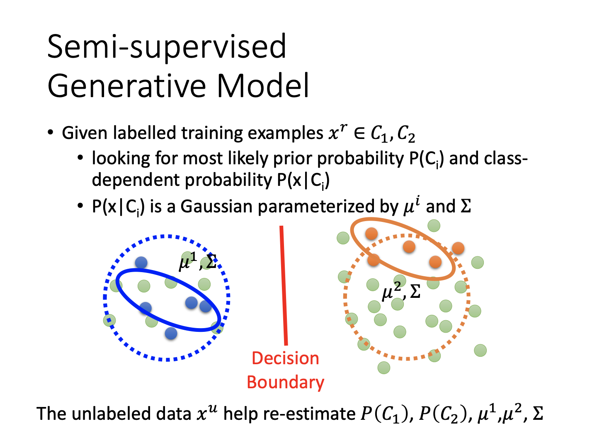
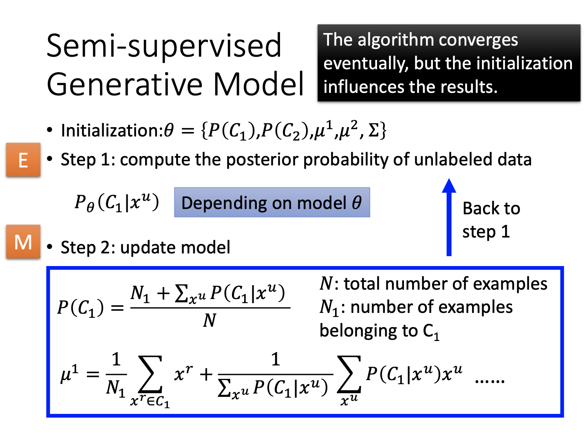
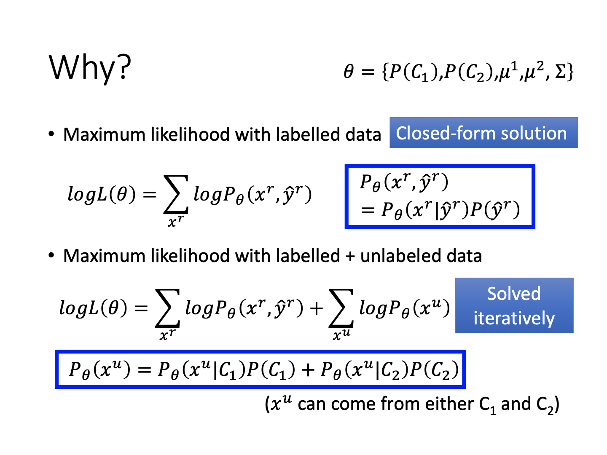
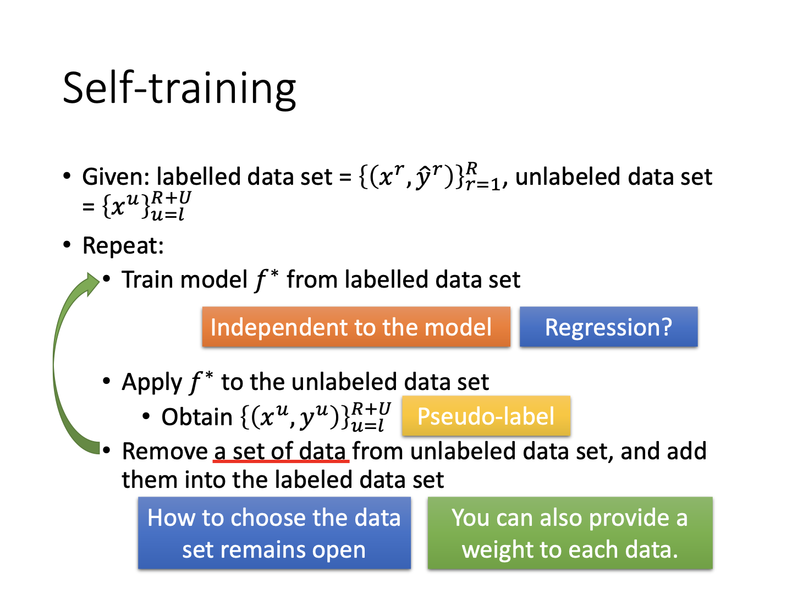
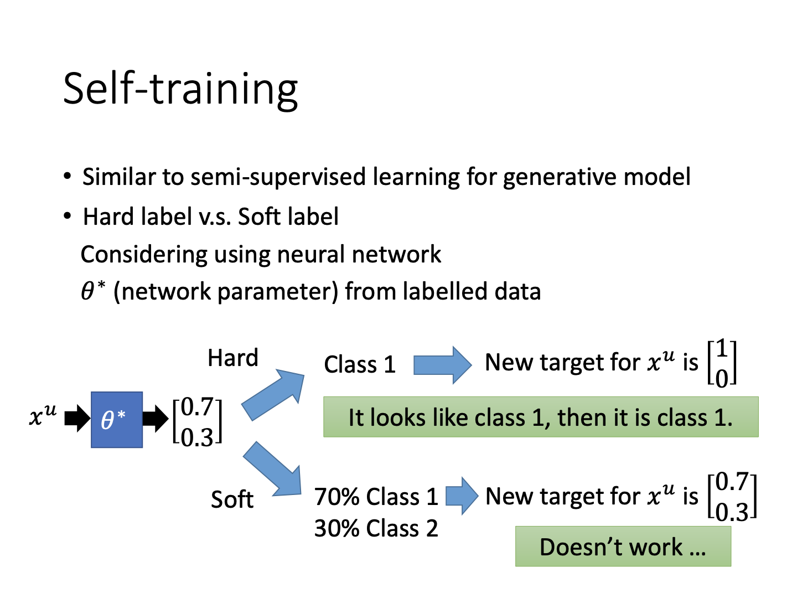
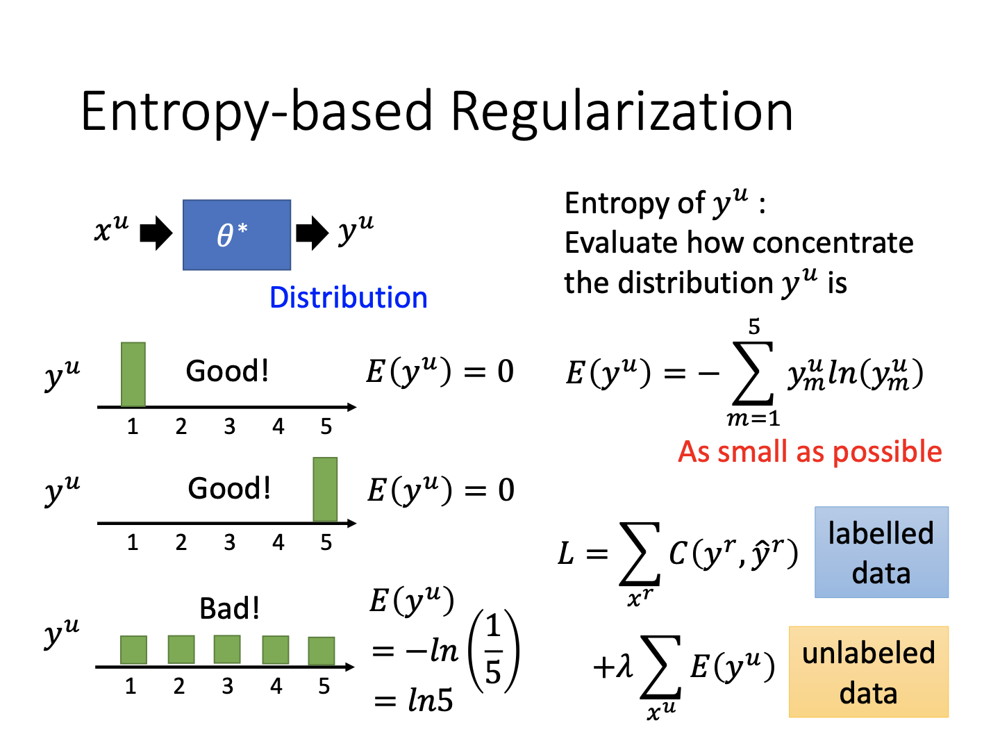
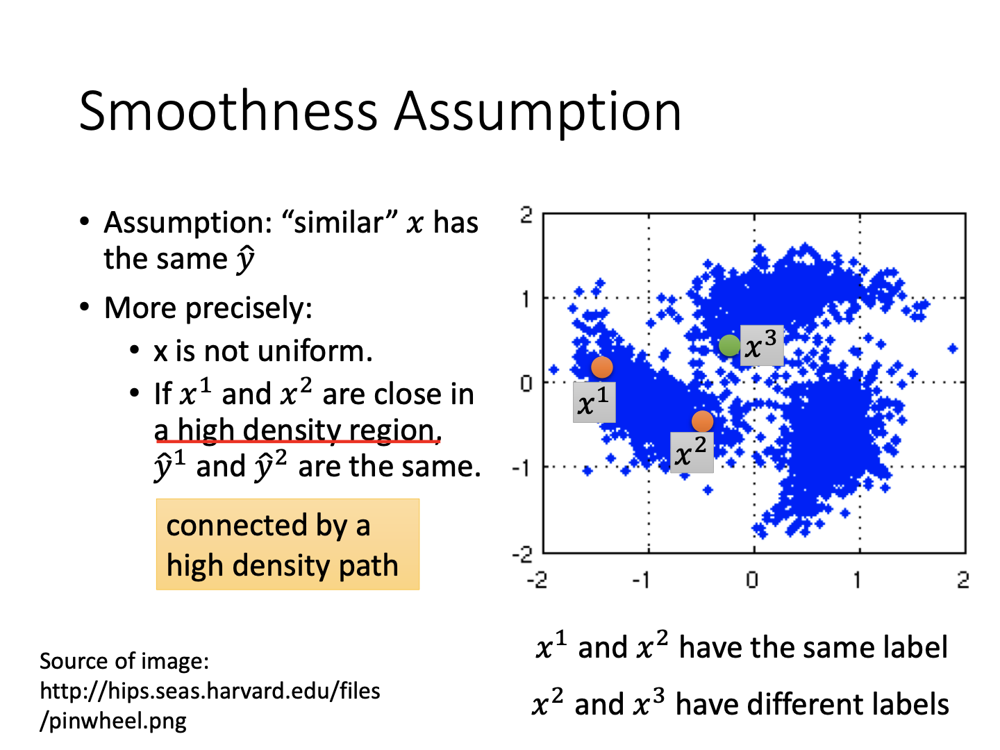
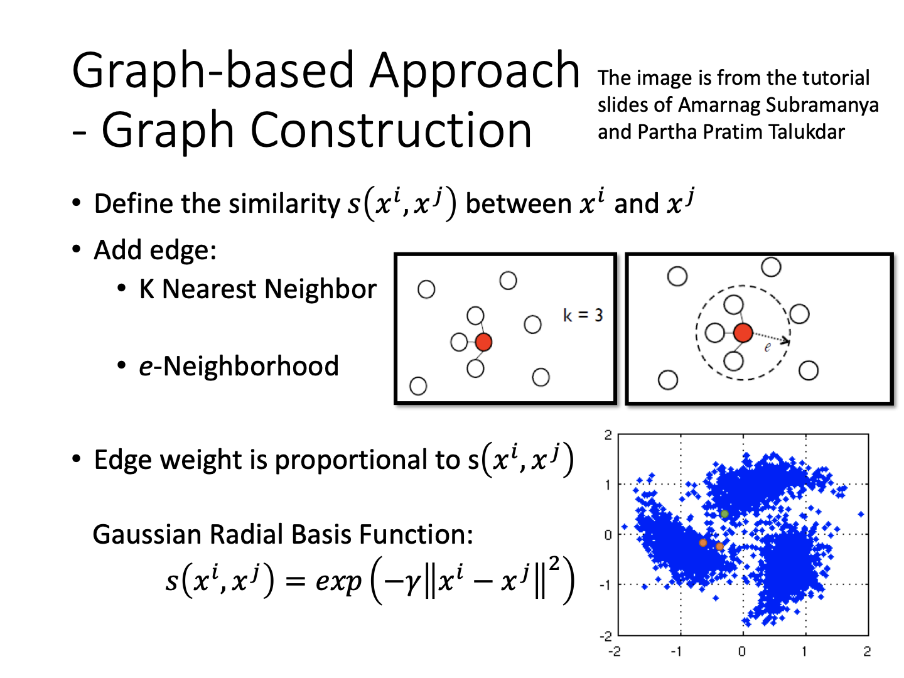
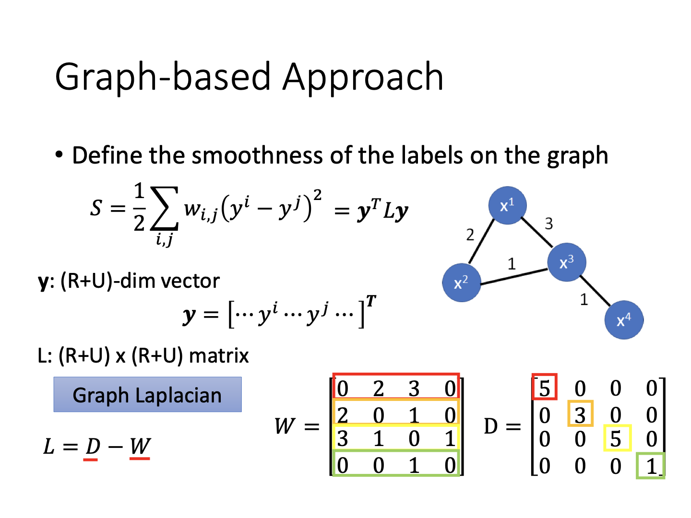

# Semi-supervised Learning

### 基本概念

对于监督学习，任务描述为对于给定的一系列数据x和标签y，进行训练活动。而**semi-supervised**为半监督学习，通常表现为训练集同监督学习，但额外存在一系列无标签数据（且数量通常远大于标签数据）。关于无标签数据被用作训练，有如下两个概念：

1.Transductive learning：无标签数据是训练数据；

2.Inductive learning：无标签数据非训练数据。

通过利用这一部分数据，可以增加模型的效果。

***为什么用半监督学习***

数据是海量的，但标签是匮乏的，所以大规模数据下仍然期望监督学习不现实。但是无标签数据可能表示数据的真实分布，所以仍然能够帮到训练。

另外，以人类的经历出发，我们实际上也利用半监督学习的方式获取知识，所以需要将其推广。

### Semi-supervised Learning for Generative Model

对于彩色的已标记数据，通过生成模型可以计算出数据分布的参数。然而如果加入额外的无标签数据，从直觉上就可认为数据分布会发生变化，从而影响分布参数、决策边界。

### 怎么做

半监督学习在生成模型上的优化过程实际上类似于EM算法。首先通过标记数据将模型参数分布等求出。对于非标签数据$x^u$，计算其后验概率，将其加入模型的类型分布和均值计算中去。注意此处加入的是软分类，即对于先验概率$P(C_1)$，数据$x^u$的数目会以其属于类别1的概率加入考虑。同理，原本均值$\mu_1$是通过计算所有属于类别1的标签数据除以类别1的数据总数所得，而现在加上了考虑非标签数据的项。理论上该算法会收敛，但是初始化的不同会影响最终的收敛结果。

实际上关于有标签数据的似然函数最大化方法是有闭式解的。然而添加上无标签项后，问题会变为非凸问题，因此要用迭代方式解。这里添加的似然概率是数据$x^u$来自两个不同类的概率之和。

### 假设：Low-density Separation

对于有标签数据，也许能够直观划分一系列边界。但一旦考虑到无标签数据，决策边界有可能产生移动。此时，一个基本假设就是决策边界一定是在数据密度较低的地方。

#### Self-training

介绍该假设之前，需要了解一个半监督学习中常用的技巧：**self-training**。该方法通过利用训练好的模型对无标签数据进行预测，将得到的假标签数据选入训练集，并迭代这一过程，从而利用无标签数据进行训练。

需要注意的是，在这一过程中，分类任务应使用hard label。因为对于soft label而言，相当于模型不做任何调整，预测的分类概率就是新的标签，也即直接挪用的新标签不会推动模型的变化。而根据low-density separation这一假设，如果数据有所偏向，那么一定要将其归为某一类，而不能有模糊边界。此时我们将某个数据按照最大概率推到某一类中，就让我们的模型更加斩钉截铁一些。同理，self-training方法由于这一特性，对于回归任务不适用，如果沿用预测的结果作为假标签值，那么对于模型改变没有任何帮助。

#### Entropy-based Regularization

Hard label方法也许过于武断，另一种折衷的思路是考虑分布的密度。按照低密度假设，如果产生的标签概率分布是有峰谷特性的，则说明当前至少对这一数据给出了较为确定的答案（并不关心答案是啥），而一个平均的分布表示完全不起作用的分类。此时，定义不同类别的熵，这一函数在分布有明显突出的时候才能达到最大值。将该函数加入总损失函数，就得到了新的目标函数（并且可微），通过梯度下降方法可解。因为这一形式与正则化较相似，所以称为基于熵的正则化。

### 假设：Smoothness

对于一系列数据，可以认为在分布上较为靠近的数据拥有相同的标签。更准确地说，因为数据分布不可能是均匀的，所以如果两个数据恰好通过某个高密度区相连，说明它们属于同一簇，因此标签相同。例如上图中$x^2$与$x^3$，虽然靠近，但是因为不在同一簇，所以并非同一类。

#### 如何构建数据联系

可以通过聚类方法将数据分类，再挑选标签。但该方法对数据类型有所要求。所以面对不同类型数据，需要合理设计衡量距离的函数。

因为提到密度和相连这一概念，所以构建数据聚类时，容易考虑基于图的方法。实际上这就是密度聚类的思想。通过划定数据相似度的距离阈值，将足够接近的数据加入。同时考虑到传递关系，新加入并归类的数据可以执行同样的操作来影响其周围的数据。不断执行上述操作直到遍历整个数据集，就可以将所有非标签数据的分类确定出来。

实际上对于具有图结构的数据（比如分配了相似度权重），可以通过构造拉普拉斯矩阵的方式衡量平滑度S。若数据标签在相邻位相同的较多，则S会变小，反之增大。在损失函数中加入该项即可对输出的标签结果进行平滑化。

### 假设：Better Representation

对于数据而言，它只是一种表象，其背后隐藏的信息可能才是更准确的代表（例如生成模型）。所以找到观测数据后的latent factor，就可以更准确地捕捉数据内容。