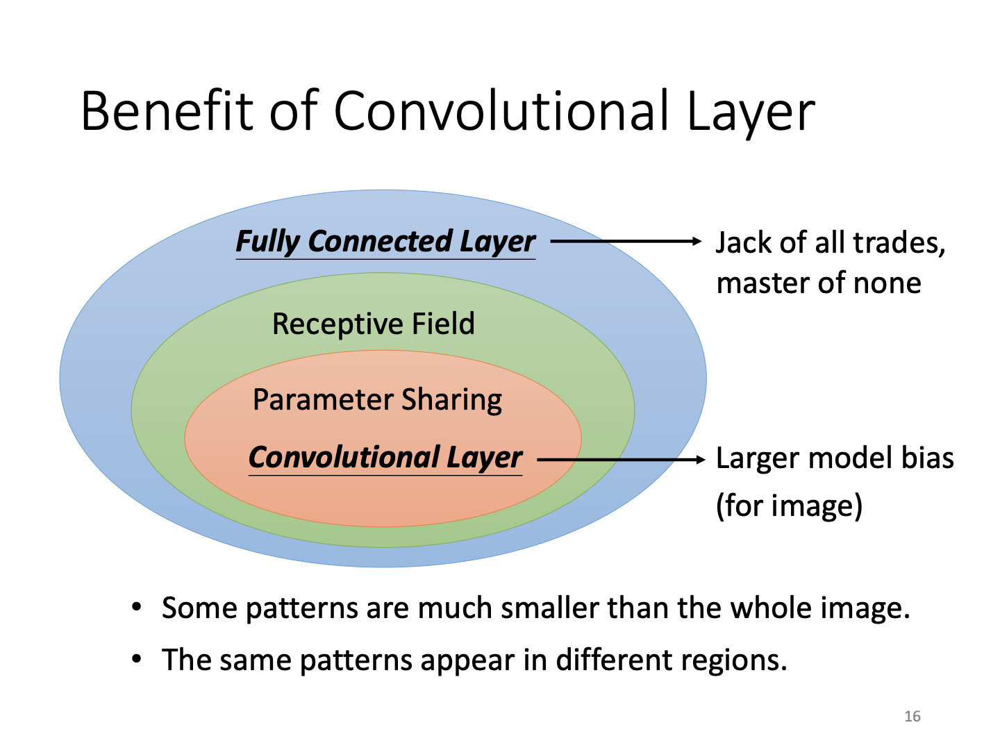

# Self-Attention

## CNN

### 从图像识别任务分析开始

在识别图像的任务中，需要输入图像，这一任务对于电脑来说实际上是一系列多通道的数据：

但是根据之前的方法，这样的图片只能直接拉直成为向量再输入网络。联想到之前的全连接神经网络，似乎任务量有点庞大...

#### 如何改进

**现象1 通过模式来确定图像内容** 

人类通过判断一些部分来确定某个图像的内容，所以对计算机也没必要输入全部的图像内容，通过让一个neuron观察小区域的数据就可以完成。

**手段1 Receptive Field**

通过让一个neuron关心某一个固定区域的内容，从而它不需要扫描整张图片，这一区域就叫做**Receptive Field**，即感受野。感受野实际上可以设置成各种形状，可以固定位置不相交而不是滑动重叠...当然这背后都体现了人类对于该网络处理问题的理解。对于经典的图像识别任务，一般正方形的感受野即可。

常用的图像任务中，常常采用宽高为3*3的感受野。一般卷积是需要重叠的，所以我们设定感受野移动的步长小于感受野的宽度。对于超出图像范围的的地方，通过padding这一方式将图像边缘的地方补上一些值（比如0），来让网络更好处理。通过这一系列过程，整张图片都被感受野覆盖了。

**现象2 同样的模式出现在不同的区域**

对于同样内容的图片，里头的图案有可能出现在不同的地方却是相同的：

如果对每一个不同位置的鸟嘴都用一个检测器，似乎有点浪费了。

**手段2 Parameter Sharing**

对于这类情形，实际上他们的感受野完全可以是同一组参数。

叙述中我们定义一个感受野内包含多个神经元。对于参数共享，不同的感受野实际上用的都是同样一组神经元，只是感受野的空间位置不同。

#### 卷积的好处

通过不断对网络加以限制，我们的网络将对图像识别任务越来越精通，最终成为了卷积神经网络。虽然通过限制参数的数量，模型的弹性变小，可能导致model bias增大（见第二课笔记），也就是不一定能找到最准确的那个解。但实际上全连接网络虽然参数众多，却因为其结构特殊，弹性过大，存在过拟合的可能，反而卷积网络因为特殊设计，在图像识别任务上有更出色准确的表现。

### 从卷积核的角度来理解CNN

实际上刚才提到的neurons就是一个个filter，即卷积核。其通过不断监测图像上的小区域而完成对一整张图片的读取。不同的filter有不同的参数，通过将参数和图像数据（比如RGB值）作点乘，得到通过一个filter的结果（实际上就是将这一区域拉直再用全连接网络处理）。通过卷积层的结果称为**Feature Map**

filter通过设置参数的不同，可以捕捉图像上的不同特征。比如例图中一个对角线正值的filter扫过图像，反映在结果上就是最大的结果位置对应的感受野区域也有对角线图像特征。

另外，通过叠加卷积层，让下一层卷积在前一轮的feature map上进行，实际上相当于读取到了最开始图像的更大区域，所以卷积网络虽然有固定的filter大小，却可以读取到图像的更大范围。

作个简单总结就是，从神经元角度和从卷积核角度考虑，实际上大家在关心同一个问题了。

#### 如何改进（续）

**现象3 下采样可以较好保持图像原貌**

通过合理的下采样技术，图像在缩小后仍然能够大致反映同样的事物！

**手段3 Pooling**

Pooling，即池化。通过池化，将输出再次压缩，从而在后续压缩运算量。当然，下采样是会伤害图像质量的，所以在计算资源充足的今天，池化操作反而可以丢弃。

### 应用？

#### 围棋

围棋判定中，棋盘是19*19维的向量，所以实际上如果拉直分类，一共有361个走子结果。但是围棋棋盘的pattern比较固定，并且在不同地方都会出现，所以实际上可以用CNN。实际上AlphaGo中并没有用到池化操作，所以网络设计还是要以现实为准，不可死记硬背。

#### 其他

CNN也可以给语音、NLP等任务进行运用，但是需要进行特别的数据处理，或网络设计。

#### 问题？

CNN其实没法处理同一个图片内容放大缩小的结果，所以它也存在诸多限制。在训练中实际上可能还需要数据增强等操作。