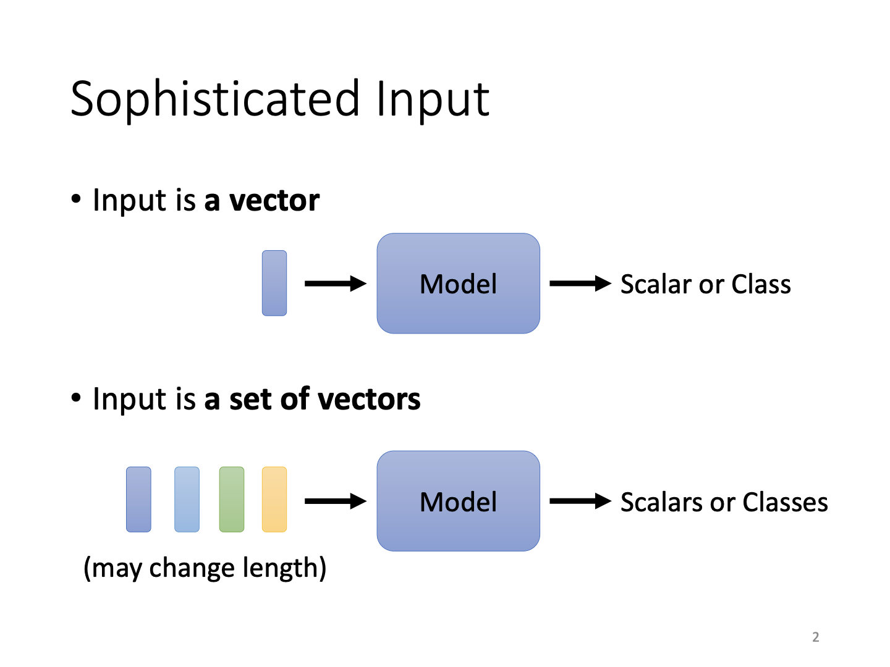
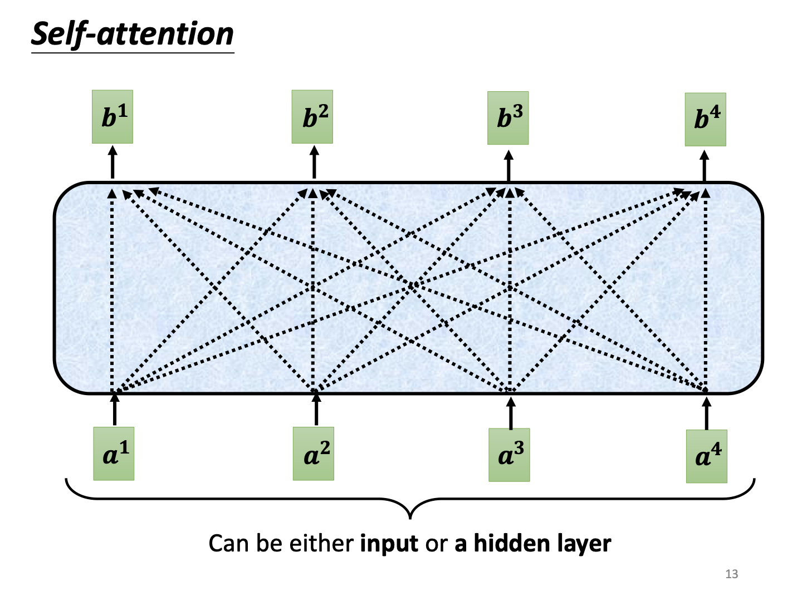

# Self-Attention

## CNN

### 从图像识别任务分析开始

在识别图像的任务中，需要输入图像，这一任务对于电脑来说实际上是一系列多通道的数据：

但是根据之前的方法，这样的图片只能直接拉直成为向量再输入网络。联想到之前的全连接神经网络，似乎任务量有点庞大...

#### 如何改进

**现象1 通过模式来确定图像内容** 

人类通过判断一些部分来确定某个图像的内容，所以对计算机也没必要输入全部的图像内容，通过让一个neuron观察小区域的数据就可以完成。

**手段1 Receptive Field**

通过让一个neuron关心某一个固定区域的内容，从而它不需要扫描整张图片，这一区域就叫做**Receptive Field**，即感受野。感受野实际上可以设置成各种形状，可以固定位置不相交而不是滑动重叠...当然这背后都体现了人类对于该网络处理问题的理解。对于经典的图像识别任务，一般正方形的感受野即可。

常用的图像任务中，常常采用宽高为3*3的感受野。一般卷积是需要重叠的，所以我们设定感受野移动的步长小于感受野的宽度。对于超出图像范围的的地方，通过padding这一方式将图像边缘的地方补上一些值（比如0），来让网络更好处理。通过这一系列过程，整张图片都被感受野覆盖了。

**现象2 同样的模式出现在不同的区域**

对于同样内容的图片，里头的图案有可能出现在不同的地方却是相同的：

如果对每一个不同位置的鸟嘴都用一个检测器，似乎有点浪费了。

**手段2 Parameter Sharing**

对于这类情形，实际上他们的感受野完全可以是同一组参数。

叙述中我们定义一个感受野内包含多个神经元。对于参数共享，不同的感受野实际上用的都是同样一组神经元，只是感受野的空间位置不同。

#### 卷积的好处

通过不断对网络加以限制，我们的网络将对图像识别任务越来越精通，最终成为了卷积神经网络。虽然通过限制参数的数量，模型的弹性变小，可能导致model bias增大（见第二课笔记），也就是不一定能找到最准确的那个解。但实际上全连接网络虽然参数众多，却因为其结构特殊，弹性过大，存在过拟合的可能，反而卷积网络因为特殊设计，在图像识别任务上有更出色准确的表现。

### 从卷积核的角度来理解CNN

实际上刚才提到的neurons就是一个个filter，即卷积核。其通过不断监测图像上的小区域而完成对一整张图片的读取。不同的filter有不同的参数，通过将参数和图像数据（比如RGB值）作点乘，得到通过一个filter的结果（实际上就是将这一区域拉直再用全连接网络处理）。通过卷积层的结果称为**Feature Map**

filter通过设置参数的不同，可以捕捉图像上的不同特征。比如例图中一个对角线正值的filter扫过图像，反映在结果上就是最大的结果位置对应的感受野区域也有对角线图像特征。

另外，通过叠加卷积层，让下一层卷积在前一轮的feature map上进行，实际上相当于读取到了最开始图像的更大区域，所以卷积网络虽然有固定的filter大小，却可以读取到图像的更大范围。

作个简单总结就是，从神经元角度和从卷积核角度考虑，实际上大家在关心同一个问题了。

#### 如何改进（续）

**现象3 下采样可以较好保持图像原貌**

通过合理的下采样技术，图像在缩小后仍然能够大致反映同样的事物！

**手段3 Pooling**

Pooling，即池化。通过池化，将输出再次压缩，从而在后续压缩运算量。当然，下采样是会伤害图像质量的，所以在计算资源充足的今天，池化操作反而可以丢弃。

### 应用

**围棋**

围棋判定中，棋盘是19*19维的向量，所以实际上如果拉直分类，一共有361个走子结果。但是围棋棋盘的pattern比较固定，并且在不同地方都会出现，所以实际上可以用CNN。实际上AlphaGo中并没有用到池化操作，所以网络设计还是要以现实为准，不可死记硬背。

**其他**

CNN也可以给语音、NLP等任务进行运用，但是需要进行特别的数据处理，或网络设计。

#### 问题？

CNN其实没法处理同一个图片内容放大缩小的结果，所以它也存在诸多限制。在训练中实际上可能还需要数据增强等操作。

## Self-attention

### 输入向量集的机器学习问题

对于常见的机器学习任务，一般是输入一个向量，输出一个值或标签，即分类或回归任务。而如果输入是一组向量且不一定数量一致（下一组的向量数量不一样），问题将变得复杂。

对于以向量集作为输入的问题，常见的有word-embedding、图预测、分子预测等，均为输入一系列代表某个实体的向量，输出对于该实体的预测。另外，它们的输出也有不同的类型：

***1.一对一输出*** 以词性标注为例，对输入的一系列句子，输出其中每一个词的词性，所以输入的向量数（单词数量）对应输出的结果数。

***2.多对一输出*** 对输入向量集，给出一个结果，比如输入一个分子的向量表示集，输出其名称/类别等。

***3.模型自决定*** 不确定的输出数量，比如机器翻译问题。

#### 考虑上下文的方法？

通过人为处理数据，其实可以在全连接网络上实现对输入序列数据进行处理，从而解决输入向量集的问题。

对于输入序列问题，常考虑是否不同的序列中数据用不同的FC单元进行处理。若如此，此时可以将某个向量数据前后的数据均加入考虑，这样相当于考虑到了序列关系。当然，如果序列太长，网络就会过于复杂导致过拟合；另外序列长度如何设置也需要实践，所以这并不是一个好方法。

### Self-attention

在*Attention is all you need*一文中，作者构想一种网络，其接受所有的输入向量，又产生对应数量的输出，而产生的结果就包含了输入向量的上下文数据。

拆开Self-attention的盒子，我们实际上看到的是如下的关系：

从输入a到输出b，每一个输出都在考虑所有输入的关系。此时不禁要问，如何衡量不同输入间的关系（以$\alpha$）代表？

实际上输入会乘上两个矩阵$W^q$与$W^k$，得到的向量作内积，最终得到不同输入间的分数。当然，得到的中间向量也可以通过加和再通过其他非线性函数输出关系分数，此处不讨论。

实际上得到的结果分数需要通过Soft-max层，以确定其在所有结果分数中的占比，这也是为了表现一种比例关系。当然这一过程也可以通过ReLU等激活函数来代替。此处的$q$意为query，而$k$意为key。

另外，输入再分别与矩阵$v$相乘，得到的结果与对应的注意力分数作线性组合，就得到了最终的输出：

**需要注意的是，从$b_1$到$b_4$，都是可以并行计算的！所以该网络效率并不低。**

从矩阵运算的角度，可以将每个向量$a_i$按列堆叠，从而运算输出的向量$q_i, k_i, v_i$均能够按同样顺序堆叠，简化计算。

同理，在求取注意力分数$\alpha$时，也可以利用矩阵形式计算：

此时，利用先前得到的矩阵$\boldsymbol{V}$对矩阵$\boldsymbol{A'}$左乘，即可得到输出$\boldsymbol{O}=(\boldsymbol{b}^1, \boldsymbol{b}^2, \boldsymbol{b}^3, \boldsymbol{b}^4)$。也即，从矩阵表示来说，存在如下关系：

此处$\boldsymbol{I}$代表input，也就是$\boldsymbol{a_i}$组成的矩阵。自注意力网络虽然过程复杂，但实际上执行的是一系列矩阵操作，并且需要学习的参数只有关于Q、K、V的三个系数矩阵。

#### Multi-head

现实中，相关关系可能不只有一种，怀着这种想法，多头注意力机制出现了：

通过在原有的qkv上分别套上新的系数矩阵，可扩增产生的向量，再分别对不同位置的向量（相同位置下标处才可联合计算，如$\boldsymbol{q}^{i,2}$和$\boldsymbol{k}^{i,2}$）进行类似操作，将结果使用矩阵乘法拼合，融为最终的某位置单输出$\boldsymbol{b}_i$。

#### Positional Encoding

虽然自注意力机制不考虑输入序列的长度，但是也没有考虑不同位置的距离和顺序，这对于语言识别类任务是灭顶之灾。所以实际上输入时会加入表示位置的向量，该向量从数据中学习得到（此处不展开）。

### 应用

**Speech**

语音识别任务中，通常向量长度较大，而Attention Matrix的维度是向量长度^2，所以导致计算复杂度增加。实际上会使用*Truncated Self-attention*，考虑较短的序列，该过程需人为设置。

**Image**

对于图像任务，多通道图的每一个像素位置堆叠都可看作一个向量，所以图像是一个向量集。和CNN类似，Attention通过读取不同位置图像信息，同样可以学习像素关联关系。有论文表明，attention是复杂化的CNN（https://arxiv.org/abs/1911.03584）。

联想网络参数数量和网络弹性的讨论，如果网络过于复杂导致其弹性大，那么这样的网络1.需要大量数据才能拟合；2.会出现过拟合问题。实际上cnn是attention的一个子集，它们之间使用不同数据的性能表现对比如下：

显而易见，在数据量适中的情况下，CNN因网络设计的特殊性，图像任务结果好于attention机制。然而因为后者参数量足够多，所以面对巨量数据，仍然有超过CNN的能力。

**RNN对比**

在语音识别中，RNN是一种常用方法。其通过考虑前序输入的结果，结合当前输入进入网络层的结果，产生当前输出结果。某种意义上，当走遍一个序列，RNN也是可以考虑两个不同位置的数据关系的，当然，仅限单向。所以有人认为双向RNN可以解决这个问题。然而，所有数据传递操作与两个数据之间的距离有关。若输入序列过长，头尾数据的考虑就需要极长迭代。反观attention，对于某个数据和其他所有数据，均是在同时完成计算。另外，attention是并行计算，RNN只能进行串行计算，这一点限制了一些分布式或并行优化。

**Graph**

另外，对于图任务，attention机制存在优势：图节点的相邻边表示节点关系，而attention需要通过网络学习关系。然而通过相邻边，就可以排除某些attention位置的计算（设为0）。