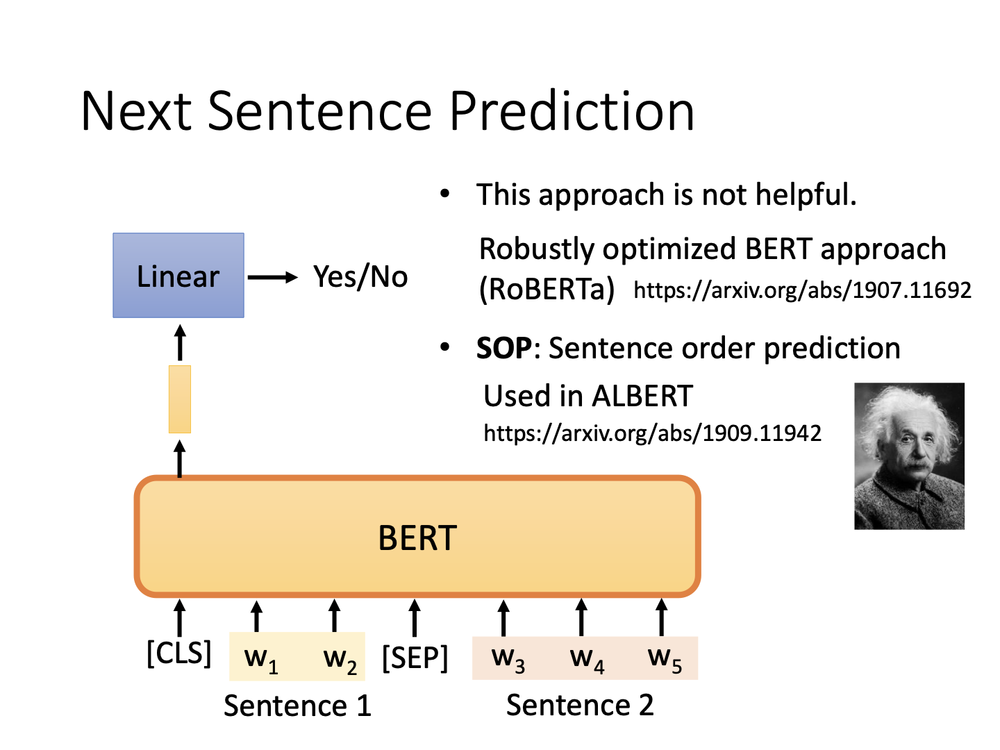
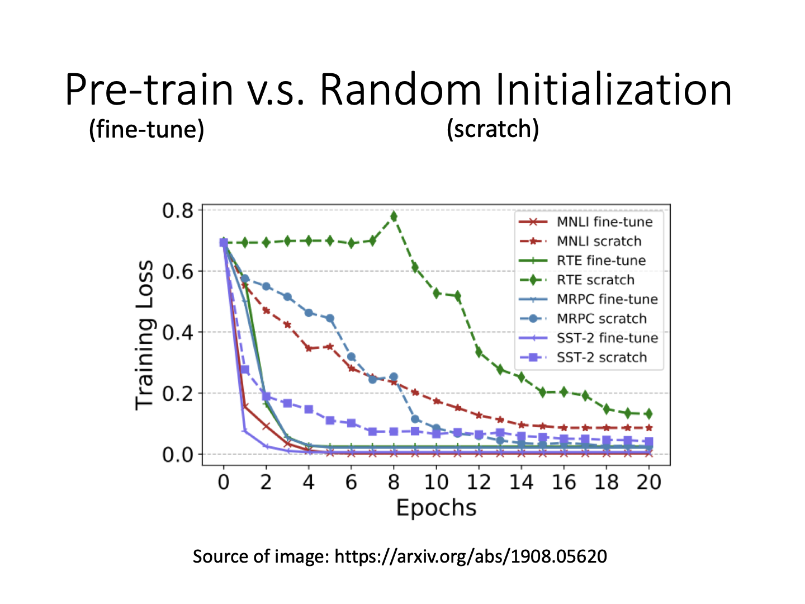
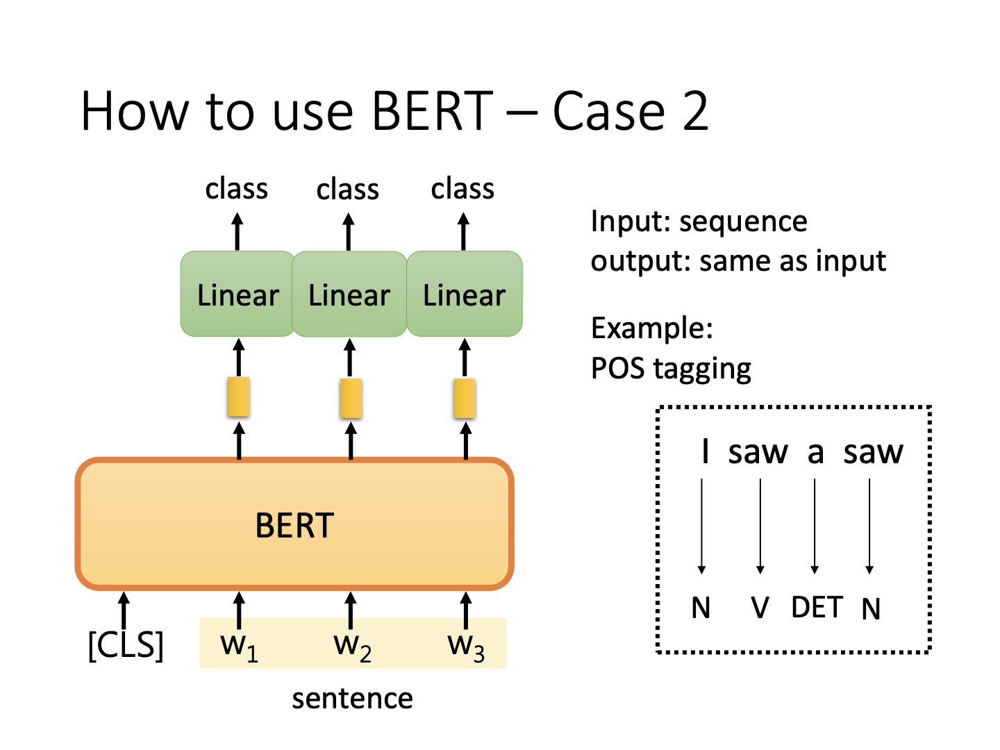
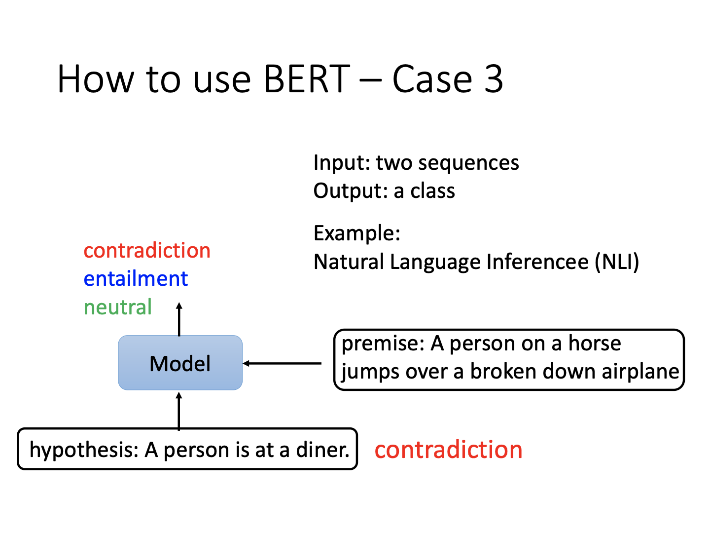
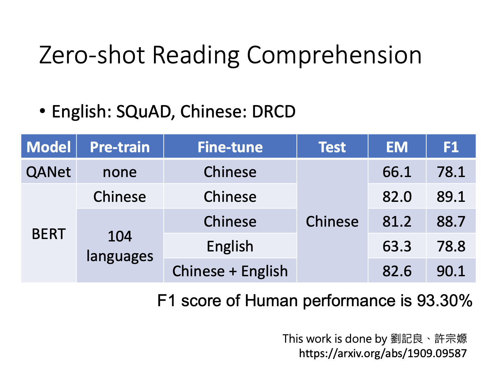
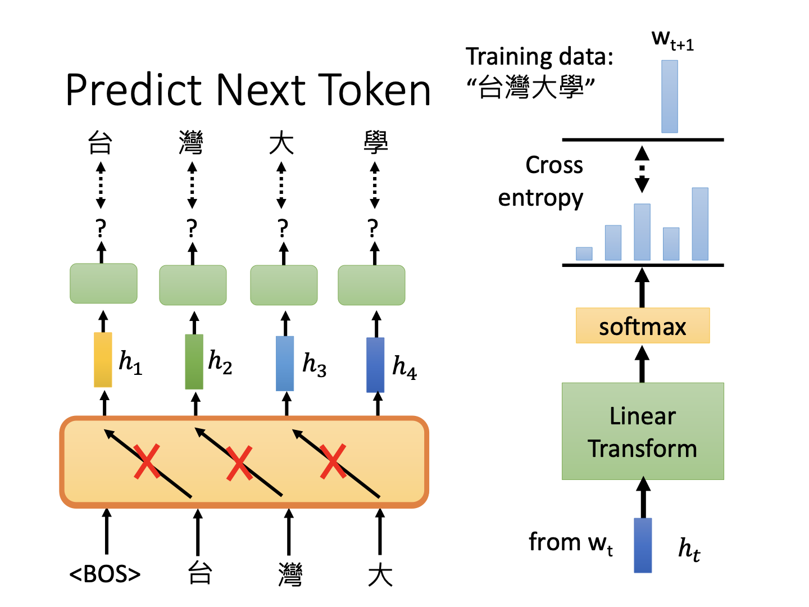

# Self-Supervised Learning

## Self-Supervised Learning

自然语言处理模型层出不穷，目前有一系列模型以知名少儿节目《芝麻街》命名，包括ELMO、BERT、ERNIE等。随着模型发展，其参数量也在不断增加，以下为一个示例：

流行的BERT模型已经有340M（百万）的参数，而在其之上还有GPT-2等更大的模型。本课根据使用的网络结构不同，划分为两种类别：BERT和GPT。

### BERT series

BERT由transformer中的encoder组成。以BERT为主流的NLP任务实际上是自监督学习（**self-supervised learning**）的体现。监督学习在进行NLP时，将文档输入模型，输出的目标需要和标签进行比对；而自监督学习取一部分数据输入模型，而另一部分数据作为标签，对模型输出进行评估与纠正。

**Masking Input**

BERT进行自监督的方法为对输入进行覆盖。例如输入模型的句子为“台湾大学”，BERT使用一个特殊符号对“湾”进行覆盖或将这个字替换为随机的其他文字。而模型对于该文字的输出又需要和“湾”在字典里的one-hot向量进行对比。由此，模型将训练数据通过特殊处理，去除其部分当作预测目标，以完成自监督训练。

**Next Sentence Prediction**

BERT在训练中也会抽取两个句子并输出其是否是顺序相邻句。然而该方法似乎无法让BERT学到有用信息，此处不展开。

***怎么把BERT运用到其他任务？***

上文提到的BERT训练方法仅仅是训练了它“做填空题”的能力，无论是确定某个句子中的词输出或确定两个句子的关系。但实际上，Google研发BERT并将以上过程均当作pre-train。面对繁多的NLP任务，需要使用这种pre-train的BERT在不同的任务数据上进行微调（**fine-tune**）。此时微调的数据是标签数据。所以实际上BERT的pre-train+fine-tune是一种半监督学习了。

#### 如何使用BERT

**通用任务集**

评估NLP任务一般使用GLUE任务集，其中包括9大类NLP任务，通过评估该任务集在不同模型的分数进行评判。

#### BERT任务例

**Case1: Sentiment Analysis**

输入一段话，输出对这段话包含情感的正负评价，这就是情感分析（**sentiment analysis**）的目标。该任务虽然和先前提到的pre-train方式不同，但人们发现使用训练后的模型参数并fine-tune效果好于随机初始化。直觉来看其实就是一个有一点学习能力的人肯定比一无所知强。

图例分析可知，虚线代表的参数随机初始化模型远不如pre-train并fine-tune的模型。无论是训练过程的误差下降速度还是最终稳定后的模型误差，pre-train+fine-tune均有更好的表现。***这也说明pre-train的重要性。***

**Case2: POS tagging**

输入某长度序列，输出同样长度序列，这样的任务通常是词性标注的场景：

**Case3: Natural Language Inference**

输入某内容和一个假设，输出对这二者之间的判断：

例如告诉模型“某人在骑马”，又假设“某人是在吃饭”，机器就应该输出这是一个矛盾的内容。

**Case4: Extraction-based Question Answering**

有一种问答任务限定答案来自于文章。在这种情况下，要求输入文章和问题，输出的内容是两个index，指示问题的答案在文章的第几个词到第几个词：

这种任务在训练时输入问题与文档，并初始化两个随机向量，通过将它们分别与文档单词作内积和softmax，找出概率最大的那个位置，当作答案的开始/终结位置。

#### BERT为什么有效

因为BERT使用encoder提取输入的embedding，所以不难猜测，有相似信息的词应该有类似的embedding结果。

例如，将包含水果意义的苹果和包含苹果手机意义的苹果这两个词的不同句子送入BERT，观察这两个句子中的“果”字对应的embedding间余弦相似度，发现作为水果的句子之间该文字的embedding相似度均较高，描述数码产品的句子之间相似度也较高，但是这两组句子之间的相似度就显著很低。这说明它确实在embedding中考虑到了不同的词、不同的上下文的关系。所以BERT实际上也叫做**Contextualized word embedding**。

甚至，对于在英文数据上预训练的BERT，让它处理蛋白质氨基酸等分类预测任务都有不错的结果。例如氨基酸分A、T、C、G四种，将他们随便映射为四个不同的单词，从而氨基酸序列就是一些胡乱的单词序列。BERT对于这样的数据同样能够识别出内在的关系！

#### Multi-lingual BERT

科学家们不满足于BERT的强大性能，提出了更疯狂的目标：同时学习多语言内容的BERT。即该模型同时学习英文、中文等不同的语言内容。在这样的情况下，BERT甚至可以胜任更多奇特的任务。

**Zero-shot Reading Comprehension**

当BERT同时使用多种语言进行训练后，设立一个下游任务：问答。原本的目标是输入某语言的问答任务，fine-tune模型以使其能够胜任该语言的问答任务。然而对于多语言的预训练BERT，有一种构想是输入某语言问答任务，通过fine-tune可以令其直接完成其他语言（预训练中包含的语言）的问答。

如图，一个训练了104种语言的BERT，只使用英文问答任务fine-tune，在中文问答任务上也可获得不错的结果（虽然相比其他BERT差）。

该任务体现的实际上是BERT对于语言背后特征的学习。如果其真的能探究语言背后的关系，那么网络甚至可以直接将语言关系输入，而令其在未学习某语言的情况下完成该语言任务。例如，对于中文和英文的同义词，其通过BERT训练后均产生embedding。这时候输入英文句+英-中之间embedding的差异向量，BERT就可以直接学会英-中翻译任务！

如图，当$\alpha=1$时，BERT已经学习到“没有人”和“no one”之间的关系了。当然这种翻译是词之间的翻译，对于组成完整的句子仍有难度，但至少说明BERT在学习语言背后的表征。

### GPT series

GPT是使用decoder的模型，它更多的应用不是提取语言特征，而是产生下一步结果。

GPT的代表标志是独角兽，这是来源于其最出名的任务：生成了一篇描写独角兽的新闻文章。

#### 使用方法

与BERT不同，GPT的任务目标更加疯狂。它希望直接给定某任务描述，产生对应的输出，就如同做英语问答题一般。

例如，输入一个描述为翻译的句子，再给定一些某语言到另一语言的输入，最后给出某语言词句，令其输出对应语言。这在其论文中也被称为“Few-shot Learning”：

这是一种非常疯狂的idea。并且随着给出的example减少，还有单例的“one-shot”和无范例的“zero-shot”。当然，从结果上来看，其实效果并非特别理想。在某些任务上可能确实能够学到信息。

另外，自监督学习的方式不仅局限于NLP任务，在语音辨识和CV上都有相应的研究。

## Auto-encoder

### 基本概念

Auto-encoder是另一种自监督学习的方式。其训练某一网络，使用训练资料作为输入，能够产生一个中间表示，且该表示通过网络输出可以还原回原始的训练资料。

实际上这一过程和先前介绍的CycleGAN十分相似，图片通过一个encoder变为中间向量，中间向量通过decoder还原回原始图片。而CycleGAN的训练目标就是自我监督形式的。

***为什么有用***

以图片为例，显而易见一张N*N的图片中，并非所有的像素取值组合方式都能呈现为图片（否则全1矩阵也能显示）。既然假设图片的组合变化方式有内在规律，所有像素并非都有意义，那么它们就应该能被映射到更低维度上。

实际上，BERT其实就是一种拥有“去噪”功能的auto-encoder。在输入拥有噪声（mask）的情况下，要求输出的噪声对应位置要尽量接近原始数据。

### Feature Disentanglement

既然能够提取特征，自然而然就会想到所提取的特征向量中的不同部分是否固定代表不同的信息。例如语音识别任务中，假设通过encoder提取出的中间向量前半部分代表内容，后半部分代表说话者特征（音色）。

在语音转换任务中，如果需要进行两个不同说话者的音调转换，监督学习的思路是两个说话者各提供同样数目、同样内容的语音，机器当作训练数据与标签，由此学会语音转换特征。当需要转换的说话者说一句新的语音后，机器能够将其转化成目标说话者的音色。但该任务在数据搜集上有极大困难，显然限定了应用范围。借助feature disentanglement的思想，不妨考虑如果语音信息中内容是一部分特征，音色是一部分特征，那么说话者A的内容+说话者B的音色就可以组合成B说A说过的话（而B自己并没说过）。

如上例，通过内容+音色的特征分解拼凑，再送入decoder，就使得一个从没讲过某内容的说话者使用其音调特征讲出该内容。

### Discrete Latent Representation

当前讨论的encoder输出向量均为连续向量。如果该向量为离散结果，就可以完成不同的任务。

**图像分类**

例如输入图像的AE，如果其中间向量从连续数值变为0-1，则可以认为是对某些图像特征的分类表示。更进一步，成为one-hot向量即说明对该图像做出了一种分类。

**固定输入特征**

另外，也可以考虑对decoder的输入是从固定向量中挑选。首先encoder得到的向量和一系列向量计算相似度分数，将最高者当作decoder的输入。这些向量都可以从模型中习得。这种挑选固定内容进行编码的过程也是离散化的表现。例如在语音识别中这些向量就可以当作是一种音节特征的离散化（固定音标）。

**文字摘要生成**

类似的，如果中间表示可以是一段文字而非向量，那么对于两端输入为文档，就可以要求这是一种摘要生成的任务。当然，因为encoder和decoder之间可能会产生人类不理解的特殊文字表示，所以在生成的过程中还需要加入识别人类句子的discriminator进行判别。这实际上就是CycleGAN的思路。

不难发现，这一方法确实可以学习到一部分信息。

### 其他应用

首先，因为AE的特殊结构，其decoder实际上可以当作GAN中的generator。

**压缩**

通过AE进行图片特征提取和还原，实际上就是一种压缩任务的体现，而产生的中间向量就是压缩的结果。当然，因为decoder出来的图片不可能跟原始图片完全一致，所以这是一种有损压缩。

**异常检测**

异常检测（**anomaly detection**）是另一种比较重要的应用。

如果模型只针对某类数据进行训练，那么一旦出现范围之外的内容，它就倾向认为这些数据是不正常的。该思路在金融欺诈、网络异常检测中均有应用。这类任务的数据集通常是类别分布极度不均匀的。搜集较少的那一类开销极大，因此应使用异常检测的方式进行训练与预测。

再以图像任务为例。如果训练某人脸检测器，那么训练成熟的检测器在遇到非训练人脸时，decoder就难以较好重建。此时，通过衡量重建图片和原始图片的相似度，差异较大就说明输入图像非某人脸，即监测到异常。当然需要注意的是这种网络不能使用真正有效进行人脸特征提取的模型。例如一个可以完全重建各类人脸的GAN，其输入未见过的人脸，可能同样能够还原这张脸，从而造成误判。所以从某种角度说，异常检测任务是限制网络的能力以找出范围外的数据。

