# Self-Supervised Learning

## Self-Supervised Learning

自然语言处理模型层出不穷，目前有一系列模型以知名少儿节目《芝麻街》命名，包括ELMO、BERT、ERNIE等。随着模型发展，其参数量也在不断增加，以下为一个示例：

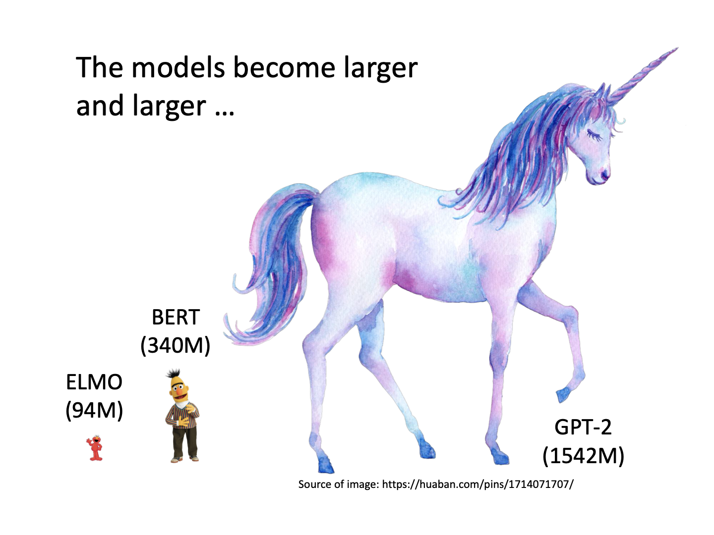

流行的BERT模型已经有340M（百万）的参数，而在其之上还有GPT-2等更大的模型。本课根据使用的网络结构不同，划分为两种类别：BERT和GPT。

### BERT series

BERT由transformer中的encoder组成。以BERT为主流的NLP任务实际上是自监督学习（**self-supervised learning**）的体现。监督学习在进行NLP时，将文档输入模型，输出的目标需要和标签进行比对；而自监督学习取一部分数据输入模型，而另一部分数据作为标签，对模型输出进行评估与纠正。

**Masking Input**

BERT进行自监督的方法为对输入进行覆盖。例如输入模型的句子为“台湾大学”，BERT使用一个特殊符号对“湾”进行覆盖或将这个字替换为随机的其他文字。而模型对于该文字的输出又需要和“湾”在字典里的one-hot向量进行对比。由此，模型将训练数据通过特殊处理，去除其部分当作预测目标，以完成自监督训练。

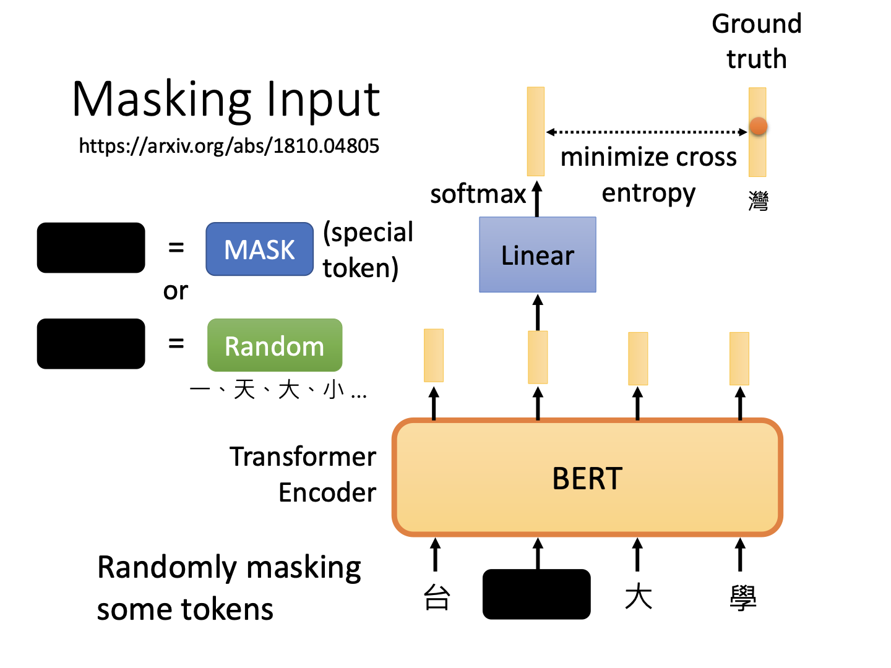

**Next Sentence Prediction**

BERT在训练中也会抽取两个句子并输出其是否是顺序相邻句。然而该方法似乎无法让BERT学到有用信息，此处不展开。

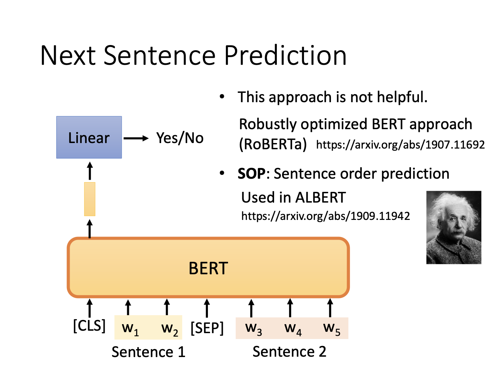

***怎么把BERT运用到其他任务？***

上文提到的BERT训练方法仅仅是训练了它“做填空题”的能力，无论是确定某个句子中的词输出或确定两个句子的关系。但实际上，Google研发BERT并将以上过程均当作pre-train。面对繁多的NLP任务，需要使用这种pre-train的BERT在不同的任务数据上进行微调（**fine-tune**）。此时微调的数据是标签数据。所以实际上BERT的pre-train+fine-tune是一种半监督学习了。

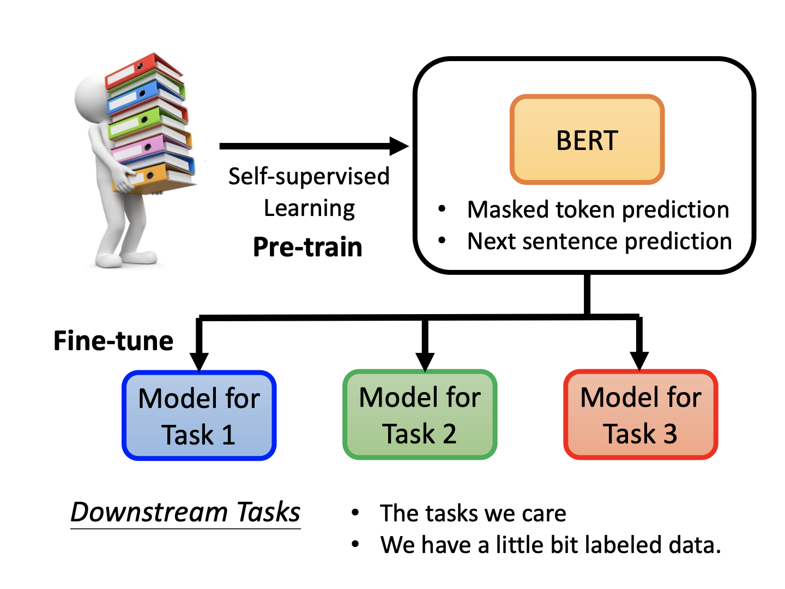

#### 如何使用BERT

**通用任务集**

评估NLP任务一般使用GLUE任务集，其中包括9大类NLP任务，通过评估该任务集在不同模型的分数进行评判。

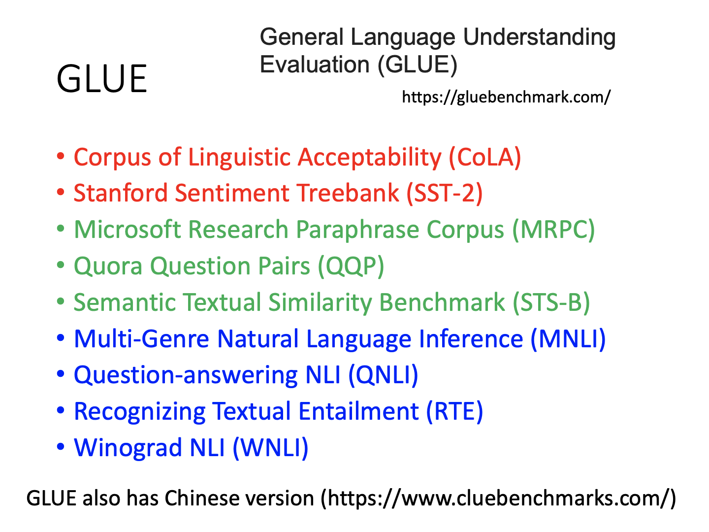

#### BERT任务例

**Case1: Sentiment Analysis**

输入一段话，输出对这段话包含情感的正负评价，这就是情感分析（**sentiment analysis**）的目标。该任务虽然和先前提到的pre-train方式不同，但人们发现使用训练后的模型参数并fine-tune效果好于随机初始化。直觉来看其实就是一个有一点学习能力的人肯定比一无所知强。

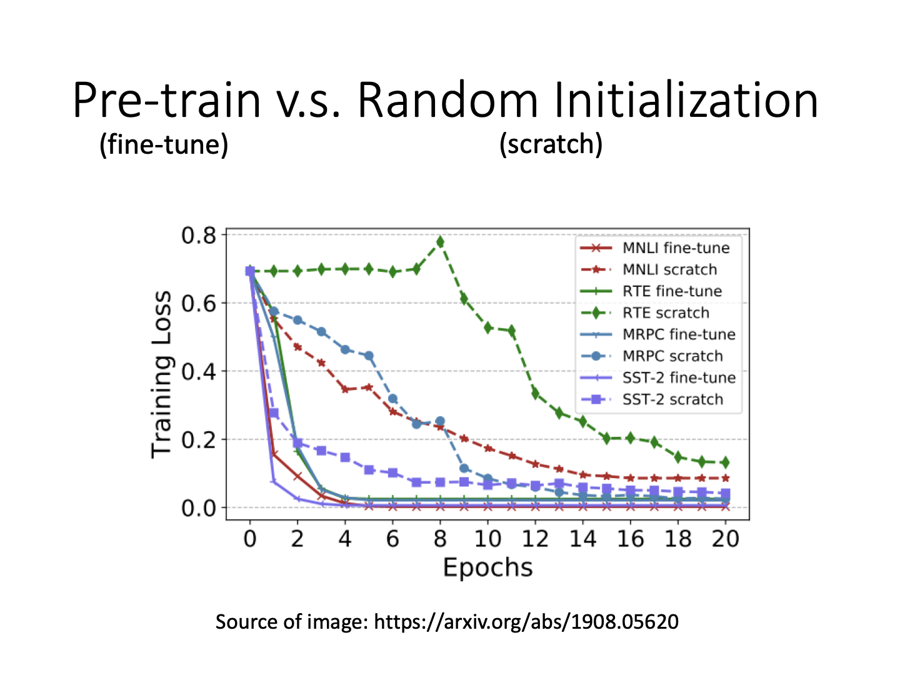

图例分析可知，虚线代表的参数随机初始化模型远不如pre-train并fine-tune的模型。无论是训练过程的误差下降速度还是最终稳定后的模型误差，pre-train+fine-tune均有更好的表现。***这也说明pre-train的重要性。***

**Case2: POS tagging**

输入某长度序列，输出同样长度序列，这样的任务通常是词性标注的场景：

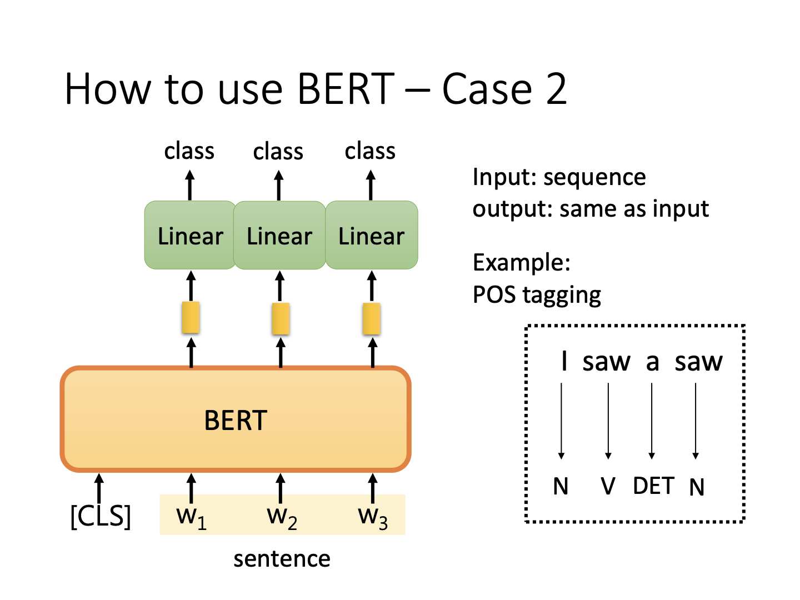

**Case3: Natural Language Inference**

输入某内容和一个假设，输出对这二者之间的判断：

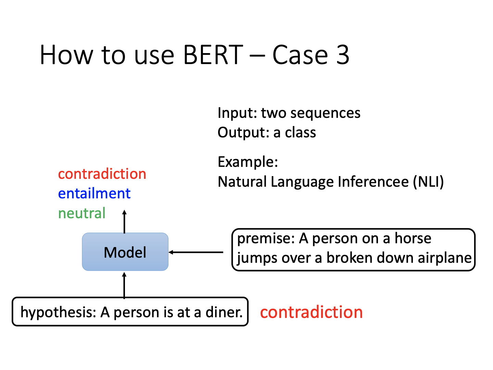

例如告诉模型“某人在骑马”，又假设“某人是在吃饭”，机器就应该输出这是一个矛盾的内容。

**Case4: Extraction-based Question Answering**

有一种问答任务限定答案来自于文章。在这种情况下，要求输入文章和问题，输出的内容是两个index，指示问题的答案在文章的第几个词到第几个词：

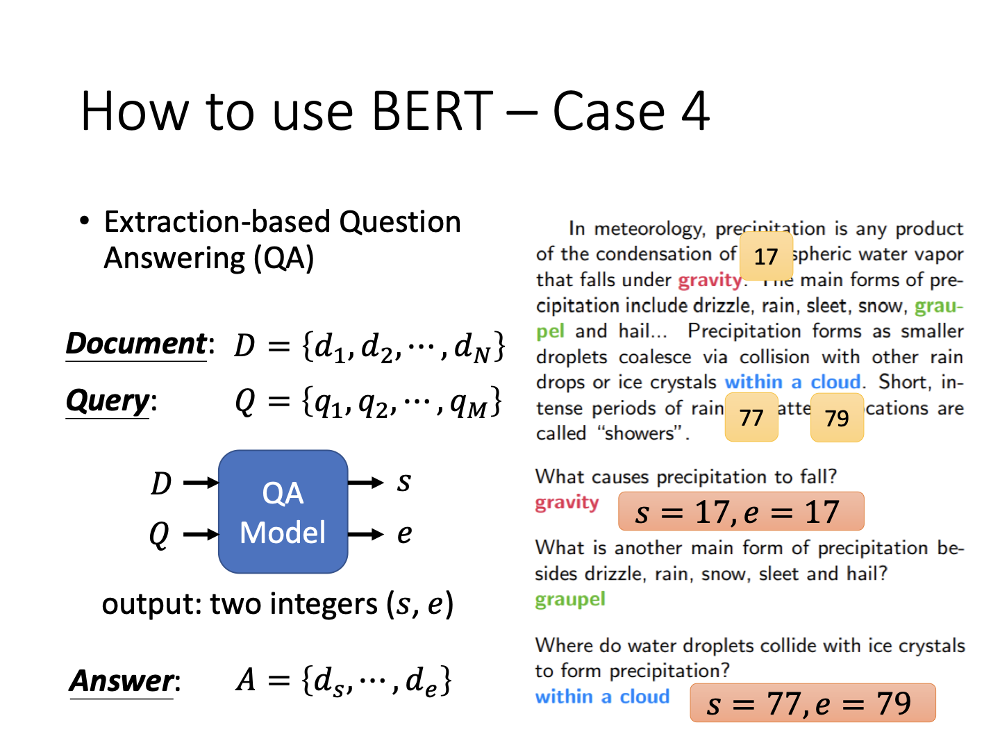

这种任务在训练时输入问题与文档，并初始化两个随机向量，通过将它们分别与文档单词作内积和softmax，找出概率最大的那个位置，当作答案的开始/终结位置。

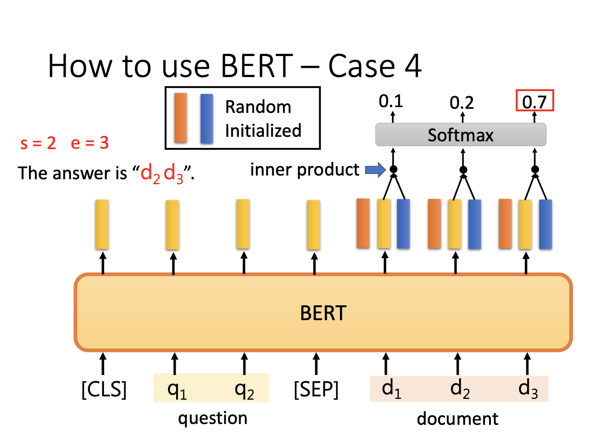

#### BERT为什么有效

因为BERT使用encoder提取输入的embedding，所以不难猜测，有相似信息的词应该有类似的embedding结果。

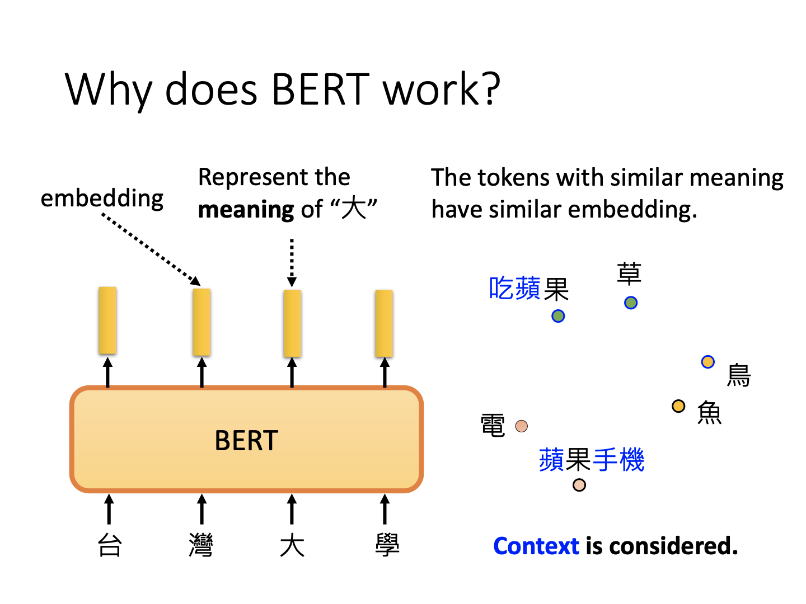

例如，将包含水果意义的苹果和包含苹果手机意义的苹果这两个词的不同句子送入BERT，观察这两个句子中的“果”字对应的embedding间余弦相似度，发现作为水果的句子之间该文字的embedding相似度均较高，描述数码产品的句子之间相似度也较高，但是这两组句子之间的相似度就显著很低。这说明它确实在embedding中考虑到了不同的词、不同的上下文的关系。所以BERT实际上也叫做**Contextualized word embedding**。

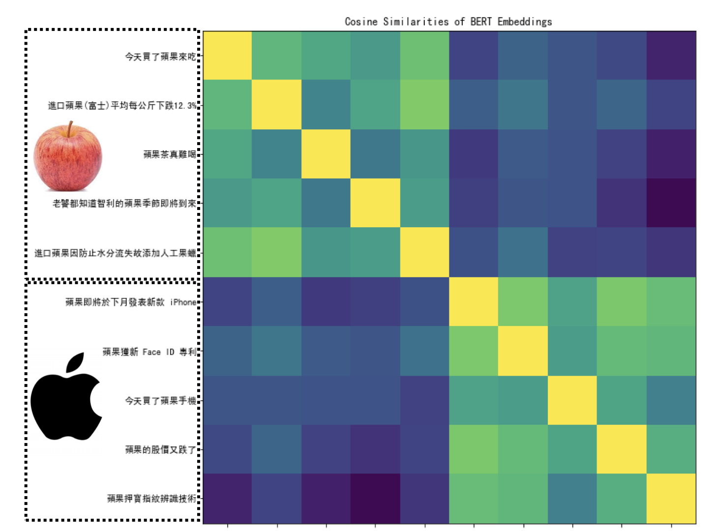

甚至，对于在英文数据上预训练的BERT，让它处理蛋白质氨基酸等分类预测任务都有不错的结果。例如氨基酸分A、T、C、G四种，将他们随便映射为四个不同的单词，从而氨基酸序列就是一些胡乱的单词序列。BERT对于这样的数据同样能够识别出内在的关系！

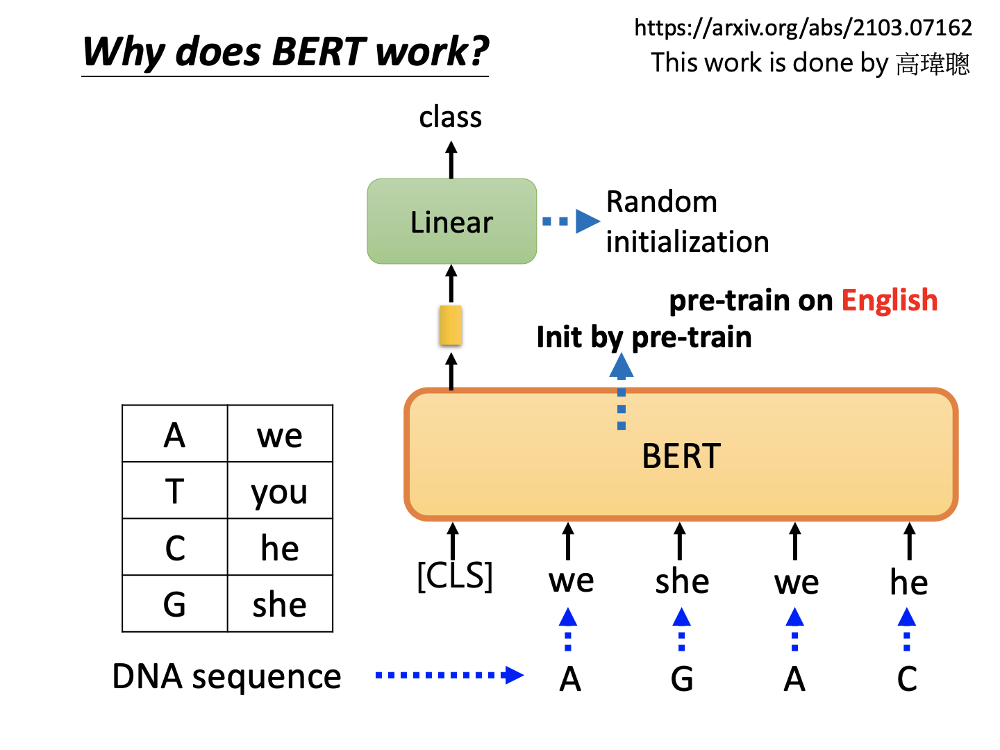

#### Multi-lingual BERT

科学家们不满足于BERT的强大性能，提出了更疯狂的目标：同时学习多语言内容的BERT。即该模型同时学习英文、中文等不同的语言内容。在这样的情况下，BERT甚至可以胜任更多奇特的任务。

**Zero-shot Reading Comprehension**

当BERT同时使用多种语言进行训练后，设立一个下游任务：问答。原本的目标是输入某语言的问答任务，fine-tune模型以使其能够胜任该语言的问答任务。然而对于多语言的预训练BERT，有一种构想是输入某语言问答任务，通过fine-tune可以令其直接完成其他语言（预训练中包含的语言）的问答。

如图，一个训练了104种语言的BERT，只使用英文问答任务fine-tune，在中文问答任务上也可获得不错的结果（虽然相比其他BERT差）。

该任务体现的实际上是BERT对于语言背后特征的学习。如果其真的能探究语言背后的关系，那么网络甚至可以直接将语言关系输入，而令其在未学习某语言的情况下完成该语言任务。例如，对于中文和英文的同义词，其通过BERT训练后均产生embedding。这时候输入英文句+英-中之间embedding的差异向量，BERT就可以直接学会英-中翻译任务！

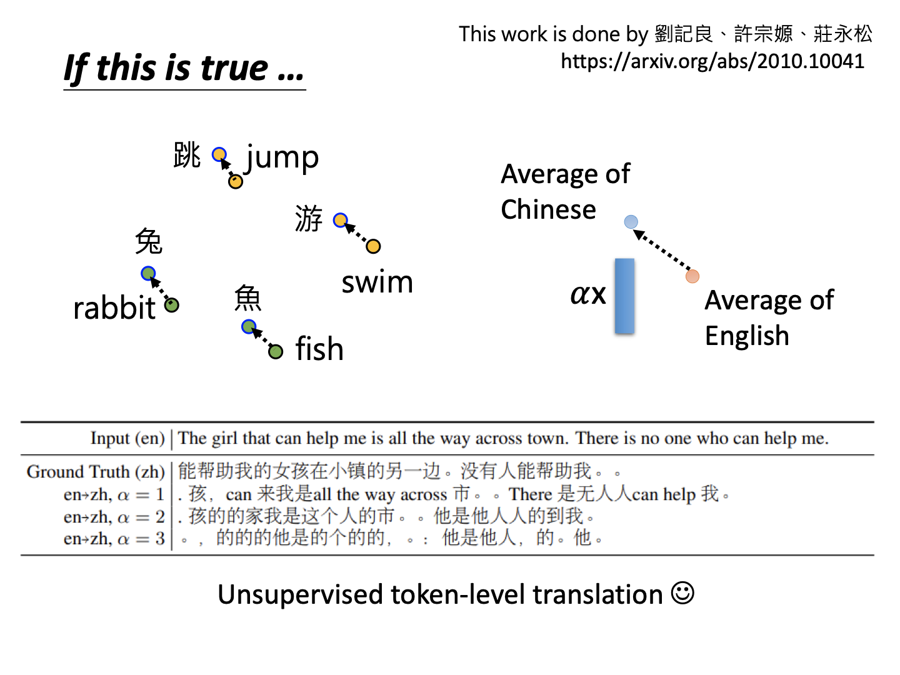

如图，当$\alpha=1$时，BERT已经学习到“没有人”和“no one”之间的关系了。当然这种翻译是词之间的翻译，对于组成完整的句子仍有难度，但至少说明BERT在学习语言背后的表征。

### GPT series

GPT是使用decoder的模型，它更多的应用不是提取语言特征，而是产生下一步结果。

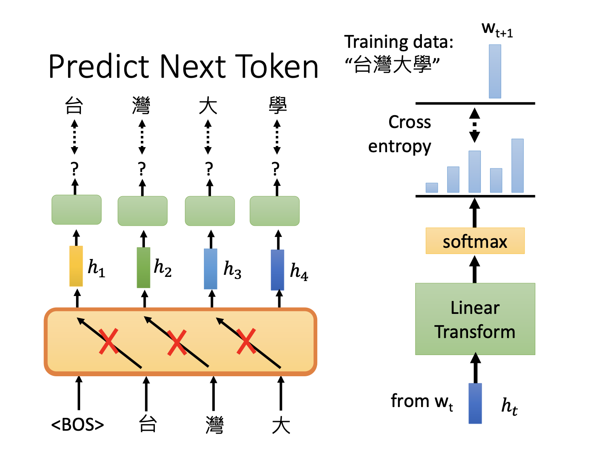

GPT的代表标志是独角兽，这是来源于其最出名的任务：生成了一篇描写独角兽的新闻文章。

#### 使用方法

与BERT不同，GPT的任务目标更加疯狂。它希望直接给定某任务描述，产生对应的输出，就如同做英语问答题一般。

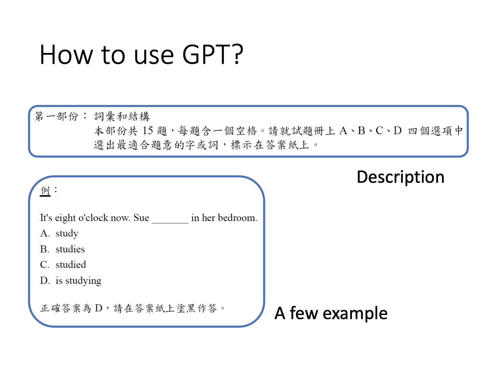

例如，输入一个描述为翻译的句子，再给定一些某语言到另一语言的输入，最后给出某语言词句，令其输出对应语言。这在其论文中也被称为“Few-shot Learning”：

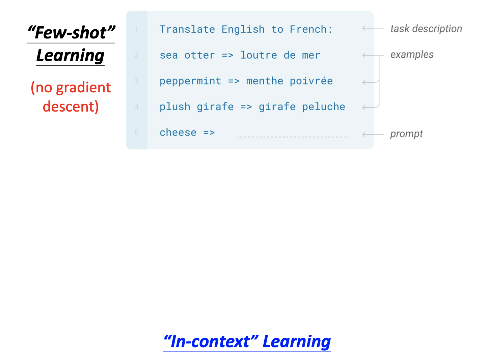

这是一种非常疯狂的idea。并且随着给出的example减少，还有单例的“one-shot”和无范例的“zero-shot”。当然，从结果上来看，其实效果并非特别理想。在某些任务上可能确实能够学到信息。

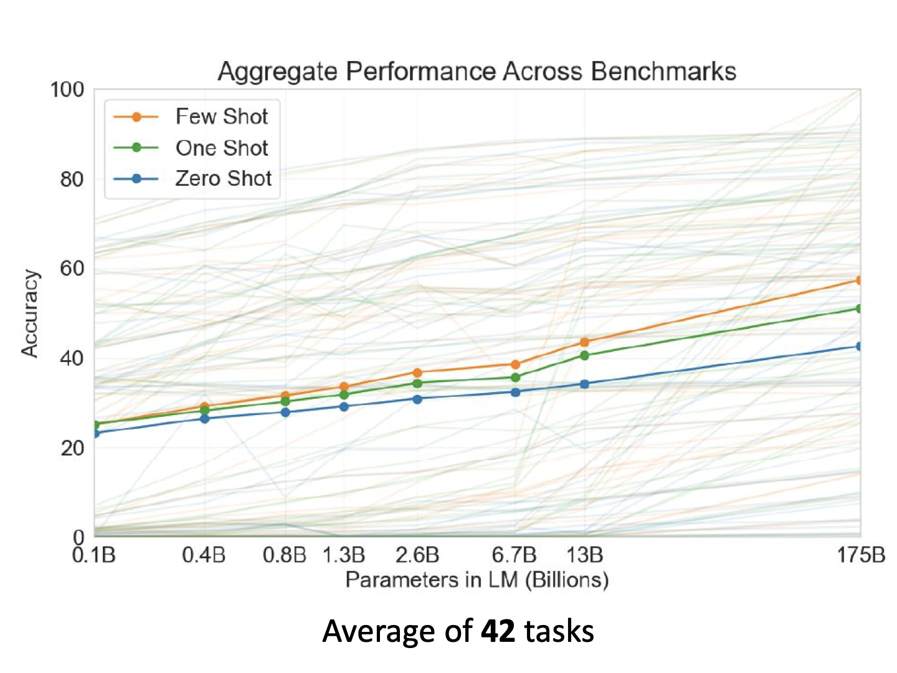

另外，自监督学习的方式不仅局限于NLP任务，在语音辨识和CV上都有相应的研究。