# Transformer

## Quick Introduction of Batch Normalization

该节实际上是Deep Learning一课中的训练技巧介绍，因课程需要在此处讲授。

### Changing Landscape

以二维参数的网络为例，两个参数组合的error surface可以是任意形状，例如椭圆。该情况说明输入$x_1$较小，移动其并不会对损失函数$L$造成极大影响，而输入$x_2$值较大，则同样微小的$\Delta w_2$会令产生的$\Delta L$较大，因此产生一种两个坐标轴尺度不同的error surface，如下图。

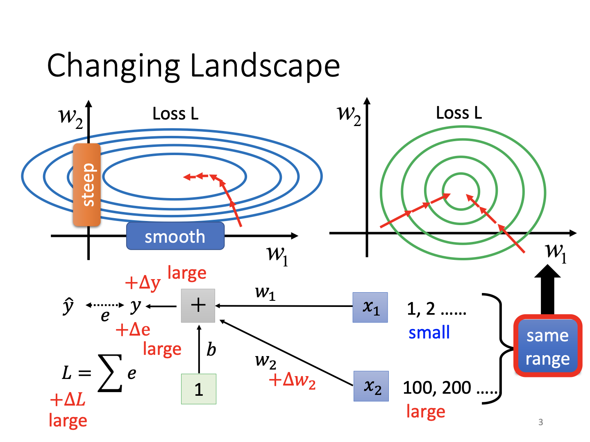

如果将输入的尺度规范到同类区间，则其对error surface的改善体现为绿色等高线图，此时两个方向的参数优化均有同等水平的影响，从而不会出现不均衡的下降。

### Feature Normalization

对于序列输入，将它们同样位置的值求均值与方差而进行标准化，即称为feature normalization。根据以上分析可知，这种标准化过程能够让梯度下降过程更快收敛。

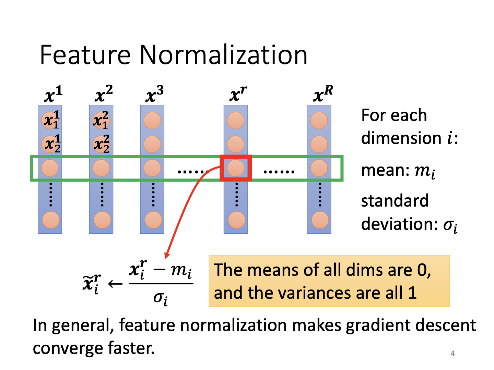

### Normalization in Deep Learning

在深度学习中，因为数据量众多，因此一般不可能对所有数据进行标准化。实际中是针对一批训练数据进行该操作。当批数据量合适的时候，它们的均值和方差分布被认为可以代表全体数据。这就是batch normalization （BN）的由来。

DL中的BN不仅需要对数据输入$x_i$进行，其对应的某层输出$z_i$也可以被看作下一层的输入，而它们在经过神经网络层后已经产生了偏移，所以对它们执行BN同样有利于下一层网络的训练。BN操作可以放在激活函数前/后，实际效果均较好。虽然大部分激活函数在0附近才有激活的效果，但是实测发现BN的顺序不太影响效果。

另外，虽然将数据标准化，但我们仍希望让网络来决定这一程度。所以BN后的数据实际上是标准化数据和超参数$\gamma$、$\beta$的结合，前者控制方差，后者控制均值。注意它们的维度和输入是一致的。

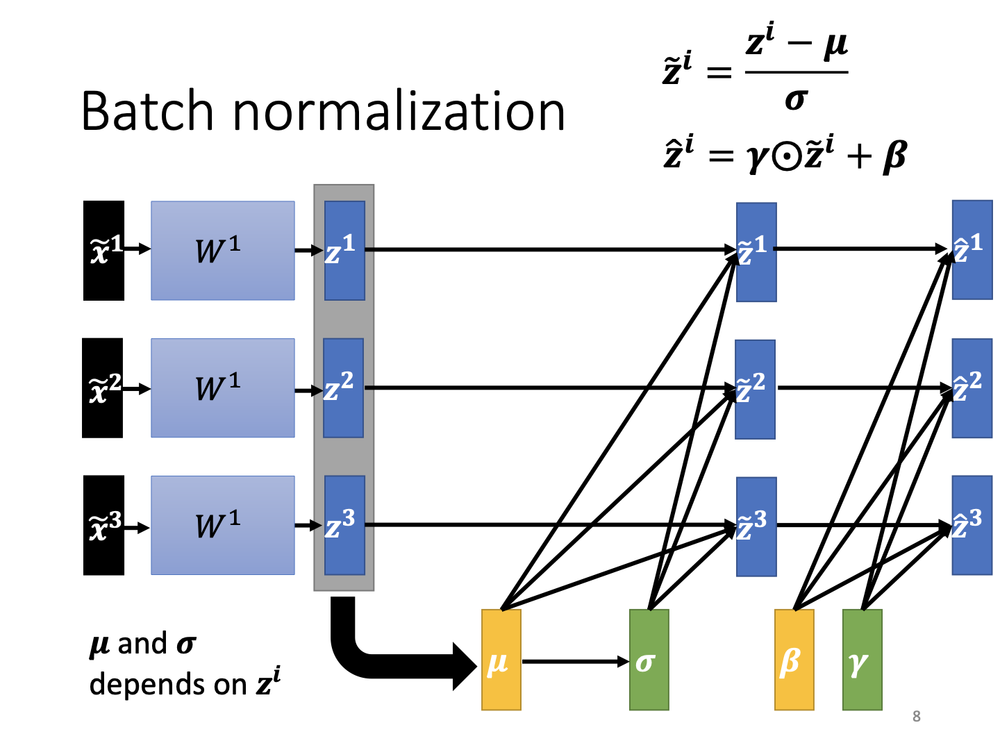

#### 测试集怎么办

在进行测试的时候，不可能等到一批数据后再输出结果，所以在训练时BN就已经将得到的均值与方差进行了滑动平均：

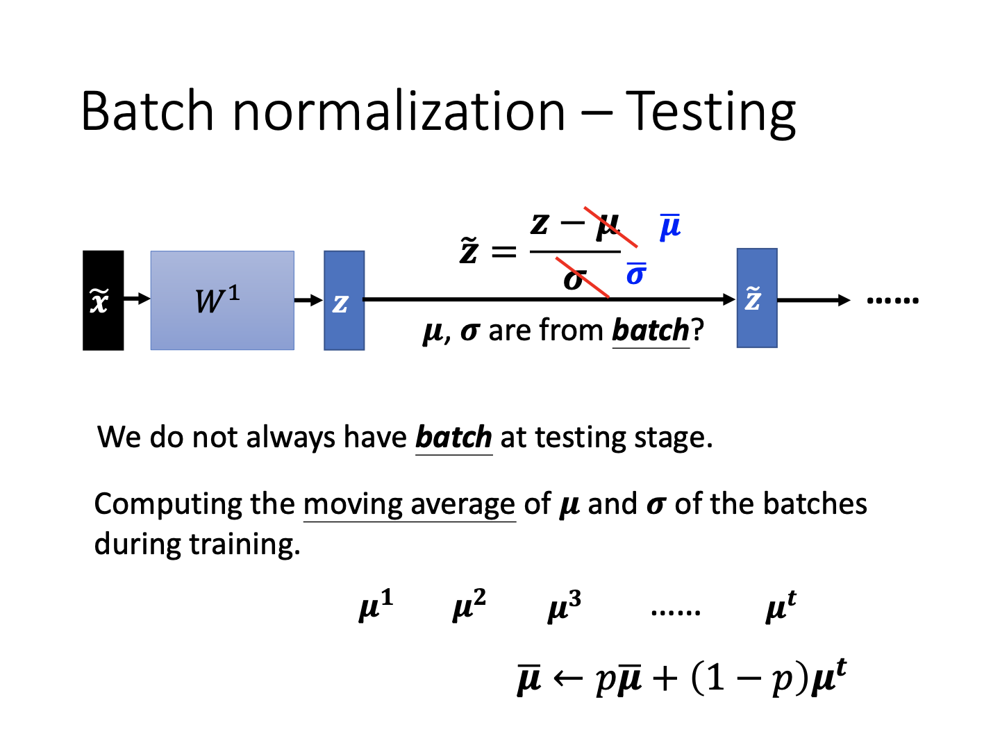

通过来自大量训练集的参数，可以为测试集提供同样好的结果。

#### 效果

因为BN改变了error surface，所以梯度下降的过程能够得到加速。实验证明加上BN可以显著提升训练速度。另外，因为平滑的error surface，较大的学习率同样能够有效训练，如下图蓝色实线（然而蓝色虚线学习率比它低反而效果好，深度学习的不可解释性- -）和红色虚线的对比。此途中粉色线为Sigmoid函数，就算搭配BN也无法较好训练，所以实际中尽量少用。

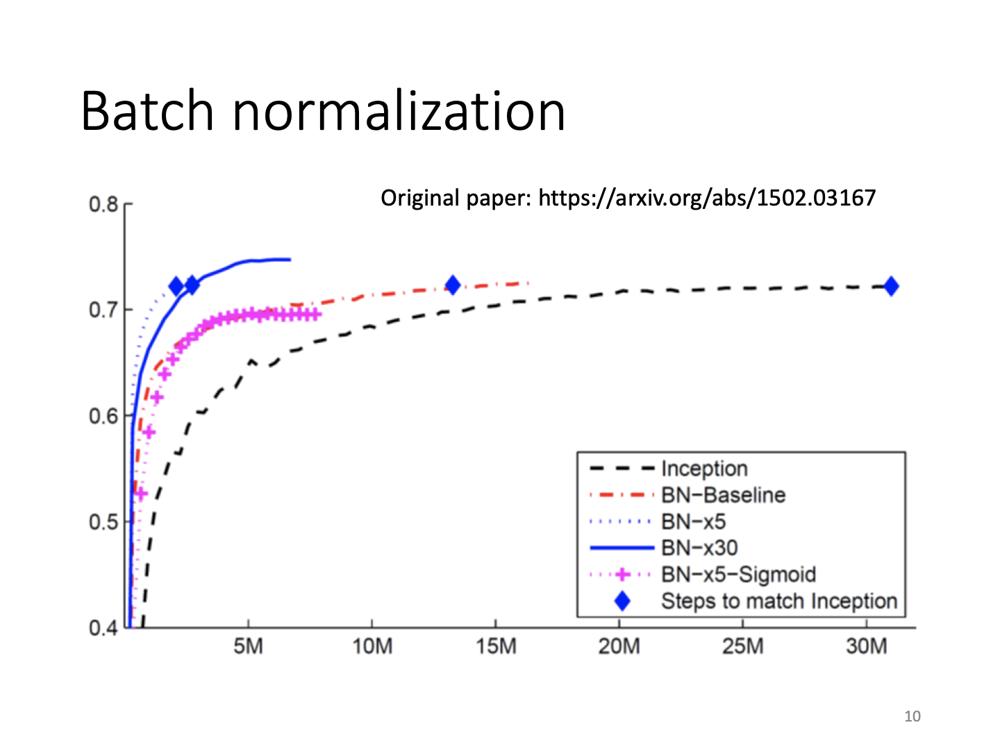

### Internal Covariate Shift

DL中还有一个概念称为Internal Covariate Shift，即，当优化网络参数的时候，比如对矩阵A进行更新为A'，且对B更新为B‘。但存在一种可能：B'的更新是以A为基准的，所以A'的产生会让B‘的更新“不够匹配”。有人认为，BN的存在让中间输入/输出$\boldsymbol{a}$和$\boldsymbol{a}'$的分布接近，从而缓解了参数矩阵优化时候的偏移。

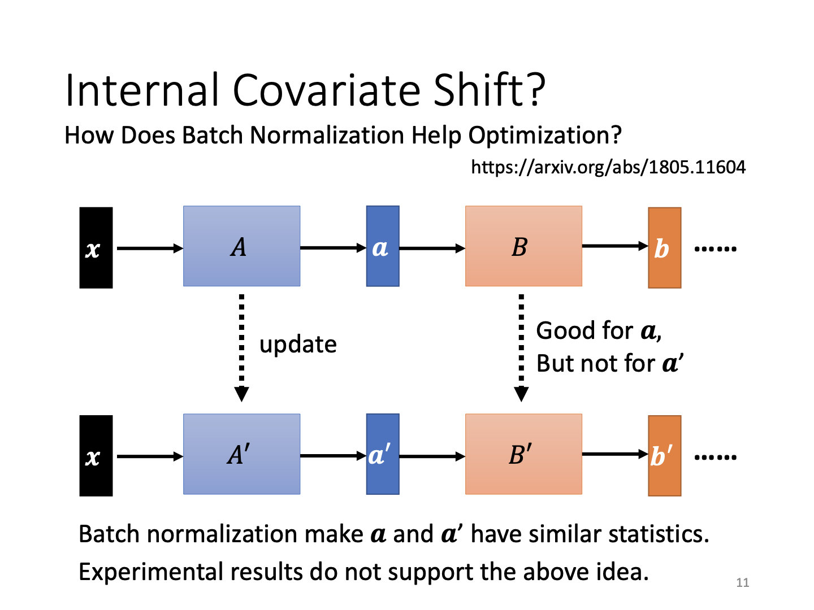

然而在*How Does Batch Normalization Help Optimization?*（https://arxiv.org/abs/1805.11604）一文中，作者对BN的原理进行了分析和实验，输出中间变量发现该现象并不存在。即添加BN不会导致$\boldsymbol{a}$和$\boldsymbol{a}'$的分布有多接近，所以BN的效果好可以说是一种意外之喜。另外，该文章在理论和实验上都证明了BN能够平滑化error surface。

## Transformer

### Seq2Seq

提到Transformer，无法绕开的就是sequence to sequence（Seq2Seq）模型。该模型的输出长度由模型自己决定，这一特性恰好符合语音辨识、机器翻译、语音翻译之类任务。另外有大量额外的工作皆可由它解决。

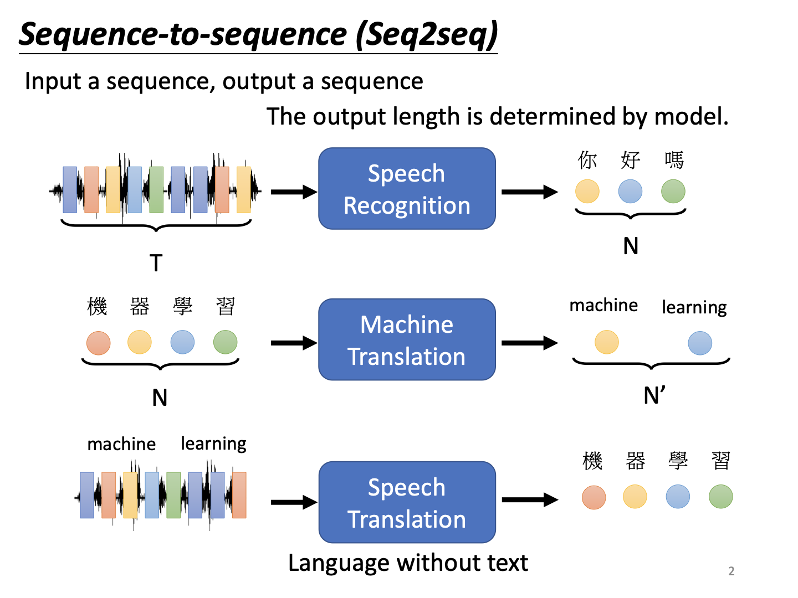

**Speech**

老师给出其实验室的一个范例：台语-中文辨识。台语因为没有文字，因此从语音辨识再到机器翻译的做法并不可取，因此需要尝试直接从语音到翻译。使用网上的肥皂剧（配音台语，字幕中文），即可获取大量训练资料。此处不关心输入语音的背景杂音、配乐，不关心字幕和配音的时间对齐问题，最终确实得到一个可用的模型。虽然这看起来像是强行训练，但也验证了端到端的DL模型之强大。

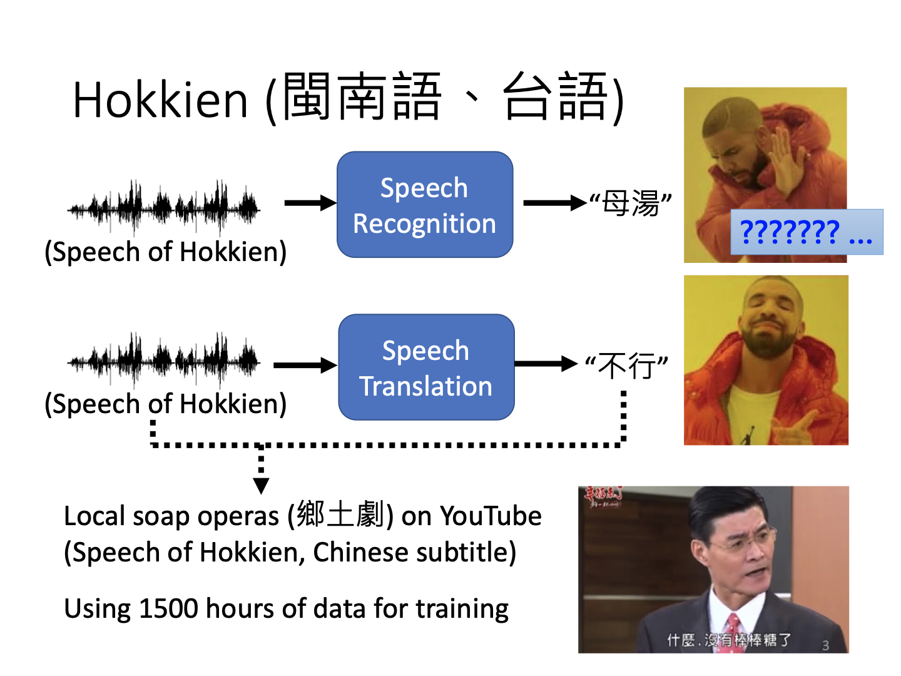

将台语与中文的映射顺序颠倒，后者当输入，前者做输出，就可以得到文字转语音合成系统，同样出自该实验室。

**Chatbot**

聊天机器人（chatbot）通过接收上下文对话，可以学习一种应答机制。这种输出长度不限的问题就可以通过seq2seq解决。

***Question Answering***

实际上，该类问题被称为问答。例如翻译、文章摘要提炼、文章内容属性判断等。最极端下只有一个输出，但seq2seq均能够胜任。

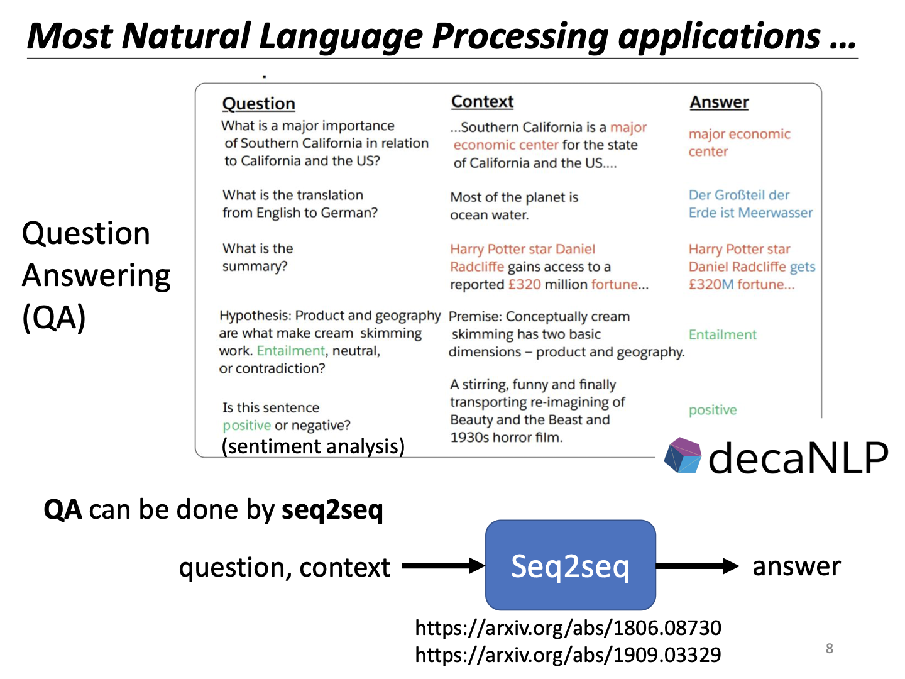

**Syntactic Parsing**

对于语句，其可以被拆解成语法树的结构。如果将其写作一串字符如下，那么我们同样获得了对应的输出序列，从而可以去训练一种语法分析器。

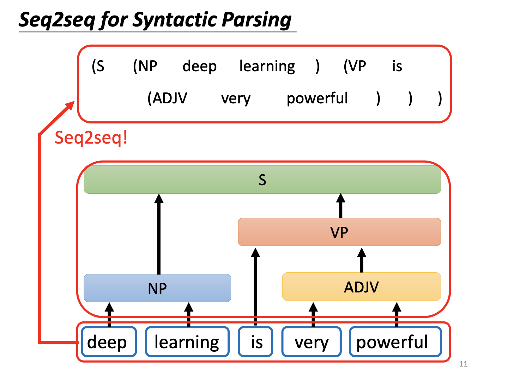

实际上这串字符（树）的产生类似于编译原理的分析过程，此处不详述。

**Multi-label Classification**

对于多标签问题，某个输入（如文档）可能拥有不同的类别，可以由seq2seq模型自行决定划定的标签数量。

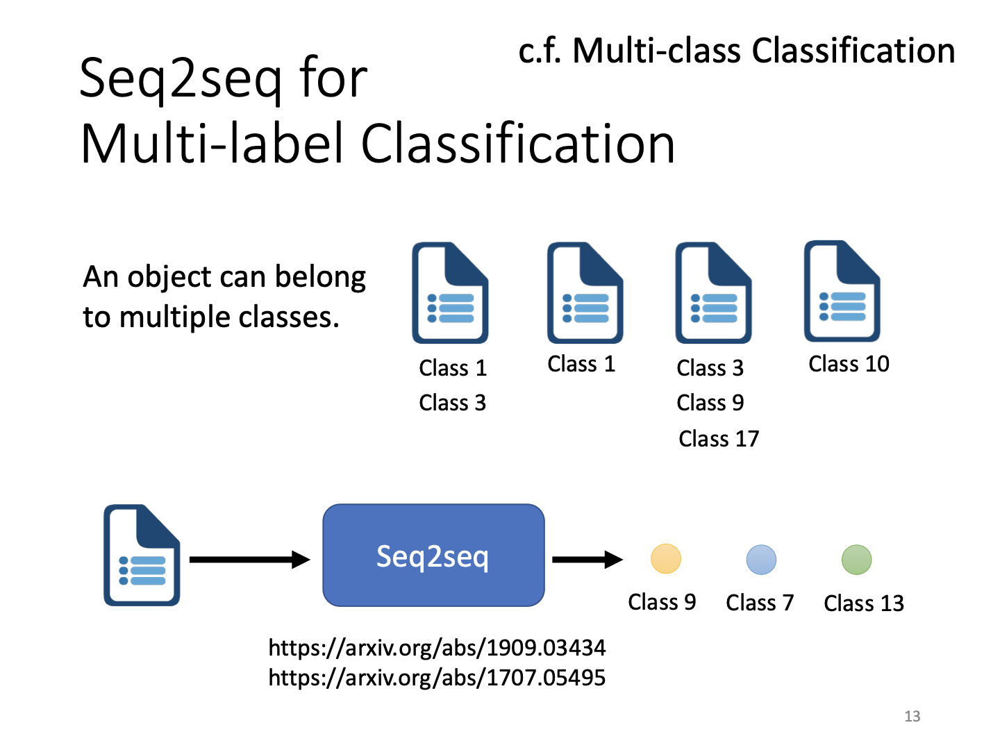

实际上目标检测问题也是一种多标签问题。

### Encoder

Seq2seq模型分为encoder和decoder两部分。

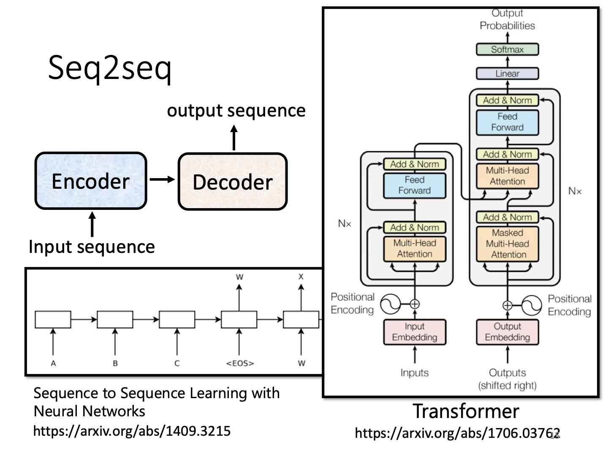

Encoder为给定长度序列，输出相同长度序列的机构，致力于提取足够多的输入序列信息。

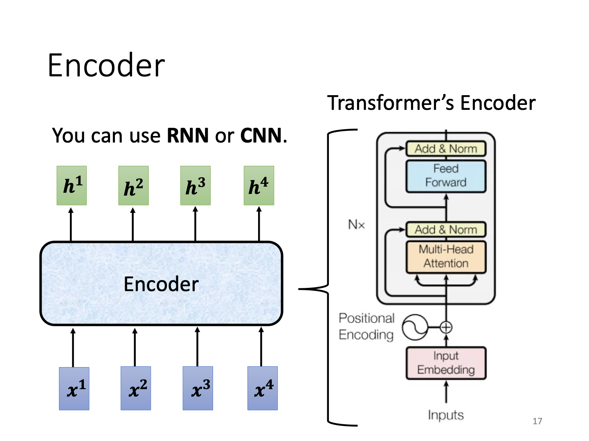

Encoder的结构中细分为多个block，每个block内含self-attention模块，因此它能够在block的堆叠中积累序列前后的数据信息。

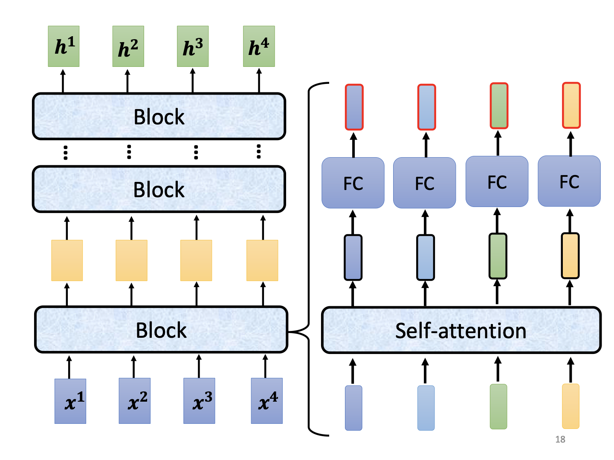

实际上，在attention层后，输出会和其对应的输入作加，这也叫做**残差（residual）**机制。接下来该合成输出会经过layer norm，对输入序列这一维度（而不是序列间）作标准化，即对每一个序列的不同维度合起来标准化。另外，输出后的结果进入全连接层后，同样要经过residual和layer norm。这就是Transformer中的Add&Norm层。

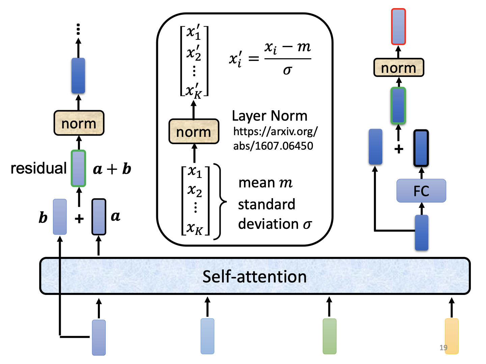

### Decoder

Decoder分为两种：Autoregressive（AT）与Non-Autoregressive（NAT）。

#### Autoregressive (AT)

首先需要明确，Decoder吐出的输出是所需输出集合内所有元素的概率分布。例如对于输出中文的翻译任务，输出的每一个向量都是包含所需中文字集合（由训练者确定范围）的向量，每个元素位的数值代表不同文字的概率。

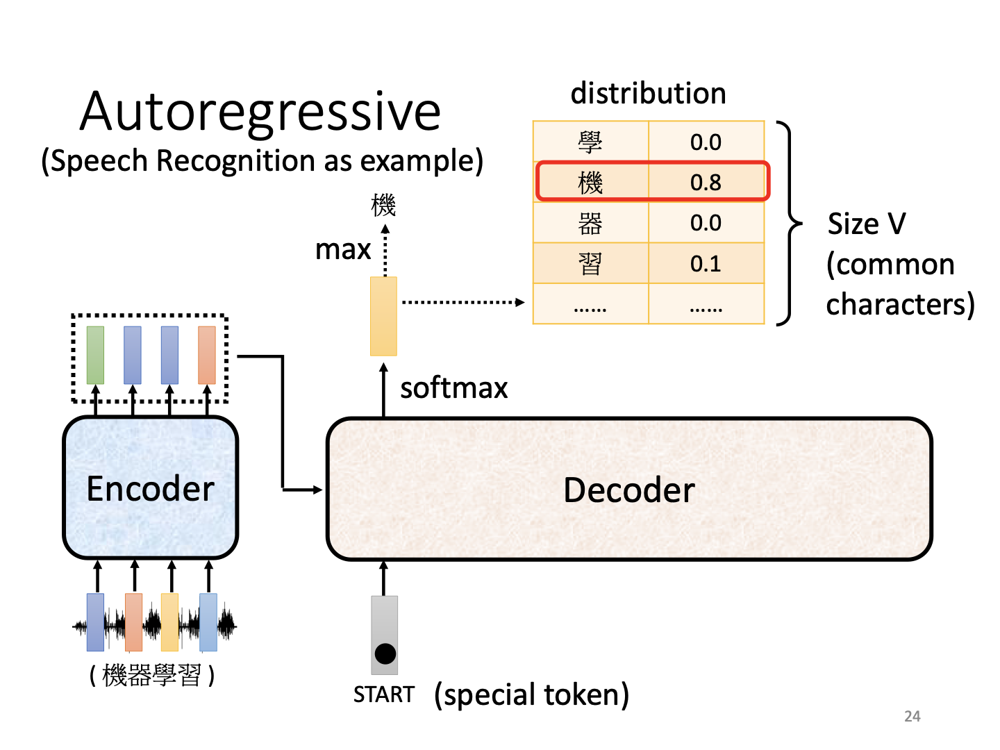

AT形式的Transformer中，Decoder产生输出的过程为：给定一个起始符号（START），让机器通过读取Encoder的信息，输出第一个结果向量；将第一个结果向量和起始符号连接作为输入，输出第二个结果向量...以此类推，直到输出一个结束符号（END）。

需要注意的是，Decoder的组成中，包含一个Masked Multi-Head Attention。联想AT Decoder的工作过程，在输出“机器学习”这四个字的时候，对于第一个字“机”，我们实际上只给Decoder一个输入：起始符号。也就是说，每一个输出对应的输入不再是全体输入，而仅仅是其对应输入位左边的所有内容。所以使用一个Masked模块阻止输入不足时多余模块的计算。

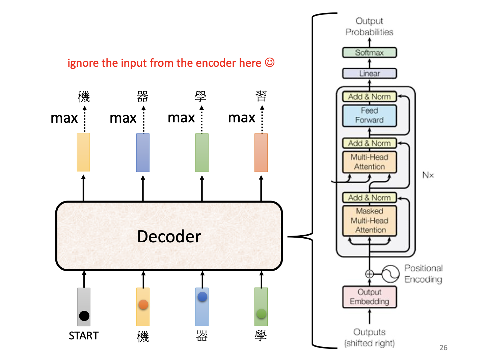

#### Non-autoregressive (NAT)

虽然AT Decoder自行决定其输出长度，但有可能不断输出而难以停下。另外AT方法的输出是由其输入串行决定的。所以NAT的形式应运而生：通过在一开始给定所有位置均为START的token，让模型在读取Encoder内容的同时，决定所有位置的输出。该过程显然比AT更高效，但是如何决定输出长度又成为问题。一种方法是在网络中接收Encoder的序列长度，通过某个分类器学习判定输出长度交给Decoder；另一种方法为给定一个较长序列，将输出结果内结束符右侧的所有输出抛弃。NAT的性能始终不如AT，所以仍然有待研究。

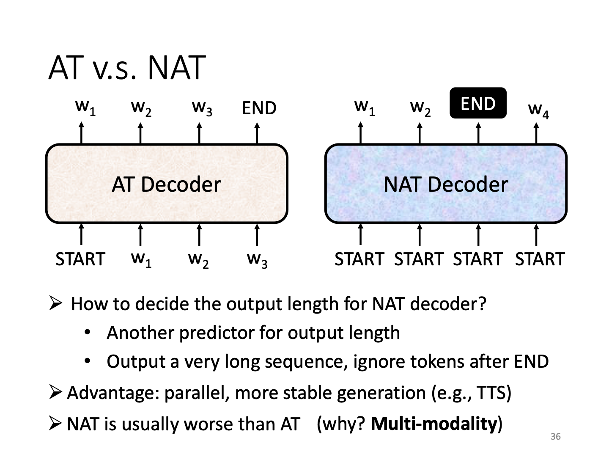

### Encoder-Decoder的链接

在Encoder向Decoder传输数据的过程中，实际上是将输出的向量再次进行QKV操作。首先，Decoder吃下输入，给出其对应的$\boldsymbol{q}$，而Encoder从产生的输出向量中再次产生不同的$\boldsymbol{k}$和$\boldsymbol{v}$，通过$\boldsymbol{q}$进行和attention机制类似的计算，达到一种考虑所有Encoder输出信息的目的。这也称为**Cross Attention**。

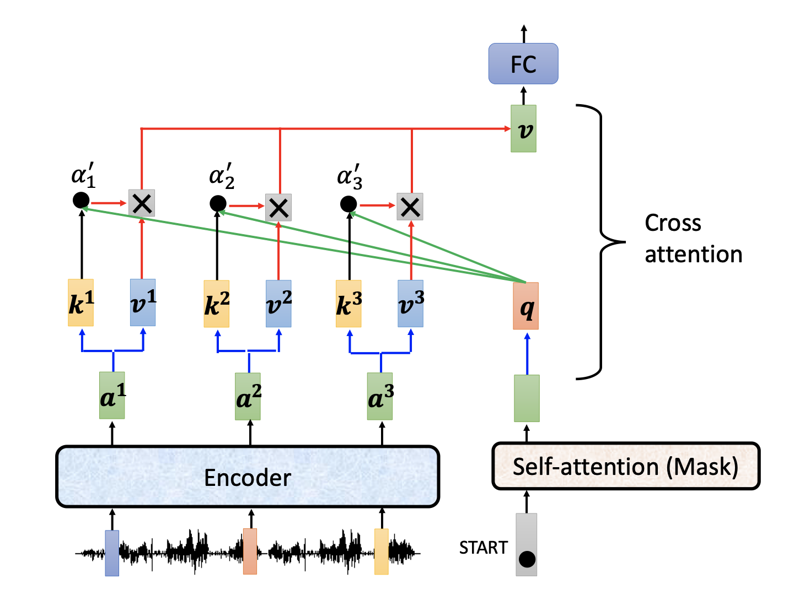

另外，无论Encoder还是Decoder都可以有不止一层。Decoder不一定只接收Encoder的最后一层。不同层之间的连接方式较多，此处不赘述。

### 如何训练

以中文输出为例。在训练时，比较的label为包含所有文字的one-hot向量，而Decoder的输出为同样文字顺序的distribution向量。因此所需工作就是最小化二者之间的cross-entropy。

**Teacher Forcing**

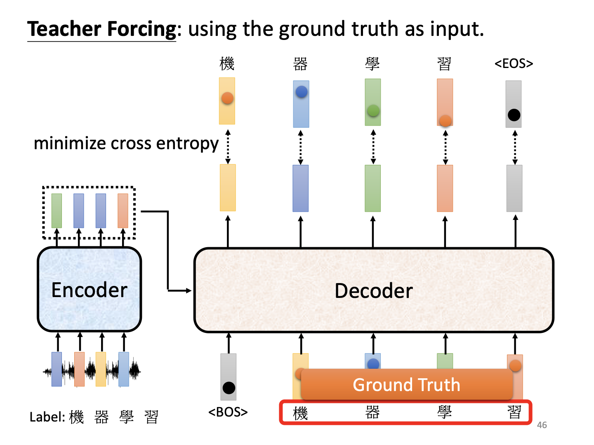

训练中，Decoder吃进的输入是训练者给定的ground truth，即使用正确答案进行训练，而非使用Decoder自己的上一个输出当作下一个输入。

### Tips

**Copy Mechanism**

在文字生成类的任务中，实际上并不需要机器对所有文字都了解才能生成。例如机器翻译和聊天机器人，它们在收到人名讯息后，只要学习如何在回复的句式中放置这些专有名词即可。生成文章摘要任务同理，摘要中的大部分讯息均来自于原文，这只需要提炼和复制的技巧。

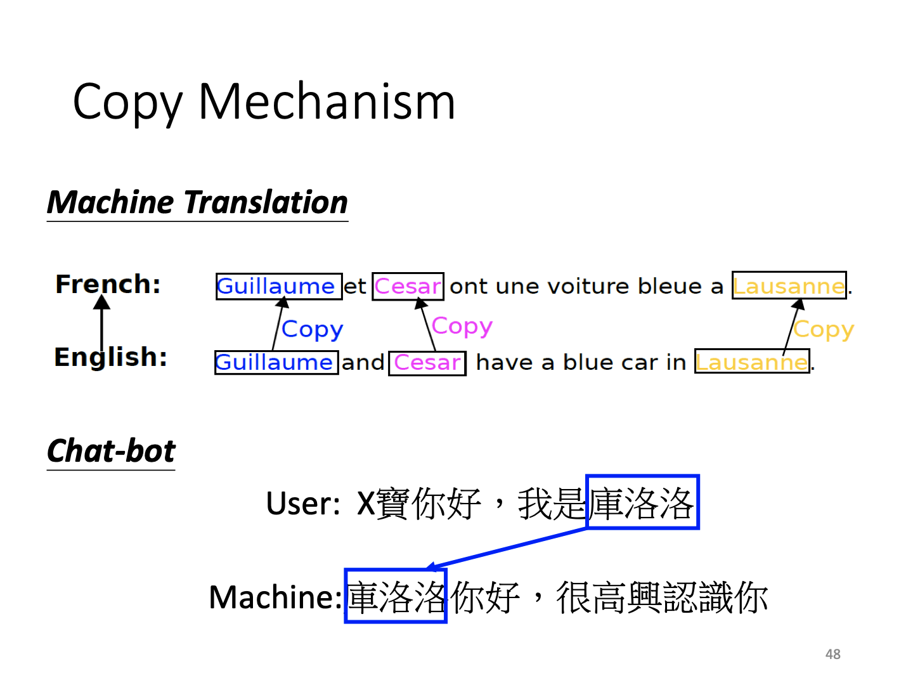

**Guided Attention**

因为Attention考虑所有时序关系，所以机器有可能会错误地先考虑句子后头的时序。人为规定不同位置attention的区别可以避免这一问题，即引导机器进行学习。

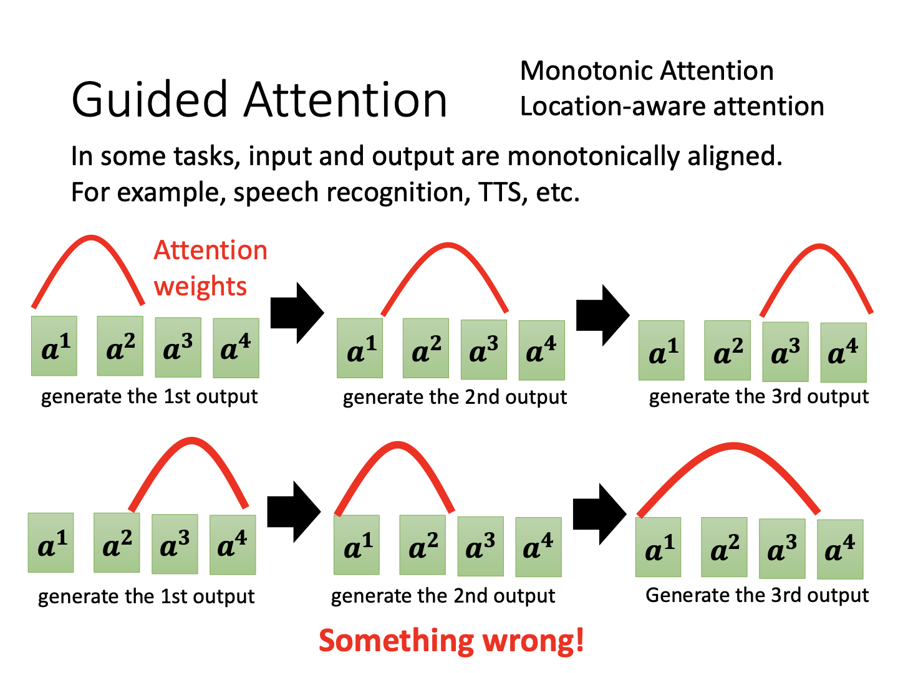

**Beam Search**

编码总找到分数最高的那一个结果来开启下一个输出，这是一种贪婪思想。但是有可能分数次高者在下一步对应的新输出能够有更高的置信度。这种折衷的想法催生了Beam Search的应用。其通过合理的规划、搜索，试图找出生成一个序列的总分数最高的方法。

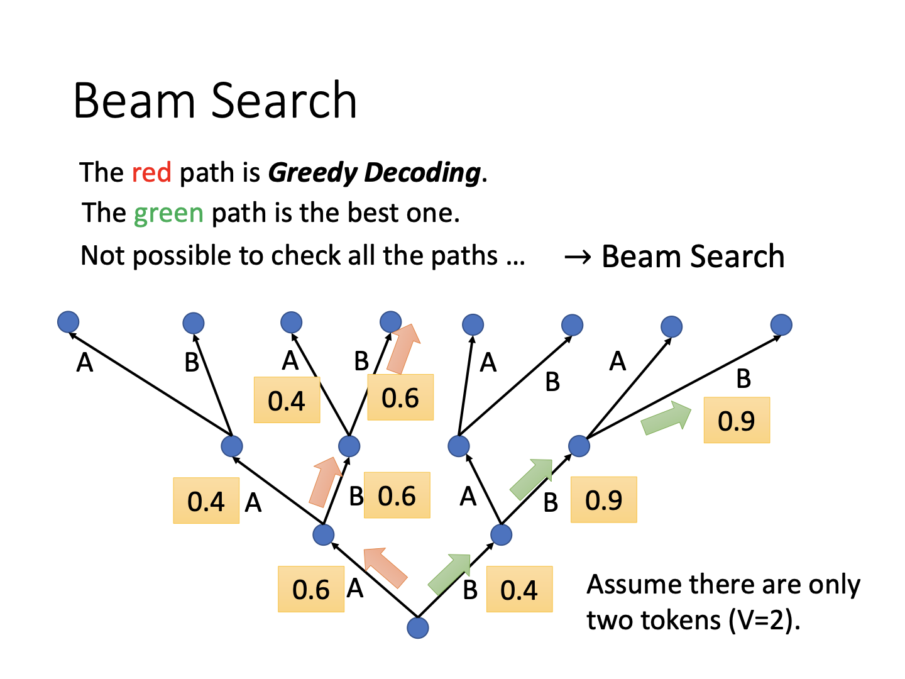

**Sampling**

当然，实际上并非分数最高的token序列能带来最好的结果。例如句式填充或机器文章生成任务，只选择高分路径有可能让生成结果成为一堆废话。老师提到，一般对于有确定输入输出关系的任务（如语音辨识）可以将准确率分数当做评判标准；但对于需要机器发挥创造力的工作，加入一些随机性也许更好。

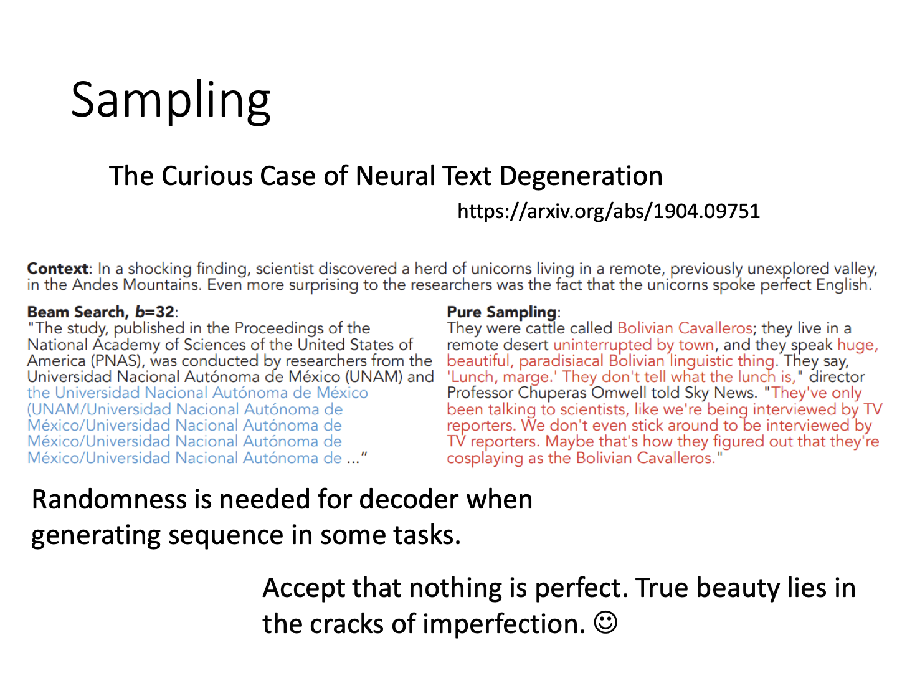

一句哲言：“万事非完美，而瑕疵之中隐藏着美好。”

**Optimizing Evaluation Metrics**

训练时候对于输出序列用的是每个序列元素和目标元素间作交叉熵，而对于句式生成任务，可能在测试时的标准是句子的匹配分数。这些区别会导致训练和测试的目标不一致。但这种匹配分数无法微分，较难训练，RL可能可以解决。因为过于复杂，这里不再深入。

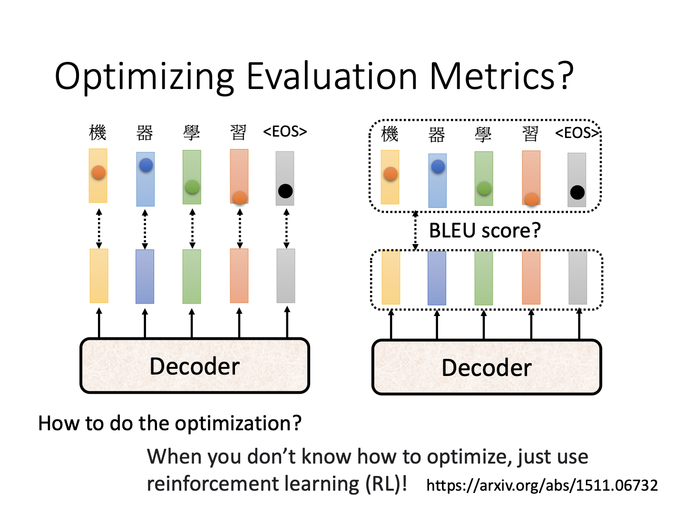

**Scheduled Sampling**

如果在训练时仅给出正确的输入，Decoder在真正执行任务时假如发现错误的信息，就可能难以抵抗。所以有必要在训练时引入一点小错误，使其更加鲁棒。

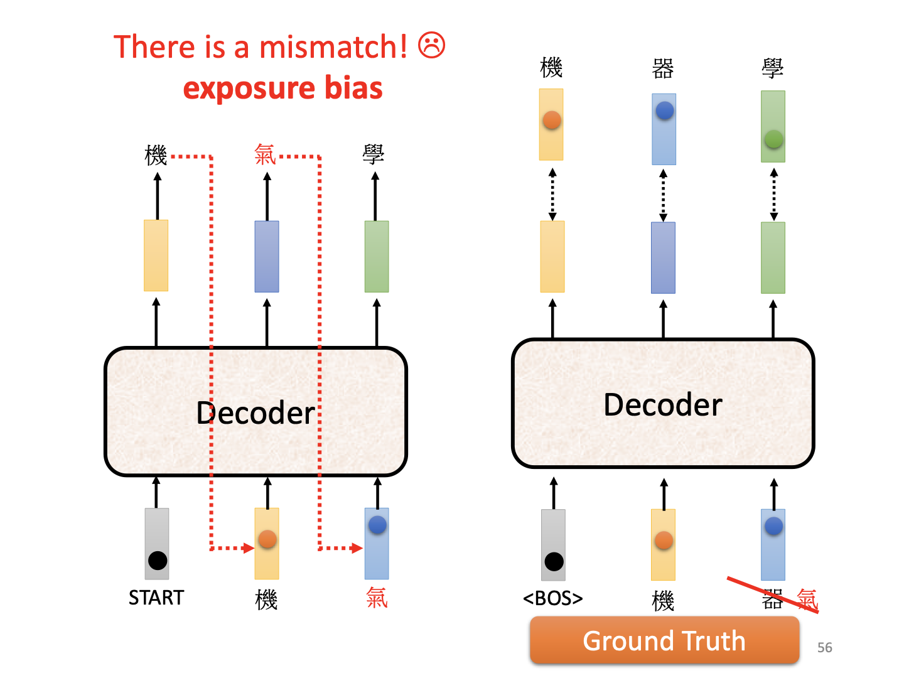